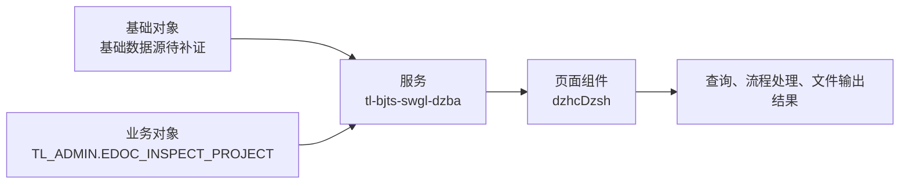

# M_DZBA_NDDZHC_SH 单证核查审核——系统功能分析整理

> 文档编号：`FUN-M_DZBA_NDDZHC_SH`
> 当前版本：V0.1（静态资料还原稿）
> 整理日期：2026-09-03
> 代码与资料基线：`main@9648d427f49f4aa0d6faef8ec78f3959cb5dc3ee`
> 状态：**静态分析基线；运行口径、数据权限及缺失服务实现仍需业务、开发和数据平台主管确认**

---

## 功能简述

1. **[事实]** `M_DZBA_NDDZHC_SH` 是“日常管理 → 备案单证管理 → 年度单证核查 → 单证核查审核”路径下的有效叶子菜单，前端页面组件为 `dzhcDzsh`。需求资料说明：单证核查审核的过程，与日常审单核查类似。其中有几点需要注意： 1、一个项目下的每一笔出口业务的报送和审核是独立的，出口企业可以分多次上报待核查单证资料，审核人员也可以分多次审核不同的出口业务，但是，最终整个项目提交“核查完成”，必须项目下所有出口业务均完成了审核操作。 2、每一笔出口业务只能被退回整改一次。

---

## 1. 文档与功能身份

| 项目 | 内容 | 证据状态 |
|---|---|---|
| 功能编号 | `FUN-M_DZBA_NDDZHC_SH` | 本文建立 |
| 菜单代码 | `M_DZBA_NDDZHC_SH` | [事实] |
| 功能名称 | 单证核查审核 | [事实] |
| 菜单路径 | `M_ROOT → M_RCGL → M_DZBA → M_DZBA_NDDZHC → M_DZBA_NDDZHC_SH` | [事实]，菜单结构表 |
| 页面入口 | 前端页面组件为 `dzhcDzsh` | [事实]，`app.js` |
| 功能类型 | 查询、流程处理、文件输出 | [事实]，页面源码与需求资料 |
| 需求来源/年份 | 2021年杭州市税务局需求。 | [事实/待确认] |
| 原关系表服务标识 | `tl-bjts-swgl-dzba` | [事实]，功能—数据库关系表 |
| 授权角色 | `DZBA`、`DZBASH`、`DZBAGL` | [事实]，菜单—角色关系表 |
| 菜单状态 | `ISVALID=1`、`CHILDFLAG=0` | [事实]，有效且无下级菜单 |

---

## 2. 业务规则清单

| 规则编号 | 规则 | 来源 | 改造要求/待确认 |
|---|---|---|---|
| `RULE-DZBA_NDDZHC_SH-001` | 授权菜单包含 `M_DZBA_NDDZHC_SH` 时才应显示并允许打开该功能 | 菜单表、`app.js` | 服务端接口必须独立鉴权，不能只依赖前端隐藏 |
| `RULE-DZBA_NDDZHC_SH-002` | 页面提供“税务机关、纳税人识别号 企业名称 海关代码、项目状态、年度、管理等级、企业规模、备案方式、上报状态”等输入或筛选项 | 页面模板 | 后端需实施类型、长度、必填、日期区间及数据范围校验 |
| `RULE-DZBA_NDDZHC_SH-003` | 页面以当前登录用户税务机关初始化组织范围 | 前端源码 | 服务端须根据会话重算允许组织集合，拒绝越权机关代码 |
| `RULE-DZBA_NDDZHC_SH-004` | 页面可见操作包括“单证核查审核、查询、核查完成、发放、导出、确定、取消、单证核查-出口业务、基础信息、批量退回” | 页面模板 | 逐项确认角色、状态前置条件、并发控制和审计要求 |
| `RULE-DZBA_NDDZHC_SH-005` | 列表查询使用 `pageNo/pageSize` 或 jqGrid 分页事件 | 前端源码 | 统一页码基数、最大页大小、总数和空页返回约定 |
| `RULE-DZBA_NDDZHC_SH-006` | 页面会把列名与排序方向写入 `orderSql` 或排序参数 | 前端源码 | 服务端必须使用字段白名单映射，禁止直接拼接 SQL |
| `RULE-DZBA_NDDZHC_SH-007` | 组件初始化过程中会触发首次查询 | 前端源码 | 确认默认条件、默认数据范围及首屏性能基线 |
| `RULE-DZBA_NDDZHC_SH-008` | 单证核查审核的过程，与日常审单核查类似。其中有几点需要注意： | 功能清单 | 作为业务验收口径；歧义项由业务部门确认 |
| `RULE-DZBA_NDDZHC_SH-009` | 1、一个项目下的每一笔出口业务的报送和审核是独立的，出口企业可以分多次上报待核查单证资料，审核人员也可以分多次审核不同的出口业务，但是，最终整个项目提交“核查完成”，必须项目下所有出口业务均完成了审核操作。 | 功能清单 | 作为业务验收口径；歧义项由业务部门确认 |
| `RULE-DZBA_NDDZHC_SH-010` | 2、每一笔出口业务只能被退回整改一次。 | 功能清单 | 作为业务验收口径；歧义项由业务部门确认 |
| `RULE-DZBA_NDDZHC_SH-011` | 功能包含“导出”能力 | 页面与接口源码 | 限制文件类型、大小/行数，防公式注入和敏感数据泄露并记录审计 |
| `RULE-DZBA_NDDZHC_SH-012` | 前端以字符串业务码 `"0"` 判定成功，失败时展示 `res.msg` | 前端源码 | 统一 HTTP 状态、业务码、错误信息和请求关联号 |

---

## 3. 数据结构、血缘与一致性

### 3.1 核心实体

| 实体/对象 | Schema | 用途 | 操作 | 依据 |
|---|---|---|---|---|
| `EDOC_INSPECT_PROJECT` | `TL_ADMIN` | 功能业务数据 | R/C/U/D（具体权限按接口确认） | 功能—数据库关系表/页面源码 |

### 3.2 核心表结构特征

- **[事实]** `TL_ADMIN.EDOC_INSPECT_PROJECT` 在本仓库 Oracle 对象脚本中定义为表，共 35 个字段，有主键，检出 2 个索引（其中 1 个唯一索引）。

### 3.3 数据血缘

**[事实]** 功能—数据库关系表登记的基础对象为 `未登记`，业务对象为 `TL_ADMIN.EDOC_INSPECT_PROJECT`。
**[事实]** 页面及直接关联组件共识别 24 个接口/外部入口，其中 2 个可与当前提交的 `tl-bjts-sw` Controller 路由静态匹配；其余实现可能位于未提交服务、网关或外部系统。
**[待确认]** 静态匹配不等同于生产调用闭环，仍需核对网关前缀、实际 SQL、数据权限、刷新作业、异常补偿和对账机制。

---

## 4. 接口、文件与消息

### 4.1 页面直接依赖的接口

| 接口 | 方法 | 用途 | 服务端证据 | 改造关注点 |
|---|---|---|---|---|
| `/auth/preLogin` | POST | 获取登录用户信息 | [`LoginController.java`](../src/server/tl-bjts-sw/src/main/java/com/tl/bjts/sw/controller/LoginController.java) | 校验参数、分页/排序白名单、行级权限、超时和空结果契约 |
| `/dzba/inspect/year/project/file/view` | POST | 查看税务事项通知书/检查报告 | **当前服务工程未检出匹配路由** | 校验文件权限、类型/大小、行数上限、敏感字段和审计 |
| `/dzba/file/viewPdf` | POST | 查看年度核查的回证 | **当前服务工程未检出匹配路由** | 校验文件权限、类型/大小、行数上限、敏感字段和审计 |
| `/dzba/inspect/year/examine/list` | POST | 年度单证核查审核 - 查询 | **当前服务工程未检出匹配路由** | 校验参数、分页/排序白名单、行级权限、超时和空结果契约 |
| `/dzba/inspect/year/examine/inspect/pre` | POST | 年度单证核查审核 - 核查完成 - 批量 - 前置获取信息 | **当前服务工程未检出匹配路由** | 校验参数、分页/排序白名单、行级权限、超时和空结果契约 |
| `/dzba/inspect/year/examine/inspect/batch/check` | POST | 年度单证核查审核 - 核查完成 - 批量 - 前置检查 | **当前服务工程未检出匹配路由** | 校验参数、分页/排序白名单、行级权限、超时和空结果契约 |
| `/dzba/inspect/year/examine/issue/batch` | POST | 年度单证核查审核 - 发送 - 批量 | **当前服务工程未检出匹配路由** | 校验角色与数据范围，并保证幂等、事务一致性和操作审计 |
| `/dzba/inspect/year/examine/issue/single` | POST | 年度单证核查审核 - 核查完成 - 单笔 | **当前服务工程未检出匹配路由** | 校验角色与数据范围，并保证幂等、事务一致性和操作审计 |
| `/dzba/inspect/year/project/baseinfo` | POST | 核查项目明细 - 基础信息 | **当前服务工程未检出匹配路由** | 校验参数、分页/排序白名单、行级权限、超时和空结果契约 |
| `/cxfw/export/readtree` | POST | 加载税务机关树 | [`ExportController.java`](../src/server/tl-bjts-sw/src/main/java/com/tl/bjts/sw/controller/ExportController.java) | 校验可见范围、字典有效性、缓存刷新和参数白名单 |
| `/dzba/inspect/nsrxx/list` | POST | 页面调用 | **当前服务工程未检出匹配路由** | 校验参数、分页/排序白名单、行级权限、超时和空结果契约 |
| `/dzba/export/inspect/year/examine` | POST FORM | exform | **当前服务工程未检出匹配路由** | 校验文件权限、类型/大小、行数上限、敏感字段和审计 |
| `/dzba/inspect/year/project/business/list` | POST | 核查项目明细 - 列表 | **当前服务工程未检出匹配路由** | 校验参数、分页/排序白名单、行级权限、超时和空结果契约 |
| `/dzba/inspect/year/examine/inspect/single` | POST | 年度单证核查审核 - 核查完成 - 单笔 | **当前服务工程未检出匹配路由** | 校验参数、分页/排序白名单、行级权限、超时和空结果契约 |
| `/dzba/inspect/year/business/examine/single/pre` | POST | 核查项目明细 - 审核结束 - 前置 | **当前服务工程未检出匹配路由** | 校验参数、分页/排序白名单、行级权限、超时和空结果契约 |
| `/dzba/inspect/tree` | POST | 根据nsrsbh和entryIds获取核查单证类型 | **当前服务工程未检出匹配路由** | 校验可见范围、字典有效性、缓存刷新和参数白名单 |
| `/dzba/inspect/year/business/examine/revoke/single` | POST | 核查项目明细 - 审核撤销 | **当前服务工程未检出匹配路由** | 校验参数、分页/排序白名单、行级权限、超时和空结果契约 |
| `/dzba/inspect/daily/business/back/pre` | POST | 退回 - 前置，将审核意见写入退回原因 | **当前服务工程未检出匹配路由** | 校验角色与数据范围，并保证幂等、事务一致性和操作审计 |
| `/dzba/inspect/year/business/back/batch` | POST | 年度单证核查-出口业务 - 退回 - 批量 | **当前服务工程未检出匹配路由** | 校验角色与数据范围，并保证幂等、事务一致性和操作审计 |
| `/dzba/inspect/year/business/back/single` | POST | 核查项目明细 - 单笔退回 | **当前服务工程未检出匹配路由** | 校验角色与数据范围，并保证幂等、事务一致性和操作审计 |
| `/dzba/inspect/view/second` | POST | 业务详情弹框 - 查看单证 | **当前服务工程未检出匹配路由** | 校验参数、分页/排序白名单、行级权限、超时和空结果契约 |
| `/cxfw/aisdhc/aicompare/business/sync` | POST | ===== 临时模拟结束 ===== | **当前服务工程未检出匹配路由** | 校验参数、分页/排序白名单、行级权限、超时和空结果契约 |
| `/dzba/file/remark/save` | POST | 页面调用 | **当前服务工程未检出匹配路由** | 校验角色与数据范围，并保证备注更新的幂等性、事务一致性和操作审计 |
| `/auth/getmenu` | POST | 登录后取得授权菜单 | **当前服务工程未检出匹配路由** | 校验可见范围、字典有效性、缓存刷新和参数白名单 |

### 4.2 返回码与异常

前端调用主要以字符串业务码 `"0"` 作为成功条件，非成功结果通常展示 `res.msg`，网络失败交由通用提示处理。[事实]

以下接口契约仍需统一确认：

- HTTP 状态码与业务码的对应关系，以及未登录、无菜单权限、无数据权限的标准返回；
- 参数非法、页大小超限、排序字段非法、重复提交和并发修改的错误码；
- 正常空结果与上游数据未就绪、部分数据失败之间的区分；
- 请求关联号、用户提示、运维日志及敏感信息过滤规则。

### 4.3 文件、消息与外部接口

- 页面存在文件相关能力（导出）；文件格式、编码、模板版本、最大行数、失败反馈和敏感字段策略需按接口逐项确认。[事实/待确认]
- 未发现该页面直接发送或消费 MQ 消息；若服务端通过异步作业生成数据或文件，需补充调度与消息链路证据。[静态检索结论/待确认]

---

## 5. 实现资产清单与可追溯关系

### 5.1 前端资产

| 资产 | 关键位置/用途 |
|---|---|
| [`app.js`](../src/client/src/app.js) | 85 行菜单注册、页面组件/外部地址及授权过滤 |
| [`dzhcDzsh.js`](<../src/client/src/page/单证备案/单证核查/dzhcDzsh.js>) | `dzhcDzsh` 主组件、查询状态、表格与操作逻辑 |
| [`dzhcDzsh.html`](<../src/client/src/page/单证备案/单证核查/dzhcDzsh.html>) | 页面输入、按钮、列表及弹窗结构 |
| [`dzhcCkyw.js`](<../src/client/src/page/单证备案/单证核查/dzhcCkyw.js>) | 主页面直接引用的关联组件 |
| [`static/js/api.js`](../src/client/static/js/api.js) | 公共 API 方法与端点定义 |

### 5.2 服务端及数据库资产

| 资产 | 关键位置/用途 |
|---|---|
| [`LoginController.java`](../src/server/tl-bjts-sw/src/main/java/com/tl/bjts/sw/controller/LoginController.java) | 页面端点在当前服务工程中的 Controller 路由 |
| [`ExportController.java`](../src/server/tl-bjts-sw/src/main/java/com/tl/bjts/sw/controller/ExportController.java) | 页面端点在当前服务工程中的 Controller 路由 |
| 服务标识 `tl-bjts-swgl-dzba` | 功能—数据库关系表登记的原部署/服务边界；与当前提交工程是否一致需确认 |
| [`tl_admin_object20260804.sql`](../tl_admin_object20260804.sql) | `TL_ADMIN` 对象定义、约束与索引核验 |

### 5.3 需求—实现—数据—测试追踪

| 需求编号 | 需求 | 页面/接口 | 数据对象 | 验收用例 |
|---|---|---|---|---|
| `REQ-DZBA_NDDZHC_SH-001` | 授权用户可从菜单路径打开功能 | `M_DZBA_NDDZHC_SH`、`dzhcDzsh` | 菜单/角色配置 | `TC-01` 菜单可见性与接口越权校验 |
| `REQ-DZBA_NDDZHC_SH-002` | 单证核查审核、查询、核查完成、发放、导出 | `/dzba/inspect/year/project/file/view` | `TL_ADMIN.EDOC_INSPECT_PROJECT` | `TC-02` 正常、空结果及边界条件 |
| `REQ-DZBA_NDDZHC_SH-003` | 查询条件、列表字段和业务口径一致 | 主组件及直接接口 | `TL_ADMIN.EDOC_INSPECT_PROJECT` | `TC-03` 字段映射、分页排序及数据范围 |
| `REQ-DZBA_NDDZHC_SH-004` | 文件输入输出与页面数据、权限一致 | `/dzba/inspect/year/project/file/view` | 同列表/业务对象 | `TC-04` 文件格式、上限、脱敏和审计 |
| `REQ-DZBA_NDDZHC_SH-005` | 角色与税务机关数据范围受控 | `/auth/getmenu`、全部业务接口 | 权限对象待补证 | `TC-05` 横向/纵向越权与敏感字段校验 |
