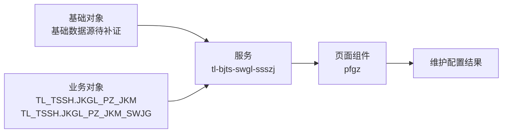

# M_JKM_GZ 健康码评分规则设置——系统功能分析整理

> 文档编号：`FUN-M_JKM_GZ`
> 当前版本：V0.1（静态资料还原稿）
> 整理日期：2026-09-03
> 代码与资料基线：`main@9648d427f49f4aa0d6faef8ec78f3959cb5dc3ee`
> 状态：**静态分析基线；运行口径、数据权限及缺失服务实现仍需业务、开发和数据平台主管确认**

---

## 功能简述

1. **[事实]** `M_JKM_GZ` 是“风险管理 → 风险管理 → 健康码管理 → 健康码评分规则设置”路径下的有效叶子菜单，前端页面组件为 `pfgz`。需求资料说明：健康码的评分规则，由业务分类、指标赋分、等级线设定等功能构成。 业务分类：主要划分为信用类、出口类、退税类、发票类、财务类和外部信息类六个维度。 指标赋分：分为两级管理，一级是全省统一的指标赋分规则，二级是以地市为单位对指标赋分的个性化调整。

---

## 1. 文档与功能身份

| 项目 | 内容 | 证据状态 |
|---|---|---|
| 功能编号 | `FUN-M_JKM_GZ` | 本文建立 |
| 菜单代码 | `M_JKM_GZ` | [事实] |
| 功能名称 | 健康码评分规则设置 | [事实] |
| 菜单路径 | `M_ROOT → M_FXGL → M_SSZJ → M_JKM → M_JKM_GZ` | [事实]，菜单结构表 |
| 页面入口 | 前端页面组件为 `pfgz` | [事实]，`app.js` |
| 功能类型 | 维护配置 | [事实]，页面源码与需求资料 |
| 需求来源/年份 | 2022年由义乌市税务局联合柯桥、椒江、温州二分局提交业务需求开发。 | [事实/待确认] |
| 原关系表服务标识 | `tl-bjts-swgl-ssszj` | [事实]，功能—数据库关系表 |
| 授权角色 | `SSZJCZ` | [事实]，菜单—角色关系表 |
| 菜单状态 | `ISVALID=1`、`CHILDFLAG=0` | [事实]，有效且无下级菜单 |
| 名称一致性 | 菜单表为“健康码评分规则设置”，前端注册标题为“评分规则配置” | [风险]，需确认统一展示名称 |

---

## 2. 业务规则清单

| 规则编号 | 规则 | 来源 | 改造要求/待确认 |
|---|---|---|---|
| `RULE-JKM_GZ-001` | 授权菜单包含 `M_JKM_GZ` 时才应显示并允许打开该功能 | 菜单表、`app.js` | 服务端接口必须独立鉴权，不能只依赖前端隐藏 |
| `RULE-JKM_GZ-002` | 页面可见操作包括“保存” | 页面模板 | 逐项确认角色、状态前置条件、并发控制和审计要求 |
| `RULE-JKM_GZ-003` | 组件初始化过程中会触发首次查询 | 前端源码 | 确认默认条件、默认数据范围及首屏性能基线 |
| `RULE-JKM_GZ-004` | 业务分类：主要划分为信用类、出口类、退税类、发票类、财务类和外部信息类六个维度。 | 功能清单 | 作为业务验收口径；歧义项由业务部门确认 |
| `RULE-JKM_GZ-005` | 指标赋分：分为两级管理，一级是全省统一的指标赋分规则，二级是以地市为单位对指标赋分的个性化调整。 | 功能清单 | 作为业务验收口径；歧义项由业务部门确认 |
| `RULE-JKM_GZ-006` | 前端以字符串业务码 `"0"` 判定成功，失败时展示 `res.msg` | 前端源码 | 统一 HTTP 状态、业务码、错误信息和请求关联号 |

---

## 3. 数据结构、血缘与一致性

### 3.1 核心实体

| 实体/对象 | Schema | 用途 | 操作 | 依据 |
|---|---|---|---|---|
| `JKGL_PZ_JKM` | `TL_TSSH` | 功能业务数据 | R/C/U/D（具体权限按接口确认） | 功能—数据库关系表/页面源码 |
| `JKGL_PZ_JKM_SWJG` | `TL_TSSH` | 功能业务数据 | R/C/U/D（具体权限按接口确认） | 功能—数据库关系表/页面源码 |
| `JKGL_PZ_ZB` | `TL_TSSH` | 功能业务数据 | R/C/U/D（具体权限按接口确认） | 功能—数据库关系表/页面源码 |
| `JKGL_PZ_ZB_YCFF` | `TL_TSSH` | 功能业务数据 | R/C/U/D（具体权限按接口确认） | 功能—数据库关系表/页面源码 |

### 3.2 核心表结构特征

- **[事实]** `TL_TSSH.JKGL_PZ_JKM` 在本仓库 Oracle 对象脚本中定义为表，共 8 个字段，有主键，检出 0 个索引（其中 0 个唯一索引）。
- **[事实]** `TL_TSSH.JKGL_PZ_JKM_SWJG` 在本仓库 Oracle 对象脚本中定义为表，共 6 个字段，未检出主键，检出 0 个索引（其中 0 个唯一索引）。
- **[事实]** `TL_TSSH.JKGL_PZ_ZB` 在本仓库 Oracle 对象脚本中定义为表，共 16 个字段，有主键，检出 0 个索引（其中 0 个唯一索引）。
- **[事实]** `TL_TSSH.JKGL_PZ_ZB_YCFF` 在本仓库 Oracle 对象脚本中定义为表，共 8 个字段，有主键，检出 0 个索引（其中 0 个唯一索引）。

### 3.3 数据血缘

**[事实]** 功能—数据库关系表登记的基础对象为 `未登记`，业务对象为 `TL_TSSH.JKGL_PZ_JKM+TL_TSSH.JKGL_PZ_JKM_SWJG+TL_TSSH.JKGL_PZ_ZB+TL_TSSH.JKGL_PZ_ZB_YCFF`。
**[事实]** 页面及直接关联组件共识别 4 个接口/外部入口，其中 0 个可与当前提交的 `tl-bjts-sw` Controller 路由静态匹配；其余实现可能位于未提交服务、网关或外部系统。
**[待确认]** 静态匹配不等同于生产调用闭环，仍需核对网关前缀、实际 SQL、数据权限、刷新作业、异常补偿和对账机制。

---

## 4. 接口、文件与消息

### 4.1 页面直接依赖的接口

| 接口 | 方法 | 用途 | 服务端证据 | 改造关注点 |
|---|---|---|---|---|
| `/sszj/zbgl/qyjkm/pz/list` | POST | search | **当前服务工程未检出匹配路由** | 校验参数、分页/排序白名单、行级权限、超时和空结果契约 |
| `/sszj/zbgl/qyjkm/pz/save` | POST | 页面调用 | **当前服务工程未检出匹配路由** | 校验角色与数据范围，并保证幂等、事务一致性和操作审计 |
| `/sszj/zbgl/qyjkm/pz/edit` | POST | getEdit | **当前服务工程未检出匹配路由** | 校验角色与数据范围，并保证幂等、事务一致性和操作审计 |
| `/auth/getmenu` | POST | 登录后取得授权菜单 | **当前服务工程未检出匹配路由** | 校验可见范围、字典有效性、缓存刷新和参数白名单 |

### 4.2 返回码与异常

前端调用主要以字符串业务码 `"0"` 作为成功条件，非成功结果通常展示 `res.msg`，网络失败交由通用提示处理。[事实]

以下接口契约仍需统一确认：

- HTTP 状态码与业务码的对应关系，以及未登录、无菜单权限、无数据权限的标准返回；
- 参数非法、页大小超限、排序字段非法、重复提交和并发修改的错误码；
- 正常空结果与上游数据未就绪、部分数据失败之间的区分；
- 请求关联号、用户提示、运维日志及敏感信息过滤规则。

### 4.3 文件、消息与外部接口

- 主页面及直接关联组件未检出明确的文件导入、导出或下载端点。[静态检索结论]
- 未发现该页面直接发送或消费 MQ 消息；若服务端通过异步作业生成数据或文件，需补充调度与消息链路证据。[静态检索结论/待确认]

---

## 5. 实现资产清单与可追溯关系

### 5.1 前端资产

| 资产 | 关键位置/用途 |
|---|---|
| [`app.js`](../src/client/src/app.js) | 403 行菜单注册、页面组件/外部地址及授权过滤 |
| [`pfgz.js`](<../src/client/src/page/三三智检/健康码管理/pfgz.js>) | `pfgz` 主组件、查询状态、表格与操作逻辑 |
| [`pfgz.html`](<../src/client/src/page/三三智检/健康码管理/pfgz.html>) | 页面输入、按钮、列表及弹窗结构 |

### 5.2 服务端及数据库资产

| 资产 | 关键位置/用途 |
|---|---|
| 服务标识 `tl-bjts-swgl-ssszj` | 功能—数据库关系表登记的原部署/服务边界；与当前提交工程是否一致需确认 |
| [`tl_tssh_object20260810.sql`](../tl_tssh_object20260810.sql) | `TL_TSSH` 对象定义、约束与索引核验 |
| [`PRO_JKGL_JKM_COMPUTE.sql`](<../tl_tssh/PRO_JKGL_JKM_COMPUTE.sql>) | 静态引用 `JKGL_PZ_JKM`、`JKGL_PZ_ZB`、`JKGL_PZ_ZB_YCFF` 的过程/函数 |
| [`F_JKGL_JKM_PD.sql`](<../tl_tssh/F_JKGL_JKM_PD.sql>) | 静态引用 `JKGL_PZ_JKM`、`JKGL_PZ_ZB`、`JKGL_PZ_ZB_YCFF` 的过程/函数 |
| [`F_MY_STDAVG_TMPTB.sql`](<../tl_tssh/F_MY_STDAVG_TMPTB.sql>) | 静态引用 `JKGL_PZ_JKM` 的过程/函数 |
| [`PRO_JKGL_JKM_ZB_YCFF.sql`](<../tl_tssh/PRO_JKGL_JKM_ZB_YCFF.sql>) | 静态引用 `JKGL_PZ_ZB_YCFF` 的过程/函数 |

### 5.3 需求—实现—数据—测试追踪

| 需求编号 | 需求 | 页面/接口 | 数据对象 | 验收用例 |
|---|---|---|---|---|
| `REQ-JKM_GZ-001` | 授权用户可从菜单路径打开功能 | `M_JKM_GZ`、`pfgz` | 菜单/角色配置 | `TC-01` 菜单可见性与接口越权校验 |
| `REQ-JKM_GZ-002` | 保存 | `/sszj/zbgl/qyjkm/pz/list` | `TL_TSSH.JKGL_PZ_JKM、TL_TSSH.JKGL_PZ_JKM_SWJG、TL_TSSH.JKGL_PZ_ZB、TL_TSSH.JKGL_PZ_ZB_YCFF` | `TC-02` 正常、空结果及边界条件 |
| `REQ-JKM_GZ-003` | 查询条件、列表字段和业务口径一致 | 主组件及直接接口 | `TL_TSSH.JKGL_PZ_JKM、TL_TSSH.JKGL_PZ_JKM_SWJG、TL_TSSH.JKGL_PZ_ZB、TL_TSSH.JKGL_PZ_ZB_YCFF` | `TC-03` 字段映射、分页排序及数据范围 |
| `REQ-JKM_GZ-004` | 角色与税务机关数据范围受控 | `/auth/getmenu`、全部业务接口 | 权限对象待补证 | `TC-04` 横向/纵向越权与敏感字段校验 |
