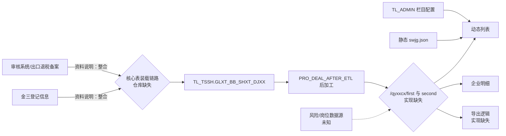

# M_QYXXCX 企业信息一户式查询——系统功能分析整理

> 文档编号：`FUN-M_QYXXCX`
> 当前版本：V0.1（静态资料还原稿）
> 整理日期：2026-09-03
> 代码与资料基线：`main@96902d0ed84ed4f87ba411a77e48032c55f01075`
> 状态：**待业务、开发、DBA、运维和安全联合确认，不能替代最终需求规格或迁移设计**

---

## 功能简述

1. **[事实]** `M_QYXXCX` 是“日常管理 → 企业基本信息查询”下的有效叶子菜单，页面组件为 `qyjcxx`（明细组件为 `qyjcxxMx`）。该功能最早由二分局于 2019 年提出，旨在集中呈现审核系统企业备案信息与金三企业登记信息，减少跨系统切换，并支持企业基础画像、两侧关键信息比对，以及欠税、近三年评估稽查、下户核查、函调等风险提示；金三数据库并库后，数据来源调整为出口退税备案信息与登记信息的整合。

---

## 1. 文档与功能身份

| 项目 | 内容 | 证据状态 |
|---|---|---|
| 功能编号 | `FUN-M_QYXXCX` | 本文建立 |
| 菜单代码 | `M_QYXXCX` | [事实] |
| 功能名称 | 企业信息一户式查询 | [事实] |
| 菜单路径 | `M_ROOT → M_RCGL（日常管理）→ M_JCXXCX（企业基本信息查询）→ M_QYXXCX` | [事实]，关系表中的完整层级 |
| 页面组件 | `qyjcxx`；明细组件 `qyjcxxMx` | [事实] |
| 功能类型 | 查询、明细查看、导出、个人列表偏好配置 | [事实] |
| 原始提出方/年份 | 二分局，2019 年 | [事实]，功能清单 |
| 原关系表服务标识 | `tl-bjts-swgl-cxfw` | [事实] |
| 当前提交的服务工程 | `tl-bjts-sw`，构件版本 `1.2.0` | [事实]；与原服务标识是否为同一部署单元待确认 |
| 业务归口/产品负责人 | 未提供 | [待确认] |
| 开发/测试/运维负责人 | 未提供 | [待确认] |
| 功能启停状态 | 资料中 `ISVALID=1`，页面仍注册 | [事实]；生产实际使用频率待确认 |
| 业务重要度 | 建议暂定“重要查询功能” | [建议]；需结合访问量、使用部门和停机容忍度确认 |

---

## 4. 业务规则清单

| 规则编号 | 规则 | 来源 | 迁移要求/待确认 |
|---|---|---|---|
| `RULE-QYXX-001` | 授权菜单中存在 `M_QYXXCX` 才显示入口 | 前端源码 | 接口端必须独立鉴权，不能依赖菜单隐藏 |
| `RULE-QYXX-002` | 初始及重置后，退税机关为当前用户税务机关 | 前端源码 | 后端须计算“允许组织集合”，拒绝越范围 `swcode` |
| `RULE-QYXX-003` | 页面打开不自动查询，用户点击“查询”后取第一页 | 前端源码 | 保持或经业务确认后变更 |
| `RULE-QYXX-004` | 海关代码、社会信用代码、企业名称前端最大长度分别为 10、21、30 | 前端源码 | 与数据库 32、20、200 不一致，需确定权威长度及历史兼容策略 |
| `RULE-QYXX-005` | 日期接受 `-`、`/`、`.` 分隔或 6/8 位数字，并归一成 `yyyy-MM-dd`；年份 1900—2100 | 公共前端工具 | 当前未校验真实日历日及起止顺序；后端必须严格校验 |
| `RULE-QYXX-006` | 列表页明确剔除 9 个“暂不支持”条件 | 前端源码 | 应下线控件或补齐能力，避免伪功能 |
| `RULE-QYXX-007` | 页面大小允许 20、50、100、500，默认取公共配置 | 前端源码 | 明确最大值，服务端限制恶意超限参数 |
| `RULE-QYXX-008` | 点击可排序列后将 `列代码 + asc/desc` 作为 `orderSql` 发给后端 | 前端源码 | 后端必须按栏目白名单映射，禁止直接拼接 SQL |
| `RULE-QYXX-009` | 列定义由 `tcode=qyxx` 动态加载，非固定列可由用户勾选，2 秒防抖保存 | 前后端源码 | 迁移配置数据；确定默认列和用户偏好继承策略 |
| `RULE-QYXX-010` | 点击企业名称或社会信用代码，以当前行 `nsrdj_no` 打开明细 | 前端源码 | 明细键必须唯一；核心表当前无主键，需先做重复基线 |
| `RULE-QYXX-011` | 当前列表无行时禁止导出 | 前端源码 | 仍需后端最大行数、超时和权限控制 |
| `RULE-QYXX-012` | 导出提交完整 `searchData`，而列表查询会剔除暂不支持字段 | 前端源码 | 可能造成屏幕与导出条件不一致，必须通过契约测试确认并统一 |
| `RULE-QYXX-013` | 详情展示企业信息、跨系统对比、四项风险提示 | 功能清单、前端源码 | 比对算法、空值规则、时间窗口及风险来源均需补证 |
| `RULE-QYXX-014` | 账号一致性涉及审核系统账号与金三出口退税账号 | 功能清单、页面 | 是否忽略空格、前导零、账号掩码及双方均空时的结果待确认 |
| `RULE-QYXX-015` | 注销与备案撤回、备案与金三归类需形成一致性标志 | 功能清单、页面 | 状态码映射、有效日期和双方均无记录的规则待确认 |
| `RULE-QYXX-016` | 风险提示包含欠税、近三年评估稽查、下户核查、函调 | 功能清单、页面 | “三年”滚动/自然年口径、记录有效状态及刷新频率待确认 |
| `RULE-QYXX-017` | 详情存在打印方法，但明细模板中的打印按钮被注释 | 前端源码 | 当前是否允许打印及敏感字段打印策略待确认 |

---

## 6. 数据结构、血缘与一致性

### 6.1 核心实体

| 实体/对象 | Schema | 用途 | 操作 | 依据 |
|---|---|---|---|---|
| `GLXT_BB_SHXT_DJXX` | `TL_TSSH` | 出口企业档案、基础画像及部分跨系统字段 | R；上游过程 U | 功能—数据库关系表、DDL、过程 |
| `SYS_CFG_TABLE_COLUMN` | `TL_ADMIN` | 动态列表列定义 | R | 公共服务源码 |
| `SYS_CFG_TABLE_USER` | `TL_ADMIN` | 用户对可选列的个人偏好，`CS` 为逗号分隔列代码 | R/C/U | 公共服务源码 |
| `DM_SWJG` | `TL_ADMIN` | 税务机关代码字典 | 候选 R | DDL；本页面实际树来自静态 JSON |
| `DM_JDXZ` | `TL_ADMIN` | 街道乡镇代码字典 | 候选 R | DDL；街道接口实现缺失 |
| `swjg.json` | 服务端资源 | `/export/readtree` 的静态税务机关树 | R | 服务端源码 |
| 风险、岗位来源对象 | 未知 | 四项风险及审核/评估岗 | R | [待确认] |

### 6.2 核心表结构特征

`TL_TSSH.GLXT_BB_SHXT_DJXX` 的迁移相关特征如下：

- 74 个字段，类型包括 `VARCHAR2`、`CHAR`、`DATE`、`NUMBER`。[事实]
- 无主键、唯一约束、外键和装载/更新时间字段。[事实]
- 10 个普通索引：`BAJC_YEAR`、`CPCODE`、`DJXH_JS`、`FRDB_ZJHM`、`ADDRESS_JY`、`NSRDJNO`、`QYHGDM`、`SHXYNO`、`SWJGDM`、`ZGSWJGDM`。[事实]
- `DJXH_JS NUMBER(21)`、`NSRDZDAH NUMBER(20)` 超过有符号 `BIGINT` 的安全十进制位数，应按实际最大值评估使用 `DECIMAL(21,0)`/`DECIMAL(20,0)`。[建议]
- 身份证号、电话、地址、银行账号均保存在该表，属于需要重点保护的个人/敏感数据。[事实]

### 6.3 数据血缘

**[事实]** `PRO_DEAL_AFTER_ETL` 包含对一个特定 `CPCODE` 的备案日期硬编码修正，并根据外综服、计算方法、应税服务等条件多次更新 `BAJC_YEAR`；各段包含显式 `COMMIT` 和 `WHEN OTHERS` 日志处理。

**[事实]** 在已提交 SQL 和拆分过程内没有检索到向 `GLXT_BB_SHXT_DJXX` 装载数据的 `INSERT` 或 `MERGE`，也没有检索到 `DBMS_JOB`/`DBMS_SCHEDULER` 创建定义。

**[待确认]** 这不证明生产环境没有装载或调度，只证明本仓库证据不完整。必须取得实际 ETL 脚本、调度平台导出、上下游表映射、运行日历、失败补偿和最近运行日志。

---

## 7. 接口、文件与消息

### 7.1 页面直接依赖的接口

| 接口 | 方法 | 主要入参 | 页面期望的成功数据 | 服务端证据 | 改造关注点 |
|---|---|---|---|---|---|
| `/auth/getmenu` | POST | `czry_dm` | `data:[{code,name}]` | 当前服务工程无实现 | 菜单权限、接口权限不可混同；参数不应允许冒用用户 |
| `/cxfw/basis/columprofile` | POST | `tcode=qyxx` | `data.profiles`、`data.select` | 有公共实现 | 角色为 `czy`；配置数据和字段缺失需补齐 |
| `/cxfw/basis/columprofile/update` | POST | `tcode`、逗号分隔 `cs` | `code=0` | 有公共实现 | 校验列白名单、长度、并发 upsert、审计 |
| `/cxfw/export/readtree` | POST | 页面传 `nodeType=3` | `{code,msg,data:树}` | 有公共实现，忽略入参并读取静态 `swjg.json` | 静态树含 122 节点并出现历史机关名称；需版本化、按用户裁剪或改为权威字典 |
| `/cxfw/common/streetTree` | POST | 空对象 | `data:树` | **缺失** | 字典来源、有效标志、组织过滤、缓存刷新 |
| `/cxfw/qyxxcx/first` | POST | 查询对象、`pageNo/pageSize/orderSql` | jqGrid 分页结构 | **缺失** | SQL、字段映射、过滤、排序白名单、数据权限、超时 |
| `/cxfw/qyxxcx/second` | POST | `nsrdj_no`、固定分页参数 | `{qyxx,dbxx,fxts}` | **缺失** | 唯一性、敏感字段、比对及风险算法、越权访问 |
| `/cxfw/export/qyxx` | POST form | `data=JSON` | 下载文件 | **缺失** | 屏幕一致性、格式/文件名、最大行数、审计、公式注入、超时 |

说明：服务端 Controller 的类级路径为 `/basis`、`/export`，页面使用 `/cxfw` 前缀；其网关或上下文路径配置不在本功能证据中。[待确认]

### 7.2 返回码与异常

前端仅把字符串 `"0"` 视为成功，其余显示 `res.msg`；网络失败则将错误对象交给通用提示。[事实] 以下契约尚缺失：

- HTTP 状态码与业务码的对应关系；
- 未登录、无菜单权限、无数据权限的标准返回；
- 参数非法、日期非法、排序字段非法、页大小超限的错误码；
- 上游数据未就绪与正常空结果的区分；
- 请求/日志关联号及面向用户与运维的消息分层；
- 导出失败时 iframe 如何向页面传递错误。

### 7.3 文件、消息与外部接口

- 本功能直接输出一个下载文件，但格式、编码、模板、列范围、文件名、最大行数和敏感字段策略均因服务端实现缺失而未知。[待确认]
- 未发现本功能直接发送或消费 MQ 消息。[静态检索结论]
- 上游跨系统数据如何进入核心表属于 ETL/数据集成边界，不能据现有材料认定为实时接口。[待确认]

---

## 9. 实现资产清单与可追溯关系

### 9.2 前端资产

| 资产 | 关键位置/用途 |
|---|---|
| [`src/client/src/app.js`](../src/client/src/app.js) | 37—49 行菜单注册；908—961 行授权菜单过滤 |
| [`qyjcxx.js`](<../src/client/src/page/数据查询/企业信息查询/qyjcxx.js>) | 查询对象、动态列、分页排序、条件剔除、树、导出和重置 |
| [`qyjcxx.html`](<../src/client/src/page/数据查询/企业信息查询/qyjcxx.html>) | 查询控件、枚举、暂不支持标记、页面操作 |
| [`qyjcxxMx.js`](<../src/client/src/page/数据查询/企业信息查询/qyjcxxMx.js>) | 以 `nsrdj_no` 获取明细 |
| [`qyjcxxMx.html`](<../src/client/src/page/数据查询/企业信息查询/qyjcxxMx.html>) | 企业信息、对比信息、风险提示字段 |
| [`static/js/tools.js`](../src/client/static/js/tools.js) | 日期归一化及 `/cxfw/export/readtree` 缓存调用 |
| [`static/js/api.js`](../src/client/static/js/api.js) | `/auth/getmenu` 定义 |
| [`package.json`](../src/client/package.json) | 前端 `0.9.6`、Avalon/webpack 时代依赖信息 |

### 9.3 服务端及数据库资产

| 资产 | 关键位置/用途 |
|---|---|
| [`AppBaseController.java`](../src/server/tl-bjts-sw/src/main/java/com/tl/bjts/sw/controller/AppBaseController.java) | 栏目读取和个人偏好保存 |
| [`BasisService.java`](../src/server/tl-bjts-sw/src/main/java/com/tl/bjts/sw/service/BasisService.java) | `TL_ADMIN` 配置表访问、更新后插入逻辑 |
| [`SysCfgTableColumn.java`](../src/server/tl-bjts-sw/src/main/java/com/tl/bjts/sw/model/domain/SysCfgTableColumn.java) | 列配置实体；与 DDL 字段不完全一致 |
| [`ExportController.java`](../src/server/tl-bjts-sw/src/main/java/com/tl/bjts/sw/controller/ExportController.java) | 静态税务机关树读取，角色注解被注释 |
| [`swjg.json`](../src/server/tl-bjts-sw/src/main/resources/template/swjg.json) | 122 节点税务机关静态树 |
| [`pom.xml`](../src/server/tl-bjts-sw/pom.xml) | 服务构件 `1.2.0`、Oracle `ojdbc14 10.2.0.4.0` |
| [`PRO_DEAL_AFTER_ETL.sql`](../tl_tssh/PRO_DEAL_AFTER_ETL.sql) | 核心表 ETL 后加工、硬编码修正及多次提交 |
| [`PRO_DEAL_JCFX_NSR_BLV.sql`](../tl_tssh/PRO_DEAL_JCFX_NSR_BLV.sql) | 核心表其他分析字段加工 |

### 9.4 需求—实现—数据—测试追踪

| 需求编号 | 需求 | 页面/接口 | 数据对象 | 验收用例 |
|---|---|---|---|---|
| `REQ-QYXX-001` | 组合查询企业档案 | `qyjcxx`、`first` | `GLXT_BB_SHXT_DJXX` | `TC-01`—`TC-08` |
| `REQ-QYXX-002` | 单户基础信息 | `qyjcxxMx`、`second` | 核心表+字典/岗位源 | `TC-09`—`TC-11` |
| `REQ-QYXX-003` | 跨系统对比 | `second` | 账号、备案、登记字段 | `TC-12`—`TC-14` |
| `REQ-QYXX-004` | 风险提示 | `second` | 风险源未知 | `TC-15` |
| `REQ-QYXX-005` | 自定义列表 | `columprofile*` | 两张 `SYS_CFG_TABLE_*` | `TC-16` |
| `REQ-QYXX-006` | 导出 | `export/qyxx` | 与列表同源（待证） | `TC-17`—`TC-18` |
| `REQ-QYXX-007` | 组织和菜单权限 | `auth/getmenu`、所有业务接口 | 角色/组织权限对象未知 | `TC-19`—`TC-21` |
