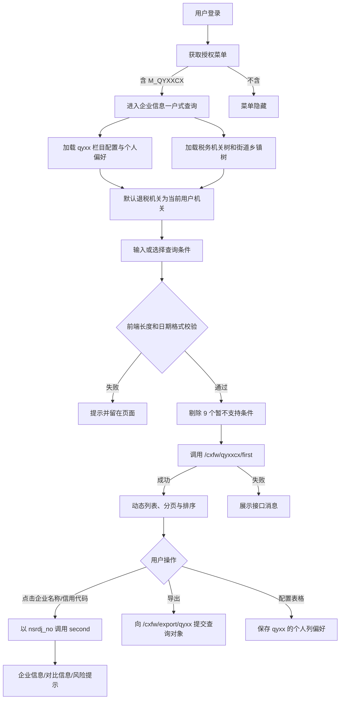
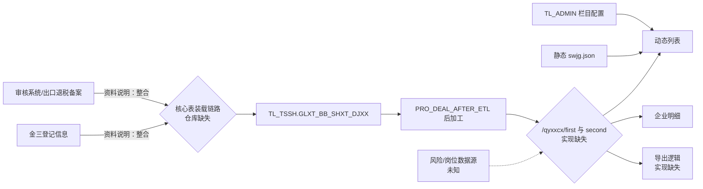

# M_QYXXCX 企业信息一户式查询——系统功能分析整理

> 文档编号：`FUN-M_QYXXCX`
> 当前版本：V0.1（静态资料还原稿）
> 整理日期：2026-09-03
> 代码与资料基线：`main@96902d0ed84ed4f87ba411a77e48032c55f01075`
> 状态：**待业务、开发、DBA、运维和安全联合确认，不能替代最终需求规格或迁移设计**

## 阅读说明

本文依据[《系统改造前业务整理框架》](../../系统改造前业务整理框架.md)组织内容，并使用以下证据标记：

- **[事实]**：可由仓库中的需求资料、页面源码、服务端源码或数据库对象直接证明。
- **[推断]**：由字段名、页面行为及数据库结构交叉推导，尚缺少服务端 SQL、运行数据或业务人员确认。
- **[待确认]**：现有仓库无法回答，迁移设计或验收前必须补证。
- **[建议]**：针对改造提出的建设性方案，不代表现系统已有能力。

## 结论摘要

1. **[事实]** `M_QYXXCX` 是“日常管理 → 企业基本信息查询”下的有效叶子菜单，页面组件为 `qyjcxx`。功能需求最早由二分局于 2019 年提出，目标是把审核系统企业备案信息与金三企业登记信息集中展示、关联比对，并提示欠税、近三年评估稽查、下户核查、函调等风险。
2. **[事实]** 页面包含查询、分页、排序、导出、用户自定义列表列以及企业明细五类能力。明细分为“企业信息、对比信息、风险提示”三块。
3. **[事实]** 功能—数据库关系表只明确登记了一张核心表：`TL_TSSH.GLXT_BB_SHXT_DJXX`（出口企业档案表）。该表有 74 个字段、10 个普通索引，但没有主键、唯一约束或装载时间字段。
4. **[事实]** 已提交的服务端工程中存在公共栏目配置和税务机关树实现，但不存在页面调用的 `/qyxxcx/first`、`/qyxxcx/second`、`/export/qyxx`、`/common/streetTree` 实现。因此查询 SQL、风险来源、数据权限、导出格式和准确字段映射目前均不能被源码闭环证明。
5. **[事实]** 仓库中可见 `PRO_DEAL_AFTER_ETL` 对核心档案表进行 ETL 后加工，但没有找到装载该表的 `INSERT`/`MERGE` 逻辑，也没有找到其生产调度定义。现有资料不足以证明数据来源、刷新频率、延迟、失败补偿和对账机制。
6. **[风险]** 明细直接展示身份证号、电话、地址、银行账号等敏感信息；税务机关下拉树来自静态 JSON，且服务端接口的角色注解被注释。必须通过查询接口的服务端数据范围校验、字段脱敏、导出审计和最小权限测试消除越权风险。
7. **[判断]** 本文已形成可用于访谈、迁移设计和测试设计的静态基线；在补齐服务端查询模块、配置表数据、生产 ETL/调度、数据量及性能基线之前，本功能迁移准备度为“**有条件进入详细设计，不具备直接切换条件**”。

---

## 1. 文档与功能身份

| 项目 | 内容 | 证据状态 |
|---|---|---|
| 功能编号 | `FUN-M_QYXXCX` | 本文建立 |
| 菜单代码 | `M_QYXXCX` | [事实] |
| 功能名称 | 企业信息一户式查询 | [事实] |
| 菜单路径 | `M_ROOT → M_RCGL（日常管理）→ M_JCXXCX（企业基本信息查询）→ M_QYXXCX` | [事实]，关系表中的完整层级 |
| 页面组件 | `qyjcxx`；明细组件 `qyjcxxMx` | [事实] |
| 功能类型 | 查询、明细查看、导出、个人列表偏好配置 | [事实] |
| 原始提出方/年份 | 二分局，2019 年 | [事实]，功能清单 |
| 原关系表服务标识 | `tl-bjts-swgl-cxfw` | [事实] |
| 当前提交的服务工程 | `tl-bjts-sw`，构件版本 `1.2.0` | [事实]；与原服务标识是否为同一部署单元待确认 |
| 业务归口/产品负责人 | 未提供 | [待确认] |
| 开发/测试/运维负责人 | 未提供 | [待确认] |
| 功能启停状态 | 资料中 `ISVALID=1`，页面仍注册 | [事实]；生产实际使用频率待确认 |
| 业务重要度 | 建议暂定“重要查询功能” | [建议]；需结合访问量、使用部门和停机容忍度确认 |

### 1.1 版本记录

| 版本 | 日期 | 变更内容 | 整理人/确认人 |
|---|---|---|---|
| V0.1 | 2026-09-03 | 首次基于仓库资料、前后端源码和 Oracle 对象静态还原 | Codex / 待确认 |

### 1.2 本轮证据边界

本轮已覆盖：功能清单、菜单—角色表、功能—数据库关系表、四套数据字典、四套 Oracle 对象脚本、拆分后的函数/存储过程、前端源码以及已提交服务端源码。

本轮未获得：生产数据库数据、配置表数据导出、生产部署包、网关路由、缺失的查询服务源码、接口报文、运行日志、用户操作录像、作业调度平台配置、外部系统接口文档、历史缺陷及生产性能监控。因此所有与这些证据相关的结论均保留“推断/待确认”标记。

---

## 2. 业务目标、参与者与范围

### 2.1 业务目标

**[事实]** 原始业务诉求是在日常查询中集中呈现出口企业在审核系统中的备案资料和金三系统中的登记资料，减少跨系统切换，并对两侧关键信息不一致及企业风险进行提示。功能清单还说明，在金三数据库并库后，数据来源调整为出口退税备案信息与登记信息的整合。

目标可拆为三层：

1. 企业基础画像：企业身份、组织归属、备案、企业类型、退税计算方法、人员、地址及专项标志。
2. 跨系统核对：信用等级与分类管理类别、两套退税账号、注销与备案撤回、备案与出口退税归类。
3. 风险提醒：欠税、近三年评估稽查、下户核查、函调记录。

### 2.2 参与角色与权限

菜单—角色关系表对本菜单标记了以下角色：

| 角色代码 | 角色含义 | 菜单可见性证据 | 仍需确认 |
|---|---|---|---|
| `SHJZZ` | 省局专责 | [事实] 静态角色表和数据库脚本注释 | 可查询组织范围、敏感字段及导出权限 |
| `SJZZ` | 市局专责 | [事实] 同上 | 本市/下级范围以及跨区查看规则 |
| `XJZZ` | 县局专责 | [事实] 同上 | 本县/下级范围以及导出权限 |
| `XJCX` | 角色中文名在现有资料中未找到 | [事实] 静态角色表标记该代码 | 角色全称、职责、组织范围、是否只读 |

**[事实]** 前端登录后调用 `/auth/getmenu`，只有后端返回字典中存在 `M_QYXXCX` 时菜单才不被隐藏。

**[待确认]** 菜单隐藏只是前端体验，不等同于接口授权；缺失接口实现导致无法证明列表、明细及导出的服务端角色校验与行级数据权限。

### 2.3 触发条件与前置条件

- 用户已登录并建立有效会话。[事实]
- 授权菜单结果包含 `M_QYXXCX`。[事实，前端行为]
- 栏目配置、税务机关树、街道乡镇树服务可用。[事实，页面初始化依赖]
- 企业档案主数据及各风险来源已完成上游同步。[推断；具体作业及新鲜度待确认]

### 2.4 功能范围

**范围内：**

- 按企业身份、组织、类型、状态、备案时间和专项标志组合查询；
- 服务端分页和排序；
- 动态列表列及个人显示偏好；
- 打开单户企业详情；
- 按当前查询条件导出；
- 展示基础信息、对比结果和风险提示。

**明确不在本功能范围：**

- 企业备案、登记、账号或风险数据的维护与审批；
- 风险处置、任务流转或问题闭环；
- 指标计算“一户式查询”等其他同名/近似功能；
- `M_BLQYXXCX`“不良企业信息查询”；
- 上游金三、审核系统或出口退税系统自身的数据修正。

### 2.5 上下游边界

| 边界 | 当前认识 | 状态 |
|---|---|---|
| 上游业务系统 | 审核系统企业备案、金三登记；并库后为出口退税备案和登记信息整合 | [事实] 需求资料；接口/表级来源待确认 |
| 核心查询数据 | `TL_TSSH.GLXT_BB_SHXT_DJXX` | [事实] 功能—数据库关系表 |
| 对比及风险数据 | 部分可由核心表字段推断，审核岗/评估岗和四项风险的来源不明 | [待确认] |
| 栏目配置 | `TL_ADMIN.SYS_CFG_TABLE_COLUMN`、`TL_ADMIN.SYS_CFG_TABLE_USER` | [事实] 公共服务源码 |
| 组织/街道字典 | 税务机关静态 JSON；数据库存在 `TL_ADMIN.DM_SWJG`、`DM_JDXZ` | [事实]；列表和街道接口实际取数 SQL 待确认 |
| 下游 | 页面列表、单户明细、导出文件 | [事实] |

---

## 3. 业务流程与状态

### 3.1 主流程



### 3.2 异常及替代流程

| 场景 | 现有前端表现 | 缺口/要求 |
|---|---|---|
| 栏目配置加载失败 | `tools.info` 显示消息，列表不能正常构建 | 应定义降级默认列及可观测错误码 |
| 组织树/街道树加载失败 | 显示错误消息 | 是否允许保留默认机关继续查询待确认 |
| 查询无数据 | 清空表格后展示空列表 | 应区分“合法空结果”和“上游未同步” |
| 查询接口失败 | 显示后端消息 | 错误码、重试、日志关联号均缺失 |
| 明细接口失败 | 新页签内显示后端消息 | 是否关闭空页签及如何重试待确认 |
| 导出失败 | 隐藏 iframe 提交，现有查询服务实现缺失 | 用户提示、超时、最大行数、审计和重试待确认 |
| 配置保存冲突 | 2 秒防抖后“先更新、无记录再插入” | 并发行为及 MySQL 原子 upsert 方案需设计 |

### 3.3 状态与事务

- 核心业务为只读查询，不存在业务状态流转。[事实]
- 唯一持久化变更是个人列表偏好 `SYS_CFG_TABLE_USER.CS`。[事实]
- 列表与随后打开的明细是否使用同一数据快照没有证据；上游刷新期间可能出现前后不一致。[待确认]
- 导出是否与屏幕列表使用完全相同 SQL、过滤条件、排序及数据权限没有证据。[待确认]

---

## 4. 业务规则清单

| 规则编号 | 规则 | 来源 | 迁移要求/待确认 |
|---|---|---|---|
| `RULE-QYXX-001` | 授权菜单中存在 `M_QYXXCX` 才显示入口 | 前端源码 | 接口端必须独立鉴权，不能依赖菜单隐藏 |
| `RULE-QYXX-002` | 初始及重置后，退税机关为当前用户税务机关 | 前端源码 | 后端须计算“允许组织集合”，拒绝越范围 `swcode` |
| `RULE-QYXX-003` | 页面打开不自动查询，用户点击“查询”后取第一页 | 前端源码 | 保持或经业务确认后变更 |
| `RULE-QYXX-004` | 海关代码、社会信用代码、企业名称前端最大长度分别为 10、21、30 | 前端源码 | 与数据库 32、20、200 不一致，需确定权威长度及历史兼容策略 |
| `RULE-QYXX-005` | 日期接受 `-`、`/`、`.` 分隔或 6/8 位数字，并归一成 `yyyy-MM-dd`；年份 1900—2100 | 公共前端工具 | 当前未校验真实日历日及起止顺序；后端必须严格校验 |
| `RULE-QYXX-006` | 列表页明确剔除 9 个“暂不支持”条件 | 前端源码 | 应下线控件或补齐能力，避免伪功能 |
| `RULE-QYXX-007` | 页面大小允许 20、50、100、500，默认取公共配置 | 前端源码 | 明确最大值，服务端限制恶意超限参数 |
| `RULE-QYXX-008` | 点击可排序列后将 `列代码 + asc/desc` 作为 `orderSql` 发给后端 | 前端源码 | 后端必须按栏目白名单映射，禁止直接拼接 SQL |
| `RULE-QYXX-009` | 列定义由 `tcode=qyxx` 动态加载，非固定列可由用户勾选，2 秒防抖保存 | 前后端源码 | 迁移配置数据；确定默认列和用户偏好继承策略 |
| `RULE-QYXX-010` | 点击企业名称或社会信用代码，以当前行 `nsrdj_no` 打开明细 | 前端源码 | 明细键必须唯一；核心表当前无主键，需先做重复基线 |
| `RULE-QYXX-011` | 当前列表无行时禁止导出 | 前端源码 | 仍需后端最大行数、超时和权限控制 |
| `RULE-QYXX-012` | 导出提交完整 `searchData`，而列表查询会剔除暂不支持字段 | 前端源码 | 可能造成屏幕与导出条件不一致，必须通过契约测试确认并统一 |
| `RULE-QYXX-013` | 详情展示企业信息、跨系统对比、四项风险提示 | 功能清单、前端源码 | 比对算法、空值规则、时间窗口及风险来源均需补证 |
| `RULE-QYXX-014` | 账号一致性涉及审核系统账号与金三出口退税账号 | 功能清单、页面 | 是否忽略空格、前导零、账号掩码及双方均空时的结果待确认 |
| `RULE-QYXX-015` | 注销与备案撤回、备案与金三归类需形成一致性标志 | 功能清单、页面 | 状态码映射、有效日期和双方均无记录的规则待确认 |
| `RULE-QYXX-016` | 风险提示包含欠税、近三年评估稽查、下户核查、函调 | 功能清单、页面 | “三年”滚动/自然年口径、记录有效状态及刷新频率待确认 |
| `RULE-QYXX-017` | 详情存在打印方法，但明细模板中的打印按钮被注释 | 前端源码 | 当前是否允许打印及敏感字段打印策略待确认 |

### 4.1 尚未获得的关键口径

以下内容不得在 MySQL 重写时凭字段名自行决定：

- 企业档案唯一身份是 `CPCODE`、`DJXH_JS`、`NSRDJNO`、`SHXYNO`、`QYHGDM` 还是组合键；
- 名称/代码查询是精确、前缀还是模糊匹配，是否大小写敏感；
- 退税机关选择父节点时是否包含全部下级、虚拟机关如何处理；
- `SQ_DATE` 起止是否闭区间、是否截断时分秒；
- 注销、撤回、归类、账号一致的空值及异常状态规则；
- 风险提示的时间点、数据有效性、去重和“一条即是”规则；
- 屏幕、明细和导出的数据范围及脱敏差异；
- 数据刷新成功但部分上游失败时，页面是展示旧值、空值还是阻断查询。

---

## 5. 页面、输入与输出

### 5.1 可用查询条件

| 页面字段 | 请求字段 | 值域/前端规则 | 候选数据库映射 | 状态 |
|---|---|---|---|---|
| 退税机关 | `swcode` | 树选择；默认当前用户机关 | `GLXT_BB_SHXT_DJXX.SWJGDM` | [推断] SQL缺失 |
| 社会信用代码 | `shxy_no` | 最大 21 | `SHXYNO`（库长 20） | [推断] |
| 企业名称 | `name` | 最大 30 | `NSRMC`（库长 200） | [推断]；匹配方式未知 |
| 海关代码 | `qydm` | 最大 10 | `QYHGDM`（库长 32） | [推断] |
| 街道乡镇 | `jdxz_dm` | 树选择 | `JDXZ_DM` | [推断] |
| 企业类型 | `qylx` | `1`内资生产、`2`外商投资、`3`外贸（工贸）、`9`其他 | `QYLX` | [推断]；代码含义待业务确认 |
| 纳税人类型 | `nsrlb` | `1`一般、`2`小规模、`3`其他 | `NSRLX_JS` | [推断] |
| 退（免）税计算方法 | `js_mode` | `1`免抵退、`2`免退税、`3`免税、`9`其他 | `JSMODE` | [推断] |
| 管理类别 | `gllb` | A/B/C/D | `FLGLCD` | [推断] |
| 企业状态 | `nsrztcode` | `01`—`13`、`99`，页面列出受理至其他 | `NSRZT_JS` | [推断] |
| 预算级次 | `ysjccode` | `10/20/30/40/50` | `YSJCCODE` | [推断] |
| 调库级次 | `tkjc` | `1000`中央100%；`2000`中央75%省25% | **不明确**：`MDJCCODE` 注释为调库级次，`TKJCCODE` 注释为退库级次 | [待确认] 高风险语义冲突 |
| 备案时间起/止 | `sq_dateq` / `sq_datez` | 归一化日期；未校验真实日历日/先后 | `SQ_DATE` | [推断] |
| 外综服标志 | `wzfqy` | `0/1` | `WZFQY` 为 `CHAR(1)`，过程又按 `Y` 判断 | [待确认] 代码值冲突 |
| 是否提供零税率服务 | `ysfw` | `N/Y`；明细标签写成“是否提供税率服务” | `YSFW` | [推断]；文案需统一 |
| 研发机构标志 | `yfjg` | `1`内资、`2`外资 | `YFJG` | [推断] |
| 水电气标志 | `sdqqy` | `0/1` | `SDQQY` | [推断]；库中实际值域待核验 |
| 无纸化标志 | `wzhqy` | `0/1` | `WZHQY` | [推断]；库中实际值域待核验 |

### 5.2 页面展示但列表查询明确不支持的条件

列表查询前端会删除下列参数：

| 页面条件 | 请求字段 | 明细是否展示 | 迁移处置建议 |
|---|---|---|---|
| 审核岗人员 | `shgry` | 是 | 明确数据源后实现，或从页面删除 |
| 调查评估岗人员 | `dcpggry` | 是 | 同上 |
| 信用等级 | `xydj` | 是 | 若实现，确认与 `NSXYDJ_JS` 的映射和代码表 |
| 欠税标志 | `qfbz` | 是 | 明确欠税数据源、时点和金额/状态口径 |
| 下户核查标志 | `xhhc_flag` | 是 | 明确有效记录及组织范围 |
| 评估稽查标志 | `pgjc_flag` | 是 | 明确“三年”口径 |
| 退税账号一致 | `tszh_sfyz` | 是 | 固化标准化和空值规则 |
| 备案撤回与注销一致 | `bzch_sfyz` | 是 | 固化状态映射 |
| 备案与归类一致 | `glyz_flag` | 是 | 固化状态映射 |

**[事实]** `hd_flag` 存在于查询对象，但页面没有相应查询控件，列表查询也未删除它；正常情况下它以空值提交。

**[事实]** 查询对象还保留地址、主管机关、账号、撤回、归类等多个未在页面提供输入的遗留字段。

**[风险]** 导出直接复制完整查询对象，没有执行列表的 9 字段删除逻辑。迁移验收必须验证暂不支持字段非空时，屏幕与导出的结果是否一致。

### 5.3 列表输出

- 列定义不在页面硬编码，而从 `tcode=qyxx` 的配置取得列代码、中文名、宽度、对齐、是否排序、是否固定及显示偏好。[事实]
- 仓库只有配置表结构，没有 `qyxx` 的配置数据，因此无法静态恢复完整列清单、顺序、固定列和默认显示列。[待确认]
- 功能清单及页面截图可证明列表至少包含海关代码、纳税人登记号、社会信用代码、企业名称、登记序号、地址、主管/退税机关、企业类型、纳税人类型等，但截图不能替代生产配置导出。[事实/限制]
- 页大小为 20/50/100/500；返回体被 jqGrid 消费，推断包含 `rows` 和分页元数据，但准确 JSON 契约缺失。[推断]

### 5.4 明细输出及候选映射

| 分组 | 页面字段 | 候选来源/算法 | 可信度 |
|---|---|---|---|
| 企业信息 | 企业名称、海关代码、社会信用代码 | `NSRMC`、`QYHGDM`、`SHXYNO` | 高，但服务 SQL 缺失 |
| 企业信息 | 主管税务所、退税机关 | `ZGSWSKFJ_DM`、`SWJGDM` 联查组织名称 | 中 |
| 企业信息 | 备案时间、企业类型、纳税人类型、企业状态、计算方法 | `SQ_DATE`、`QYLX`、`NSRLX_JS`、`NSRZT_JS`、`JSMODE` | 高 |
| 企业信息 | 预算级次、调库级次 | `YSJCCODE`；调库候选为 `MDJCCODE`，也可能错误使用 `TKJCCODE` | 低/待确认 |
| 企业信息 | 零税率服务、外综服、水电气、研发机构、无纸化 | `YSFW`、`WZFQY`、`SDQQY`、`YFJG`、`WZHQY` | 高 |
| 企业信息 | 办税人员 1/2 姓名、身份证、电话 | `BSY*`、`BSY2*` | 高；敏感信息 |
| 企业信息 | 注册/经营地址 | `ADDRESS_ZC`、`ADDRESS_JY` | 高；敏感信息 |
| 企业信息 | 审核岗、调查评估岗 | 核心表无直接字段 | 低/待确认 |
| 对比信息 | 信用等级、管理类别 | `NSXYDJ_JS`、`FLGLCD` | 中 |
| 对比信息 | 审核系统退税账号、金三退税账号、是否一致 | `ACCNO`、`ACCNO_JS` 及计算标志 | 中；算法待确认 |
| 对比信息 | 备案撤回、金三注销、是否一致 | 候选 `ZX_FLAG`、`NSRZT_JS` 及计算标志 | 中低 |
| 对比信息 | 金三是否归类、备案与归类一致 | 候选 `SFCKQY_JS` 与审核系统备案状态 | 中低 |
| 风险提示 | 欠税、近三年评估稽查、下户核查、函调 | 核心表无四个同名字段；可能实时/联表计算 | 低/待确认 |

### 5.5 页面交互缺陷候选

1. 明细跳转以 `self.tableData.rows[rowid-1]` 取记录，且读取了未使用的 `taxpayerCode` 单元格；排序/分页或 jqGrid 行号不连续时需验证是否可能打开错户。[事实 + 待复现]
2. 日期工具允许诸如 `2026-02-31` 的格式值，也不校验开始日期小于等于结束日期。[事实]
3. 明细组件实现 `printForm`，但明细模板中的打印按钮已注释；父组件的打印区域与实际打开新页签的流程不一致。[事实]
4. `tcode=qyxx` 同时被“汇总报表任务列表”和“虚拟税务机关任务列表”使用，可能造成列配置相互影响。[事实；是否有意复用待确认]

---

## 6. 数据结构、血缘与一致性

### 6.1 核心实体

| 实体/对象 | Schema | 用途 | 操作 | 依据 |
|---|---|---|---|---|
| `GLXT_BB_SHXT_DJXX` | `TL_TSSH` | 出口企业档案、基础画像及部分跨系统字段 | R；上游过程 U | 功能—数据库关系表、DDL、过程 |
| `SYS_CFG_TABLE_COLUMN` | `TL_ADMIN` | 动态列表列定义 | R | 公共服务源码 |
| `SYS_CFG_TABLE_USER` | `TL_ADMIN` | 用户对可选列的个人偏好，`CS` 为逗号分隔列代码 | R/C/U | 公共服务源码 |
| `DM_SWJG` | `TL_ADMIN` | 税务机关代码字典 | 候选 R | DDL；本页面实际树来自静态 JSON |
| `DM_JDXZ` | `TL_ADMIN` | 街道乡镇代码字典 | 候选 R | DDL；街道接口实现缺失 |
| `swjg.json` | 服务端资源 | `/export/readtree` 的静态税务机关树 | R | 服务端源码 |
| 风险、岗位来源对象 | 未知 | 四项风险及审核/评估岗 | R | [待确认] |

### 6.2 核心表结构特征

`TL_TSSH.GLXT_BB_SHXT_DJXX` 的迁移相关特征如下：

- 74 个字段，类型包括 `VARCHAR2`、`CHAR`、`DATE`、`NUMBER`。[事实]
- 无主键、唯一约束、外键和装载/更新时间字段。[事实]
- 10 个普通索引：`BAJC_YEAR`、`CPCODE`、`DJXH_JS`、`FRDB_ZJHM`、`ADDRESS_JY`、`NSRDJNO`、`QYHGDM`、`SHXYNO`、`SWJGDM`、`ZGSWJGDM`。[事实]
- `DJXH_JS NUMBER(21)`、`NSRDZDAH NUMBER(20)` 超过有符号 `BIGINT` 的安全十进制位数，应按实际最大值评估使用 `DECIMAL(21,0)`/`DECIMAL(20,0)`。[建议]
- 身份证号、电话、地址、银行账号均保存在该表，属于需要重点保护的个人/敏感数据。[事实]

### 6.3 数据血缘



**[事实]** `PRO_DEAL_AFTER_ETL` 包含对一个特定 `CPCODE` 的备案日期硬编码修正，并根据外综服、计算方法、应税服务等条件多次更新 `BAJC_YEAR`；各段包含显式 `COMMIT` 和 `WHEN OTHERS` 日志处理。

**[事实]** 在已提交 SQL 和拆分过程内没有检索到向 `GLXT_BB_SHXT_DJXX` 装载数据的 `INSERT` 或 `MERGE`，也没有检索到 `DBMS_JOB`/`DBMS_SCHEDULER` 创建定义。

**[待确认]** 这不证明生产环境没有装载或调度，只证明本仓库证据不完整。必须取得实际 ETL 脚本、调度平台导出、上下游表映射、运行日历、失败补偿和最近运行日志。

### 6.4 唯一性与明细定位

页面以 `nsrdj_no` 请求单户明细，但核心表没有唯一约束。迁移前必须分别核查 `NSRDJNO`、`SHXYNO`、`QYHGDM`、`CPCODE`、`DJXH_JS` 以及业务认可的组合键重复情况，并回答：

- 一个企业是否可能有多条历史档案、多个海关代码或多个登记序号；
- 重复时列表如何去重、明细选择哪条、导出是否保留全部；
- `SHXYNO` 为空时是否回退 `NSRDJNO`；
- 注销后重开、组织划转和备案撤回是否产生新记录；
- MySQL 是否新增技术主键，同时保留业务唯一规则。

配套脚本[《M_QYXXCX迁移前基线核验_Oracle.sql》](./M_QYXXCX迁移前基线核验_Oracle.sql)提供了不输出企业明细值的聚合核查。

### 6.5 配置数据一致性

- `SYS_CFG_TABLE_COLUMN` 主键为 `(T_CODE,T_C_CODE)`；`SYS_CFG_TABLE_USER` 主键为 `(USER_ID,T_CODE)`。[事实]
- Java 实体 `SysCfgTableColumn` 没有 DDL 中的 `DEGREE`、`D_CONFIG` 属性，而前端会读取 `degree`。[事实] 需确认生产服务版本是否不同，或该字段在当前接口中一直为空。
- `SYS_CFG_TABLE_USER.CS` 使用逗号分隔字段代码，不具备外键完整性。[事实] 迁移时需清理已删除列、重复列、未知列并保留原顺序。
- 三个页面共用 `tcode=qyxx`。[事实] 应确认共享是需求还是代码复制错误，再决定是否拆分配置键。

---

## 7. 接口、文件与消息

### 7.1 页面直接依赖的接口

| 接口 | 方法 | 主要入参 | 页面期望的成功数据 | 服务端证据 | 改造关注点 |
|---|---|---|---|---|---|
| `/auth/getmenu` | POST | `czry_dm` | `data:[{code,name}]` | 当前服务工程无实现 | 菜单权限、接口权限不可混同；参数不应允许冒用用户 |
| `/cxfw/basis/columprofile` | POST | `tcode=qyxx` | `data.profiles`、`data.select` | 有公共实现 | 角色为 `czy`；配置数据和字段缺失需补齐 |
| `/cxfw/basis/columprofile/update` | POST | `tcode`、逗号分隔 `cs` | `code=0` | 有公共实现 | 校验列白名单、长度、并发 upsert、审计 |
| `/cxfw/export/readtree` | POST | 页面传 `nodeType=3` | `{code,msg,data:树}` | 有公共实现，忽略入参并读取静态 `swjg.json` | 静态树含 122 节点并出现历史机关名称；需版本化、按用户裁剪或改为权威字典 |
| `/cxfw/common/streetTree` | POST | 空对象 | `data:树` | **缺失** | 字典来源、有效标志、组织过滤、缓存刷新 |
| `/cxfw/qyxxcx/first` | POST | 查询对象、`pageNo/pageSize/orderSql` | jqGrid 分页结构 | **缺失** | SQL、字段映射、过滤、排序白名单、数据权限、超时 |
| `/cxfw/qyxxcx/second` | POST | `nsrdj_no`、固定分页参数 | `{qyxx,dbxx,fxts}` | **缺失** | 唯一性、敏感字段、比对及风险算法、越权访问 |
| `/cxfw/export/qyxx` | POST form | `data=JSON` | 下载文件 | **缺失** | 屏幕一致性、格式/文件名、最大行数、审计、公式注入、超时 |

说明：服务端 Controller 的类级路径为 `/basis`、`/export`，页面使用 `/cxfw` 前缀；其网关或上下文路径配置不在本功能证据中。[待确认]

### 7.2 返回码与异常

前端仅把字符串 `"0"` 视为成功，其余显示 `res.msg`；网络失败则将错误对象交给通用提示。[事实] 以下契约尚缺失：

- HTTP 状态码与业务码的对应关系；
- 未登录、无菜单权限、无数据权限的标准返回；
- 参数非法、日期非法、排序字段非法、页大小超限的错误码；
- 上游数据未就绪与正常空结果的区分；
- 请求/日志关联号及面向用户与运维的消息分层；
- 导出失败时 iframe 如何向页面传递错误。

### 7.3 文件、消息与外部接口

- 本功能直接输出一个下载文件，但格式、编码、模板、列范围、文件名、最大行数和敏感字段策略均因服务端实现缺失而未知。[待确认]
- 未发现本功能直接发送或消费 MQ 消息。[静态检索结论]
- 上游跨系统数据如何进入核心表属于 ETL/数据集成边界，不能据现有材料认定为实时接口。[待确认]

---

## 8. 批处理、报表与人工操作

### 8.1 批处理

| 项目 | 当前结论 | 必补资料 |
|---|---|---|
| 页面内批处理 | 无，页面为查询/导出 | 不适用 |
| 核心表主装载 | 逻辑未提交 | 作业名、脚本、源表、全量/增量、调度时间、依赖、SLA |
| ETL 后加工 | 可见 `TL_TSSH.PRO_DEAL_AFTER_ETL` 对核心表更新 | 调用方、运行顺序、频次、重跑规则、提交边界、日志告警 |
| 其他加工 | `PRO_DEAL_JCFX_NSR_BLV` 等过程也更新核心表部分分析字段 | 是否影响本页面字段、先后关系和并发窗口 |
| 失败补偿 | 未知 | 回滚/续跑点、幂等键、人工补数流程、对账报告 |

### 8.2 导出报表

导出属于本功能输出，但不是经过审批的正式统计报表。[推断] 需要确认：

- 只导出屏幕显示列，还是导出配置中的全部列；
- 是否按当前排序导出、是否导出全部分页结果；
- 暂不支持条件是否参与导出；
- 最大行数、同步/异步方式、超时和文件保留时间；
- 身份证、手机号、地址、账号是否脱敏，谁可导出明文；
- 防止 Excel/CSV 公式注入及字符集乱码的规则；
- 导出操作日志至少记录用户、组织、时间、过滤摘要、行数、结果及文件标识，不记录完整敏感值。

### 8.3 人工操作

现有资料没有描述日常补数、对账、纠错或数据异常工单流程。[待确认] 应在迁移前记录数据管理员发现异常、定位上游、审批修正、重跑、复核和留痕的完整路径，尤其要替代过程中的硬编码单户修正。

---

## 9. 实现资产清单与可追溯关系

### 9.1 需求及结构资料

| 证据编号 | 资产 | 对本功能的证明 |
|---|---|---|
| `EVD-QYXX-001` | [《说明.txt》](../说明.txt) | 仓库目录与资料用途 |
| `EVD-QYXX-002` | [《便捷退税税务端功能清单.docx》](../便捷退税税务端功能清单.docx) | 需求来源、目标、基础/对比/风险信息范围 |
| `EVD-QYXX-003` | [《20240905便捷退税局端功能与数据库对应关系.xlsx》](../20240905便捷退税局端功能与数据库对应关系.xlsx) | 菜单层级、有效叶子、原服务标识、核心表关系（第 9 数据行） |
| `EVD-QYXX-004` | [《20241025局端菜单结构及对应角色.xlsx》](../20241025局端菜单结构及对应角色.xlsx) | `SHJZZ/SJZZ/XJZZ/XJCX` 的菜单关系（第 9 数据行） |
| `EVD-QYXX-005` | [《tl_tssh.xlsx》](../tl_tssh.xlsx) | 核心表数据字典 |
| `EVD-QYXX-006` | [《tl_admin.xlsx》](../tl_admin.xlsx) | 组织、街道和栏目配置数据字典 |
| `EVD-QYXX-007` | [《tl_tssh_object20260810.sql》](../tl_tssh_object20260810.sql) | 核心表 DDL、索引、候选视图和过程全集 |
| `EVD-QYXX-008` | [《tl_admin_object20260804.sql》](../tl_admin_object20260804.sql) | 配置表、组织/街道字典 DDL |

### 9.2 前端资产

| 资产 | 关键位置/用途 |
|---|---|
| [`src/client/src/app.js`](../src/client/src/app.js) | 37—49 行菜单注册；908—961 行授权菜单过滤 |
| [`qyjcxx.js`](<../src/client/src/page/数据查询/企业信息查询/qyjcxx.js>) | 查询对象、动态列、分页排序、条件剔除、树、导出和重置 |
| [`qyjcxx.html`](<../src/client/src/page/数据查询/企业信息查询/qyjcxx.html>) | 查询控件、枚举、暂不支持标记、页面操作 |
| [`qyjcxxMx.js`](<../src/client/src/page/数据查询/企业信息查询/qyjcxxMx.js>) | 以 `nsrdj_no` 获取明细 |
| [`qyjcxxMx.html`](<../src/client/src/page/数据查询/企业信息查询/qyjcxxMx.html>) | 企业信息、对比信息、风险提示字段 |
| [`static/js/tools.js`](../src/client/static/js/tools.js) | 日期归一化及 `/cxfw/export/readtree` 缓存调用 |
| [`static/js/api.js`](../src/client/static/js/api.js) | `/auth/getmenu` 定义 |
| [`package.json`](../src/client/package.json) | 前端 `0.9.6`、Avalon/webpack 时代依赖信息 |

### 9.3 服务端及数据库资产

| 资产 | 关键位置/用途 |
|---|---|
| [`AppBaseController.java`](../src/server/tl-bjts-sw/src/main/java/com/tl/bjts/sw/controller/AppBaseController.java) | 栏目读取和个人偏好保存 |
| [`BasisService.java`](../src/server/tl-bjts-sw/src/main/java/com/tl/bjts/sw/service/BasisService.java) | `TL_ADMIN` 配置表访问、更新后插入逻辑 |
| [`SysCfgTableColumn.java`](../src/server/tl-bjts-sw/src/main/java/com/tl/bjts/sw/model/domain/SysCfgTableColumn.java) | 列配置实体；与 DDL 字段不完全一致 |
| [`ExportController.java`](../src/server/tl-bjts-sw/src/main/java/com/tl/bjts/sw/controller/ExportController.java) | 静态税务机关树读取，角色注解被注释 |
| [`swjg.json`](../src/server/tl-bjts-sw/src/main/resources/template/swjg.json) | 122 节点税务机关静态树 |
| [`pom.xml`](../src/server/tl-bjts-sw/pom.xml) | 服务构件 `1.2.0`、Oracle `ojdbc14 10.2.0.4.0` |
| [`PRO_DEAL_AFTER_ETL.sql`](../tl_tssh/PRO_DEAL_AFTER_ETL.sql) | 核心表 ETL 后加工、硬编码修正及多次提交 |
| [`PRO_DEAL_JCFX_NSR_BLV.sql`](../tl_tssh/PRO_DEAL_JCFX_NSR_BLV.sql) | 核心表其他分析字段加工 |

### 9.4 需求—实现—数据—测试追踪

| 需求编号 | 需求 | 页面/接口 | 数据对象 | 验收用例 |
|---|---|---|---|---|
| `REQ-QYXX-001` | 组合查询企业档案 | `qyjcxx`、`first` | `GLXT_BB_SHXT_DJXX` | `TC-01`—`TC-08` |
| `REQ-QYXX-002` | 单户基础信息 | `qyjcxxMx`、`second` | 核心表+字典/岗位源 | `TC-09`—`TC-11` |
| `REQ-QYXX-003` | 跨系统对比 | `second` | 账号、备案、登记字段 | `TC-12`—`TC-14` |
| `REQ-QYXX-004` | 风险提示 | `second` | 风险源未知 | `TC-15` |
| `REQ-QYXX-005` | 自定义列表 | `columprofile*` | 两张 `SYS_CFG_TABLE_*` | `TC-16` |
| `REQ-QYXX-006` | 导出 | `export/qyxx` | 与列表同源（待证） | `TC-17`—`TC-18` |
| `REQ-QYXX-007` | 组织和菜单权限 | `auth/getmenu`、所有业务接口 | 角色/组织权限对象未知 | `TC-19`—`TC-21` |

---

## 10. Oracle → MySQL 改造影响

| 主题 | Oracle 现状/风险 | MySQL 改造要求 |
|---|---|---|
| Schema | 跨 `TL_TSSH`、`TL_ADMIN` 访问 | 明确实例/库/schema 映射、账号权限和全限定名；禁止靠默认 schema 偶然解析 |
| 字符类型 | `VARCHAR2`、大量 `CHAR(1)`；Oracle 空字符串等同 `NULL`，`CHAR` 有填充语义 | 逐字段定义空值、空串和尾随空格规则；迁移前后对代码值分布做对账 |
| 日期 | Oracle `DATE` 同时含日期和时间 | `SQ_DATE/ZX_DATE` 等按业务选择 `DATE` 或 `DATETIME`；明确时区、闭区间和时分秒处理 |
| 大整数 | `NUMBER(21)`、`NUMBER(20)` 可能超过 `BIGINT` | 先查最大值；默认用相应 `DECIMAL(p,0)`，避免截断和 Java 精度损失 |
| 数值 | `NUMBER(18,2)`、`NUMBER(10,6)` | 保持精度和舍入规则；做边界值、负数、空值对账 |
| 主键 | 核心表无主键，明细却按 `NSRDJNO` 定位 | 先确认业务唯一性；建议新增稳定技术键及经批准的业务唯一约束，不可直接假定 `NSRDJNO` 唯一 |
| 分页 | 服务端 SQL 缺失；Oracle 常见 `ROWNUM`/PageHelper 行为 | 使用确定性 `ORDER BY`；排序键不唯一时追加稳定键，验证每页无丢失/重复 |
| 动态排序 | 前端提交 `orderSql` 文本 | 改为字段代码+方向枚举，后端白名单映射列名，严禁文本直拼 |
| 模糊查询 | 名称/地址列较长且索引策略未知 | 明确精确/前缀/包含匹配及排序规则；按真实 SQL 和选择度设计组合索引，避免盲目照搬 10 个单列索引 |
| 字符集/排序规则 | SQL 注释存在历史编码痕迹；身份代码对大小写敏感性未知 | 统一 `utf8mb4`；业务代码列选二进制/大小写敏感排序规则；验证中文、全半角及特殊字符 |
| Oracle 函数 | 候选视图/过程使用 `NVL`、`TRUNC`、`SUBSTR`、`LENGTH`、日期字面量等 | 按实际依赖逐项替换为 `COALESCE`、日期函数等并建立真值表测试；当前不能证明页面使用候选视图 |
| PL/SQL | `PRO_DEAL_AFTER_ETL` 有异常块、游标语义、多次 `COMMIT`、硬编码修正 | 决定迁移为 MySQL 过程还是应用/调度任务；重构成幂等分段、明确事务边界和失败状态，硬编码转受控修正规则 |
| 配置 upsert | 服务端先 `UPDATE`，0 行再 `INSERT` | 使用事务或 `INSERT ... ON DUPLICATE KEY UPDATE`；保留 `(USER_ID,T_CODE)` 唯一性并处理并发 |
| 字段模型漂移 | 配置 DDL 有 `DEGREE/D_CONFIG`，Java 实体没有；前端读取 `degree` | 以生产报文和部署版本定真，统一 DDL、实体、Mapper、接口模型和前端契约 |
| 代码值冲突 | 页面 `WZFQY=0/1`，过程按 `Y` 判断；`tkjc` 与 `TKJCCODE/MDJCCODE` 语义冲突 | 对现存值做分布统计，由业务确认规范码；迁移转换须可追踪、可回放 |
| 静态组织树 | 资源文件固定 122 节点，含历史机关名称，且接口未按用户裁剪 | 接入权威组织字典并按用户授权范围返回；定义缓存失效和组织变更生效机制 |
| 数据新鲜度 | 核心表无装载时间，装载作业与调度缺失 | 增加批次号、源业务日期、装载开始/结束时间、成功状态和对账指标；页面展示数据截至时间 |
| 敏感数据 | 明细可能展示身份证、电话、地址、账号；导出实现缺失 | 数据分级、字段级授权、屏幕/导出脱敏、加密、传输保护、审计、保留与销毁策略 |
| 驱动/框架 | 服务工程仍声明老旧 `ojdbc14`；查询服务源码可能在其他模块 | 先找齐真实部署 BOM，再选 MySQL 驱动和兼容框架；不能只改 JDBC URL |

### 10.1 索引设计输入

在获得真实 SQL 和数据量前不应机械创建索引。至少收集：

- 各查询字段非空率、基数、热点值及组合使用频率；
- `SWJGDM` 是否展开下级组织、常用时间范围；
- 名称/代码匹配方式；
- 默认及常用排序字段；
- 页面大小 500 和全量导出的执行计划、逻辑读、返回行数、p50/p95/p99；
- 明细键重复情况及核心表写入/刷新窗口。

建议候选方向是“组织范围 + 高选择性身份字段/备案日期 + 稳定键”的复合索引，但最终必须通过生产脱敏统计和 `EXPLAIN ANALYZE` 验证。

### 10.2 数据迁移和双轨校验

1. 冻结并版本化字段映射、枚举码、空值规则、时间规则、比对算法及风险口径。
2. 在 Oracle 执行配套聚合基线脚本，记录批次、SCN/时间点、行数、重复、空值、枚举、孤儿字典及配置。
3. 全量迁移后按相同口径在 MySQL 对账；差异必须关联到批准的转换规则。
4. 增量期间按装载批次对账，并抽取经脱敏的黄金企业样本覆盖正常、注销、撤回、账号不一致、各风险组合和跨组织场景。
5. 同一输入同时调用 Oracle/MySQL 版本，比较总数、分页集合、明细字段、对比标志、风险标志和导出集合。
6. 切换前验证回退点、增量追平、缓存清理、栏目偏好迁移、静态/权威字典版本及审计链路。

---

## 11. 非功能基线

### 11.1 当前缺失项

| 维度 | 当前证据 | 迁移前必须形成的基线 |
|---|---|---|
| 数据量 | 无生产数据 | 总行数、日增量、组织分布、活跃/历史数据量、表/索引大小 |
| 使用量 | 无访问日志 | 日活用户、日查询/明细/导出次数、峰值 QPS、并发数、热点条件 |
| 性能 | 无监控/慢 SQL | 列表/明细/导出 p50/p95/p99、超时率、扫描行数、执行计划 |
| 可用性 | 未给出 SLA | 可用时间、维护窗口、允许中断、降级策略 |
| RTO/RPO | 未给出 | 数据库、应用、配置和导出链路分别确认 |
| 数据时效 | 无批次/更新时间 | 上游业务日期、计划完成时间、最大可接受延迟、页面提示 |
| 容量 | 无导出上限 | 最大筛选结果、同步导出上限、异步阈值、文件保留期 |
| 安全 | 只有部分角色/菜单证据 | 行级范围、字段级权限、脱敏、导出审批/审计、渗透测试 |
| 可观测性 | 过程有日志表但体系未知 | 请求 ID、接口指标、SQL 指标、ETL 批次、对账、告警和处置手册 |

### 11.2 建议验收原则

- 功能等价以批准后的业务口径和黄金样本为准，不以“页面能打开”为准。
- 性能目标以迁移前同等数据量、同等条件的基线为参照；具体允许变化比例由业务与运维签字，不在证据不足时虚设数值。
- 所有越权参数修改都应由服务端拒绝或收敛到授权范围，返回结果、总数和导出均不得泄露越权信息。
- 页面应展示或可追溯到数据批次/截至时间；ETL 未完成或部分失败时不能静默展示为最新数据。
- 敏感字段在日志、异常、下载文件名和监控标签中不得出现明文。

---

## 12. 测试场景与验收条件

| 用例 | 场景 | 关键期望 |
|---|---|---|
| `TC-01` | 首次进入/点击重置 | 不自动查询；退税机关恢复当前用户机关；其他条件和街道清空 |
| `TC-02` | 分别按社会信用代码、海关代码、企业名称查询 | 匹配方式符合确认口径；Oracle/MySQL 结果集合一致 |
| `TC-03` | 企业类型、纳税人类型、计算方法、管理类别、状态组合 | 所有代码与中文含义正确，无 `0/1`、`Y/N` 转换偏差 |
| `TC-04` | 税务机关父/子节点与街道筛选 | 下级展开规则正确，且不超过用户授权范围 |
| `TC-05` | 合法备案日期、边界日、跨年范围 | 闭区间和时分秒规则一致 |
| `TC-06` | `2026-02-31`、起日大于止日、非法字符 | 前后端均拒绝，不进入数据库查询 |
| `TC-07` | 长度等于/超过 UI 限制及数据库限制 | 统一按批准长度处理，历史长值可查询方案明确 |
| `TC-08` | 无条件、空结果、最大页大小 500 | 限流/上限有效；空结果不与上游失败混淆 |
| `TC-09` | 列表分页和多列排序 | 翻页无重复/丢失；相同排序值有稳定次序；非法排序字段被拒绝 |
| `TC-10` | 点击名称/信用代码打开明细 | 始终打开所点击企业，不受行号、分页、排序影响 |
| `TC-11` | `NSRDJNO` 重复、为空、历史多档案 | 按批准唯一规则返回或明确提示，不随机取一条 |
| `TC-12` | 账号双方相同、不同、单边空、双方空、空格/前导零 | 一致标志符合规则，屏幕和导出一致 |
| `TC-13` | 备案撤回与金三注销各状态组合 | 状态映射、日期条件和一致标志正确 |
| `TC-14` | 备案与金三归类各状态组合 | 空值和异常状态处理正确 |
| `TC-15` | 四项风险的有/无、过期、无效和重复记录 | “近三年”窗口及有效性正确，批次时间可追溯 |
| `TC-16` | 配置显示列、快速连续勾选、首次保存、并发保存 | 2 秒后保存最终选择；无重复键；重新登录仍保持；其他页面不被误改 |
| `TC-17` | 相同条件查询后导出 | 行集合、过滤、排序、组织范围与批准规则一致；暂不支持字段不产生差异 |
| `TC-18` | 大数据量/特殊字符/以 `=+-@` 开头内容导出 | 超限处理清晰，无公式注入、乱码、截断，失败可见可重试 |
| `TC-19` | 四类授权角色及无角色用户 | 菜单、列表、明细、导出、栏目保存分别按授权矩阵执行 |
| `TC-20` | 篡改 `swcode`、`nsrdj_no`、`pageSize`、`orderSql` | 服务端拒绝/收敛越权或非法值，不能依赖前端校验 |
| `TC-21` | 省/市/县用户跨组织查询与静态树历史节点 | 树、总数、结果、明细和导出范围一致；失效机关不可误选 |
| `TC-22` | 敏感字段查看、导出、打印、日志 | 按字段权限脱敏；所有访问与导出留痕；日志不含明文 |
| `TC-23` | ETL 正常、延迟、部分失败、重跑 | 数据批次可识别；重跑幂等；页面不会把残缺数据当最新数据 |
| `TC-24` | Oracle/MySQL 双轨黄金样本 | 基础字段、比对标志、风险标志、总数、分页和导出差异均为零或有批准解释 |

### 12.1 迁移验收证据包

验收时至少归档：

- 已签字的字段/码值/比对/风险/组织范围规则；
- Oracle 与 MySQL 同批次聚合基线结果及差异说明；
- 脱敏黄金样本清单、自动比对结果和人工复核记录；
- 关键 SQL 的执行计划及同负载性能报告；
- 权限篡改、敏感字段、导出安全测试证据；
- ETL 正常/失败/重跑、监控告警和回退演练记录；
- 缺陷清单全部关闭或形成经批准的遗留风险。

---

## 13. 问题、风险、假设与决策台账

### 13.1 待解决问题与风险

| 编号 | 级别 | 问题/风险 | 影响 | 建议责任方 | 关闭条件 |
|---|---|---|---|---|---|
| `ISS-QYXX-001` | P0 | 三个核心接口及导出实现不在仓库 | 无法确认 SQL、权限、字段及算法 | 开发/配置管理 | 提交与生产版本一致的源码、依赖及接口测试 |
| `ISS-QYXX-002` | P0 | 核心表主装载和调度缺失 | 无法迁移数据链路或保证时效 | 数据开发/运维 | 血缘、脚本、调度、SLA、重跑、对账闭环 |
| `ISS-QYXX-003` | P0 | 核心表无主键，明细按 `NSRDJNO` 定位 | 错户、分页漂移、增量同步困难 | 业务/DBA/开发 | 唯一性基线完成并批准目标键设计 |
| `ISS-QYXX-004` | P0 | 行级组织权限和明细/导出授权无法证明 | 数据越权和敏感信息泄露 | 安全/开发 | 服务端鉴权实现、权限矩阵及篡改测试通过 |
| `ISS-QYXX-005` | P0 | 风险和岗位数据源、算法缺失 | 核心业务价值无法等价迁移 | 业务/开发/数据 | 规则、SQL、源表、时间口径及样例签字 |
| `ISS-QYXX-006` | P1 | `tkjc` 与 `TKJCCODE/MDJCCODE` 含义冲突 | 筛选和明细可能错误 | 业务/数据 | 权威字段和代码值确认、样本验证 |
| `ISS-QYXX-007` | P1 | `WZFQY` 页面用 0/1，过程用 Y | 查询漏数或迁移转换错误 | 业务/数据 | 实际值分布、规范码及兼容规则确认 |
| `ISS-QYXX-008` | P1 | 9 个暂不支持条件仍展示，导出参数处理不同 | 用户误解、结果不一致 | 产品/开发 | 删除或实现；列表/导出契约一致 |
| `ISS-QYXX-009` | P1 | 静态组织树且接口角色注解被注释 | 过期组织及潜在越权入口 | 开发/安全/数据 | 权威树、按人裁剪、缓存更新和授权测试 |
| `ISS-QYXX-010` | P1 | 生产 `qyxx` 栏目配置数据未提供 | 无法恢复准确列表和导出列 | DBA/配置管理 | 导出配置、使用量及迁移映射 |
| `ISS-QYXX-011` | P1 | 同一 `tcode=qyxx` 被三个页面复用 | 用户配置跨功能污染 | 产品/开发 | 确认意图；必要时拆键并迁移偏好 |
| `ISS-QYXX-012` | P1 | Java 列配置实体缺 `DEGREE/D_CONFIG` | 数值格式/默认列可能漂移 | 开发 | 生产报文定真并统一模型 |
| `ISS-QYXX-013` | P1 | 日期只做粗粒度前端校验 | 非法日期、反向区间及数据库差异 | 开发 | 前后端严格校验用例通过 |
| `ISS-QYXX-014` | P1 | 敏感字段明文展示/导出策略未知 | 合规、安全、审计风险 | 安全/业务 | 完成数据分级、字段权限、脱敏和审计设计 |
| `ISS-QYXX-015` | P1 | 缺少数据量、访问量、性能与 SLA | 无法设计索引、容量和切换窗口 | 运维/DBA | 基线报告和批准的非功能指标 |
| `ISS-QYXX-016` | P1 | ETL 后过程包含单户硬编码修正和多次提交 | 重跑、回滚及审计困难 | 数据开发/业务 | 修正规则外部化，任务幂等且可回放 |
| `ISS-QYXX-017` | P2 | 角色 `XJCX` 中文名/职责缺失 | 权限矩阵不完整 | 权限管理员 | 角色目录和授权边界确认 |
| `ISS-QYXX-018` | P2 | 原关系表服务名与当前服务工程名不同 | 可能分析了非生产版本 | 配置管理/开发 | 部署拓扑、Git 标签、制品校验和路由确认 |
| `ISS-QYXX-019` | P2 | 明细打印入口不一致 | 功能回归或敏感信息打印风险 | 产品/开发 | 明确保留/下线及权限策略 |

### 13.2 当前假设

| 假设编号 | 假设 | 使用范围 | 验证方式 |
|---|---|---|---|
| `ASM-QYXX-001` | 功能—数据库关系表中的核心表仍是生产主查询来源 | 本文数据分析 | 获取生产 SQL/SQL Trace 和部署源码 |
| `ASM-QYXX-002` | `/cxfw` 是网关或应用上下文前缀 | 接口资产整理 | 获取网关路由和部署配置 |
| `ASM-QYXX-003` | 列表与导出业务上应使用同一数据范围和过滤口径 | 验收设计 | 业务签字并做结果集合比对 |
| `ASM-QYXX-004` | 核心表字段名相近即为页面字段候选映射 | 第 5 节候选映射 | 用 Mapper/SQL、接口报文和样本逐字段确认 |

### 13.3 待决策事项

当前没有证据表明以下方案已经正式决定：

1. 核心表是否保留宽表模式，还是拆分主档、来源快照、比对结果和风险快照；
2. 比对/风险在查询时实时计算，还是随数据批次预计算并保存规则版本；
3. 税务机关树改为数据库/统一权限服务，还是继续静态文件；
4. 个人栏目偏好是否原样迁移，三个共用 `tcode` 是否拆分；
5. 大数据导出改为异步任务，还是保留同步下载；
6. 屏幕、导出和打印各自的敏感字段权限与脱敏级别；
7. 无主键核心表的技术主键、业务唯一键和历史记录模型。

建议在详细设计评审形成 `DEC-QYXX-*` 决策记录，包含选项、理由、影响、批准人和生效版本。

---

## 14. 业务确认提纲与完成定义

### 14.1 访谈顺序

1. **业务人员**：逐项确认功能目标、18 个可用条件、9 个暂不支持条件、明细字段、四组比对/风险口径及导出需求。
2. **权限管理员/安全**：确认四角色、组织数据范围、敏感字段、导出/打印和审计。
3. **原开发人员**：补齐查询/明细/导出/街道接口源码、SQL、网关路由、生产版本和已知缺陷。
4. **数据开发/DBA**：补齐核心表主装载、过程调用链、调度、数据量、唯一性、码值、索引和历史修正。
5. **运维/测试**：补齐运行量、性能、SLA、告警、故障、黄金样本和回归资产。

### 14.2 必问问题

- 该功能当前哪些部门每天使用，最常用的三个查询组合是什么？
- 企业“一户”的权威唯一标识和多档案处理规则是什么？
- 省、市、县及 `XJCX` 用户分别能看哪些机关、哪些字段、能否导出？
- 9 个“暂不支持”条件是从未实现、已停用，还是依赖接口失效？改造后保留吗？
- “调库级次”对应 `MDJCCODE` 还是 `TKJCCODE`？`WZFQY` 的权威码是 0/1 还是 Y/N？
- 账号、注销/撤回、备案/归类的一致性真值表是什么？
- 四项风险分别来自什么表/系统，近三年如何计算，何时刷新，数据缺失如何展示？
- 核心表由哪个作业装载，何时完成，如何判定当天完整，失败如何补跑和告警？
- 导出包含哪些列与多少行，是否允许身份证、手机号、地址、账号明文？
- 生产可接受的查询、明细、导出响应时间以及数据延迟、RTO、RPO 是多少？

### 14.3 文档完成定义（DoD）

本 V0.1 当前仅完成静态证据整理。以下全部满足后方可标记“已确认”：

- [ ] 业务负责人确认范围、流程、18 个条件、输出、码值及异常规则；
- [ ] 账号/注销/归类比对和四项风险真值表签字；
- [ ] 四角色、组织范围、字段级权限、导出/打印策略签字；
- [ ] 查询、明细、导出、街道、权限服务源码与生产制品版本闭环；
- [ ] 核心表主装载、全部相关过程、调度、重跑和对账链路闭环；
- [ ] 生产 `qyxx` 栏目配置与用户偏好完成清洗和迁移方案；
- [ ] Oracle 聚合基线、脱敏黄金样本及性能基线归档；
- [ ] MySQL 字段/索引/事务/批处理/安全设计评审通过；
- [ ] 第 12 节功能、权限、数据、性能、批处理和回退测试全部通过；
- [ ] 第 13 节 P0/P1 问题关闭，或由有权负责人书面接受风险。

---

## 附录 A：页面请求对象（静态还原）

以下仅用于接口补证和契约测试，值为脱敏示例，不代表服务端已支持全部字段：

```json
{
  "swcode": "授权范围内税务机关代码",
  "shxy_no": "",
  "qydm": "",
  "name": "",
  "jdxz_dm": "",
  "qylx": "",
  "nsrlb": "",
  "nsrztcode": "",
  "js_mode": "",
  "gllb": "",
  "ysjccode": "",
  "tkjc": "",
  "sq_dateq": "2026-01-01",
  "sq_datez": "2026-01-31",
  "ysfw": "",
  "wzfqy": "",
  "wzhqy": "",
  "sdqqy": "",
  "yfjg": "",
  "orderSql": "经白名单确认的列代码 asc",
  "pageSize": 20,
  "pageNo": 1
}
```

`shgry`、`dcpggry`、`xydj`、`qfbz`、`xhhc_flag`、`pgjc_flag`、`tszh_sfyz`、`bzch_sfyz`、`glyz_flag` 在列表请求前被删除；不得仅凭前端对象存在而认定服务端支持。

## 附录 B：本轮静态检索结论

- 已提交服务端工程中对 `qyxxcx/first`、`qyxxcx/second`、`export/qyxx`、`common/streetTree` 的全文检索结果为零。
- 已提交数据库脚本中未找到对 `GLXT_BB_SHXT_DJXX` 的 `INSERT INTO` 或 `MERGE INTO`；能找到多个查询和更新引用。
- 已提交数据库脚本中未找到 `DBMS_JOB`、`DBMS_SCHEDULER` 或 `CREATE JOB` 调度创建语句。
- 上述均为“仓库中未发现”，不能外推为生产环境不存在。
