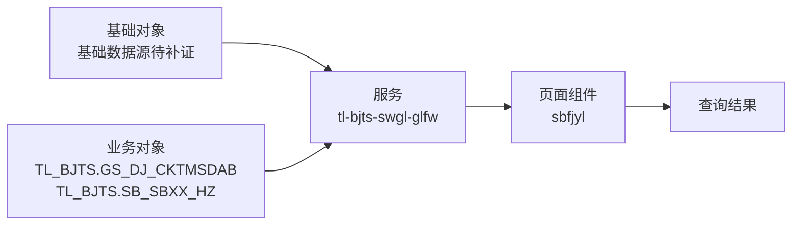

# M_SBFJDY 申报附件调阅——系统功能分析整理

> 文档编号：`FUN-M_SBFJDY`
> 当前版本：V0.1（静态资料还原稿）
> 整理日期：2026-09-03
> 代码与资料基线：`main@9648d427f49f4aa0d6faef8ec78f3959cb5dc3ee`
> 状态：**静态分析基线；运行口径、数据权限及缺失服务实现仍需业务、开发和数据平台主管确认**

---

## 功能简述

1. **[事实]** `M_SBFJDY` 是“审核管理 → 申报附件调阅”路径下的有效叶子菜单，前端页面组件为 `sbfjyl`。需求资料说明：原便捷退税申报系统，企业通过申报批次附送的附件，采用两种途径调阅，一种是在审核助手中在审核过程中的调阅，审核结束以后或审核过程中还可以通过本模块进行调阅。 新电局上线以后，企业通过新电局或单一窗口申报提交的附件，目前在税务端缺附件调阅功能。因此，根据二分局领导意见： 在中天易税云平台数字化单证备案模块提供退税申报批次附件上传的功能，经该模块上传的附件由便捷退税税务端接收以后依旧可以在审核助手或便捷退税税务端申报附件调阅模块进行调阅。

---

## 1. 文档与功能身份

| 项目 | 内容 | 证据状态 |
|---|---|---|
| 功能编号 | `FUN-M_SBFJDY` | 本文建立 |
| 菜单代码 | `M_SBFJDY` | [事实] |
| 功能名称 | 申报附件调阅 | [事实] |
| 菜单路径 | `M_ROOT → M_SHGL → M_SBFJDY` | [事实]，菜单结构表 |
| 页面入口 | 前端页面组件为 `sbfjyl` | [事实]，`app.js` |
| 功能类型 | 查询 | [事实]，页面源码与需求资料 |
| 需求来源/年份 | 2019年二分局提交第一版便捷退税局端需求。 | [事实/待确认] |
| 原关系表服务标识 | `tl-bjts-swgl-glfw` | [事实]，功能—数据库关系表 |
| 授权角色 | `XJZZ`、`SJZZ`、`SHJZZ` | [事实]，菜单—角色关系表 |
| 菜单状态 | `ISVALID=1`、`CHILDFLAG=0` | [事实]，有效且无下级菜单 |

---

## 2. 业务规则清单

| 规则编号 | 规则 | 来源 | 改造要求/待确认 |
|---|---|---|---|
| `RULE-SBFJDY-001` | 授权菜单包含 `M_SBFJDY` 时才应显示并允许打开该功能 | 菜单表、`app.js` | 服务端接口必须独立鉴权，不能只依赖前端隐藏 |
| `RULE-SBFJDY-002` | 页面提供“税务机关、企业标识、申报业务种类、所属期、上传日期、附件状态”等输入或筛选项 | 页面模板 | 后端需实施类型、长度、必填、日期区间及数据范围校验 |
| `RULE-SBFJDY-003` | 页面以当前登录用户税务机关初始化组织范围 | 前端源码 | 服务端须根据会话重算允许组织集合，拒绝越权机关代码 |
| `RULE-SBFJDY-004` | 页面可见操作包括“申报附件调阅、查询” | 页面模板 | 逐项确认角色、状态前置条件、并发控制和审计要求 |
| `RULE-SBFJDY-005` | 列表查询使用 `pageNo/pageSize` 或 jqGrid 分页事件 | 前端源码 | 统一页码基数、最大页大小、总数和空页返回约定 |
| `RULE-SBFJDY-006` | 页面会把列名与排序方向写入 `orderSql` 或排序参数 | 前端源码 | 服务端必须使用字段白名单映射，禁止直接拼接 SQL |
| `RULE-SBFJDY-007` | 组件初始化过程中会触发首次查询 | 前端源码 | 确认默认条件、默认数据范围及首屏性能基线 |
| `RULE-SBFJDY-008` | 原便捷退税申报系统，企业通过申报批次附送的附件，采用两种途径调阅，一种是在审核助手中在审核过程中的调阅，审核结束以后或审核过程中还可以通过本模块进行调阅。 新电局上线以后，企业通过新电局或单一窗口申报提交的附件，目前在税务端缺附件调阅功能。因此，根据二分局领导意见： 在中天易税云平台数字化单证备案模块提供退税申报批次附件上传的功能，经该模块上传的附件由便捷退税税务端接收以后依旧可以在审核助手或便捷退税税务端申报附件调阅模块进行调阅。 | 功能清单 | 作为业务验收口径；歧义项由业务部门确认 |
| `RULE-SBFJDY-009` | 前端以字符串业务码 `"0"` 判定成功，失败时展示 `res.msg` | 前端源码 | 统一 HTTP 状态、业务码、错误信息和请求关联号 |

---

## 3. 数据结构、血缘与一致性

### 3.1 核心实体

| 实体/对象 | Schema | 用途 | 操作 | 依据 |
|---|---|---|---|---|
| `GS_DJ_CKTMSDAB` | `TL_BJTS` | 功能业务数据 | R | 功能—数据库关系表/页面源码 |
| `SB_SBXX_HZ` | `TL_BJTS` | 功能业务数据 | R | 功能—数据库关系表/页面源码 |
| `DOC_FILEINFO` | `TL_BJTS` | 功能业务数据 | R | 功能—数据库关系表/页面源码 |

### 3.2 核心表结构特征

- **[事实]** `TL_BJTS.GS_DJ_CKTMSDAB` 在本仓库 Oracle 对象脚本中定义为表，共 87 个字段，有主键，检出 8 个索引（其中 1 个唯一索引）。
- **[事实]** `TL_BJTS.SB_SBXX_HZ` 在本仓库 Oracle 对象脚本中定义为表，共 38 个字段，有主键，检出 3 个索引（其中 0 个唯一索引）。
- **[事实]** `TL_BJTS.DOC_FILEINFO` 在本仓库 Oracle 对象脚本中定义为表，共 23 个字段，有主键，检出 4 个索引（其中 1 个唯一索引）。

### 3.3 数据血缘

**[事实]** 功能—数据库关系表登记的基础对象为 `未登记`，业务对象为 `TL_BJTS.GS_DJ_CKTMSDAB+TL_BJTS.SB_SBXX_HZ+TL_BJTS.DOC_FILEINFO`。
**[事实]** 页面及直接关联组件共识别 6 个接口/外部入口，其中 5 个可与当前提交的 `tl-bjts-sw` Controller 路由静态匹配；其余实现可能位于未提交服务、网关或外部系统。
**[待确认]** 静态匹配不等同于生产调用闭环，仍需核对网关前缀、实际 SQL、数据权限、刷新作业、异常补偿和对账机制。

---

## 4. 接口、文件与消息

### 4.1 页面直接依赖的接口

| 接口 | 方法 | 用途 | 服务端证据 | 改造关注点 |
|---|---|---|---|---|
| `/auth/preLogin` | POST | 获取登录用户信息 | [`LoginController.java`](../src/server/tl-bjts-sw/src/main/java/com/tl/bjts/sw/controller/LoginController.java) | 校验参数、分页/排序白名单、行级权限、超时和空结果契约 |
| `/cxfw/export/readtree` | POST | 加载税务机关树 | [`ExportController.java`](../src/server/tl-bjts-sw/src/main/java/com/tl/bjts/sw/controller/ExportController.java) | 校验可见范围、字典有效性、缓存刷新和参数白名单 |
| `/bjtssw/sbxx/list` | POST | 申报信息(附件预览)查询 | [`SbxxController.java`](../src/server/tl-bjts-sw/src/main/java/com/tl/bjts/sw/controller/SbxxController.java) | 校验参数、分页/排序白名单、行级权限、超时和空结果契约 |
| `/bjtssw/sbxx/doc/list` | POST | 申报信息(附件预览)查询 - 附件列表 | [`SbxxController.java`](../src/server/tl-bjts-sw/src/main/java/com/tl/bjts/sw/controller/SbxxController.java) | 校验参数、分页/排序白名单、行级权限、超时和空结果契约 |
| `/bjtssw/sbxx/doc/view` | POST | 申报信息(附件预览)查询 - 附件预览 | [`SbxxController.java`](../src/server/tl-bjts-sw/src/main/java/com/tl/bjts/sw/controller/SbxxController.java) | 校验参数、分页/排序白名单、行级权限、超时和空结果契约 |
| `/auth/getmenu` | POST | 登录后取得授权菜单 | **当前服务工程未检出匹配路由** | 校验可见范围、字典有效性、缓存刷新和参数白名单 |

### 4.2 返回码与异常

前端调用主要以字符串业务码 `"0"` 作为成功条件，非成功结果通常展示 `res.msg`，网络失败交由通用提示处理。[事实]

以下接口契约仍需统一确认：

- HTTP 状态码与业务码的对应关系，以及未登录、无菜单权限、无数据权限的标准返回；
- 参数非法、页大小超限、排序字段非法、重复提交和并发修改的错误码；
- 正常空结果与上游数据未就绪、部分数据失败之间的区分；
- 请求关联号、用户提示、运维日志及敏感信息过滤规则。

### 4.3 文件、消息与外部接口

- 主页面及直接关联组件未检出明确的文件导入、导出或下载端点。[静态检索结论]
- 未发现该页面直接发送或消费 MQ 消息；若服务端通过异步作业生成数据或文件，需补充调度与消息链路证据。[静态检索结论/待确认]

---

## 5. 实现资产清单与可追溯关系

### 5.1 前端资产

| 资产 | 关键位置/用途 |
|---|---|
| [`app.js`](../src/client/src/app.js) | 263 行菜单注册、页面组件/外部地址及授权过滤 |
| [`sbfjyl.js`](<../src/client/src/page/数据查询/申报信息查询/sbfjyl.js>) | `sbfjyl` 主组件、查询状态、表格与操作逻辑 |
| [`sbfjyl.html`](<../src/client/src/page/数据查询/申报信息查询/sbfjyl.html>) | 页面输入、按钮、列表及弹窗结构 |
| [`static/js/api.js`](../src/client/static/js/api.js) | 公共 API 方法与端点定义 |

### 5.2 服务端及数据库资产

| 资产 | 关键位置/用途 |
|---|---|
| [`LoginController.java`](../src/server/tl-bjts-sw/src/main/java/com/tl/bjts/sw/controller/LoginController.java) | 页面端点在当前服务工程中的 Controller 路由 |
| [`ExportController.java`](../src/server/tl-bjts-sw/src/main/java/com/tl/bjts/sw/controller/ExportController.java) | 页面端点在当前服务工程中的 Controller 路由 |
| [`SbxxController.java`](../src/server/tl-bjts-sw/src/main/java/com/tl/bjts/sw/controller/SbxxController.java) | 页面端点在当前服务工程中的 Controller 路由 |
| 服务标识 `tl-bjts-swgl-glfw` | 功能—数据库关系表登记的原部署/服务边界；与当前提交工程是否一致需确认 |
| [`tl_bjts_object20260804.sql`](../tl_bjts_object20260804.sql) | `TL_BJTS` 对象定义、约束与索引核验 |
| [`PROC_XXBD_WZF_TSSB_ZZSFP.sql`](<../tl_bjts/PROC_XXBD_WZF_TSSB_ZZSFP.sql>) | 静态引用 `GS_DJ_CKTMSDAB` 的过程/函数 |
| [`PROC_XXBD_JSB.sql`](<../tl_bjts/PROC_XXBD_JSB.sql>) | 静态引用 `GS_DJ_CKTMSDAB` 的过程/函数 |
| [`PROC_XXBD_GJ_ZZSFP.sql`](<../tl_bjts/PROC_XXBD_GJ_ZZSFP.sql>) | 静态引用 `GS_DJ_CKTMSDAB` 的过程/函数 |
| [`PROC_XXBD_MTS_TSJH_ZZSFP.sql`](<../tl_bjts/PROC_XXBD_MTS_TSJH_ZZSFP.sql>) | 静态引用 `GS_DJ_CKTMSDAB` 的过程/函数 |
| [`PROC_XXBD_TSZM_CKHWZNXZM.sql`](<../tl_bjts/PROC_XXBD_TSZM_CKHWZNXZM.sql>) | 静态引用 `GS_DJ_CKTMSDAB` 的过程/函数 |

### 5.3 需求—实现—数据—测试追踪

| 需求编号 | 需求 | 页面/接口 | 数据对象 | 验收用例 |
|---|---|---|---|---|
| `REQ-SBFJDY-001` | 授权用户可从菜单路径打开功能 | `M_SBFJDY`、`sbfjyl` | 菜单/角色配置 | `TC-01` 菜单可见性与接口越权校验 |
| `REQ-SBFJDY-002` | 申报附件调阅、查询 | `/bjtssw/sbxx/list` | `TL_BJTS.GS_DJ_CKTMSDAB、TL_BJTS.SB_SBXX_HZ、TL_BJTS.DOC_FILEINFO` | `TC-02` 正常、空结果及边界条件 |
| `REQ-SBFJDY-003` | 查询条件、列表字段和业务口径一致 | 主组件及直接接口 | `TL_BJTS.GS_DJ_CKTMSDAB、TL_BJTS.SB_SBXX_HZ、TL_BJTS.DOC_FILEINFO` | `TC-03` 字段映射、分页排序及数据范围 |
| `REQ-SBFJDY-004` | 角色与税务机关数据范围受控 | `/auth/getmenu`、全部业务接口 | 权限对象待补证 | `TC-04` 横向/纵向越权与敏感字段校验 |
