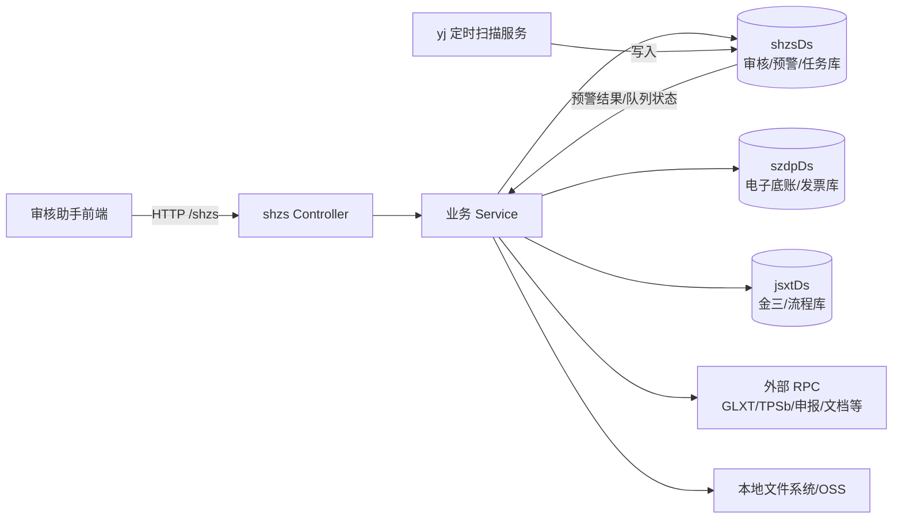
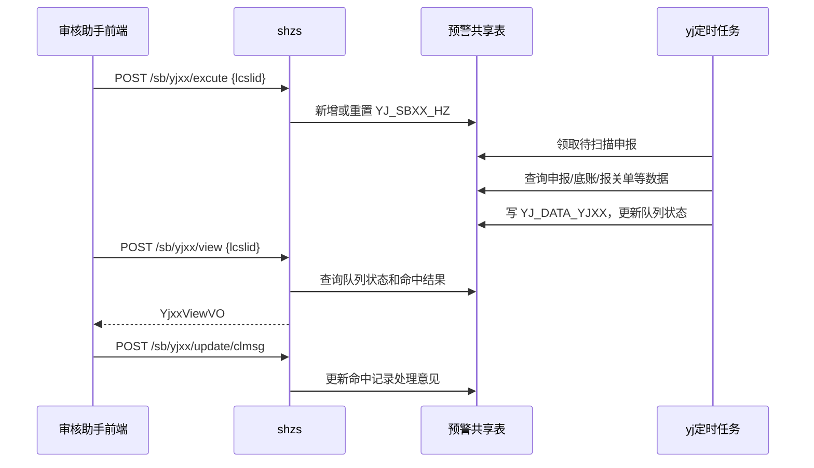

# shzs 审核助手服务分析

> 分析对象：`bjts/src/task/shzs/tl-web-bjts-shzs`<br>
> 源码基线：`main` 分支提交 `be5f1eb5498a739034058487abe3cac830f35d8d`<br>
> 分析日期：2026-09-05<br>
> 分析口径：以 Controller、Service、Mapper XML、配置和领域对象的静态调用链为准；接口中的数据库对象列出主路径涉及的核心表、视图、函数或过程，不把每个字典关联表重复展开。外部 RPC 的服务端表不在本源码包内，无法据此确认。

## 1. 结论摘要

`shzs` 是审核助手前端的后端聚合服务，主要承担登录与会话、申报任务查询、申报详情、疑点/预警查看、明细穿透、人工介入、审核任务创建、待办委派和文件下载等能力。它并不是单一数据库上的普通 CRUD 服务，而是同时编排本地审核库、便捷退税/金三库、电子底账库、文档服务及多个外部 RPC 服务。

本次从源码确认到：

- 15 个带路由的业务 Controller，共 70 条显式业务路由；无映射的 `TLBaseController` 只是分页/导出辅助类，不计入。源码中没有 Swagger/OpenAPI 定义。
- 应用默认端口为 `8081`，业务上下文为 `/shzs`，因此下文路径均以 `/shzs` 开头。
- 默认配置了 `shzsDs`、`szdpDs`、`jsxtDs` 三类数据源；部分 SQL 还通过同义词或跨库对象访问 `HX_*`、`TL_ADMIN`、`ZJ_BJTS`、`ZJ_MH`、`TL_TSSH` 等 schema。
- 业务响应通常包装为 `SimpleResult<T>`，分页响应通常为 `PageInfo`；文件导出/下载接口直接写 HTTP 响应，不使用统一包装。
- 路由中既有明确的 `POST`，也有大量仅使用 `@RequestMapping`、未限制 HTTP 方法的接口。本文将后者标为 `ANY`。
- 预警展示、处理意见和重新触发扫描都直接使用 `yj` 服务的数据表，但扫描计算由独立的 `yj` 定时任务完成。
- 发现数个应优先治理的问题：匿名申报文件下载缺少归属校验、管理端点匿名暴露、动态排序/条件拼接存在 SQL 注入面、登录日志可能记录口令，以及测试环境全路径匿名等。
- 源码中的生成器和 Druid 开发配置含固定明文凭据；应视为已暴露秘密进行轮换和历史治理，本文不复述具体值。

## 2. 服务边界与调用关系



### 2.1 部署与基础配置

| 项目 | 源码结论 |
|---|---|
| Maven 坐标/版本 | `tl-bjts-shzs:1.0.0` |
| 应用名 | `bjts.shzs` |
| 默认端口 | `8081` |
| Servlet 上下文 | `/shzs` |
| 管理上下文 | `/app` |
| 主要数据源 | `shzsDs`、`szdpDs`、`jsxtDs` |
| 会话与权限 | Apache Shiro；业务代码从当前 Subject/Session 取得操作员和税务机关信息 |
| 文件能力 | 文档元数据、外部 OSS/文档服务、申报 XML 临时文件、Excel 导出 |

### 2.2 通用输入输出约定

除特别说明外，请求体为 JSON，响应为：

```json
{
  "code": 0,
  "msg": "结果说明",
  "data": "实际返回对象、数组或空值"
}
```

`SimpleResult<T>` 的字段为 `code`（整数）、`msg`、`data`；默认成功值为 `0 / Success`。源码中不少 Service 以返回错误码而不是抛出 HTTP 异常的方式表示失败，因此调用方不能只根据 HTTP 200 判断业务成功，必须同时检查 `code`。

业务列表实际使用公共依赖中的 `com.tl.common.ext.model.PageInfo`，分页结果主要包含：

| 字段 | 含义 |
|---|---|
| `page` | 当前页；部分接口内部存在从 0/1 起算转换，详见风险项 |
| `records` | 总记录数（`int`）；源码注释说明前端以此字段接收总数 |
| `count` | 总记录数（`long`），与 `records` 重复表达 |
| `total` | 总页数，而不是总记录数 |
| `rows` | 当前页数据 |
| `sumData` | 部分申报明细接口附带的金额/数量合计 |

源码内置结果码如下；全局异常处理通常仍返回上述 JSON 包装，未显式转换 HTTP 状态：

| code | 含义 | code | 含义 |
|---:|---|---:|---|
| `0` | 成功 | `400` | 未授权 |
| `401` | 未登录 | `501` | 服务不可用 |
| `801` | 数据异常 | `802` | 金三中不存在用户 |
| `803` | 客户端版本过低 | `1001` | 参数错误 |
| `1002` | 权限异常 | `1003` | 请求过于频繁 |
| `1004` | 请求失败 | `1005` | 记录不存在 |
| `2001` | 用户不存在或口令错误 | `3001` | 流程异常 |
| `3002` | 不支持该联动明细业务 | `3003` | 报关单不存在 |
| `3004` | 发票不存在 | `3005` | 申报 ID 与企业业务不匹配 |
| `7001` | 业务异常 | `7002` | 查询结果过多 |
| `7003` | 数据库错误 | `7004` | 无自动委派岗位权限 |
| `9001` | 未知错误 |  |  |

### 2.3 鉴权边界

生产配置中，`/login`、`/download/**`、`/update/**`、`/template/**`、`/app/**`、`/jolokia/**`、`/druid/**` 及部分静态资源为匿名访问，其余业务路径落入 Shiro `authc`。测试配置存在 `/** = anon`，即所有路由均匿名。

需要特别注意：

- `/sys/version` 不在生产匿名白名单内，生产环境需要登录后调用。
- `/download/sbfile` 在匿名白名单内，并且实现中没有执行同类登录下载接口的“当前用户是否为申报人”检查。
- `/app/**`、`/jolokia/**`、`/druid/**` 属框架或运维接口，不计入下述 70 条业务接口；其实际子端点取决于运行时依赖和环境配置，应在部署态另做暴露面扫描。
- Druid Servlet 仅由 `dev` Profile 注册，并另设来源与登录限制；但 Shiro 对它放行，且登录凭据硬编码在源码中，不能把开发 Profile 或单层内置登录当作生产安全边界。

## 3. 接口总览

| 模块 | Controller | 路由数 | 主要职责 |
|---|---|---:|---|
| 系统/模板/升级 | `AppSysController`、`TemplateController`、`MyUpdateController` | 3 | 版本和升级元数据 |
| 登录会话 | `LoginController` | 3 | 登录、退出、当前用户 |
| 申报文件 | `FileController`、`DownloadController` | 4 | 附件、申报 XML 查看与下载 |
| 外部反馈 | `SbWbController` | 2 | 回写申报状态和失败原因 |
| 疑点 | `SbYdxxController` | 2 | 疑点查看和导出 |
| 预警 | `SbYjxxViewController` | 5 | 预警字典、结果、触发和处理意见 |
| 流程受理 | `SbLcslController` | 3 | 流程绑定、申报状态校验 |
| 联动联评/单证 | `SbLdlpController` | 5 | 联动联评、发票、报关单穿透 |
| 退税额异常 | `SbTseYcController` | 2 | 异常保存和判定信息 |
| 审核主业务 | `ShzsBizController` | 19 | 待办、详情、明细、人工介入、规则等 |
| 稽查协同 | `InspectController` | 12 | 稽查任务查询、创建、释放和授权 |
| 待办委派 | `DbwpController` | 10 | 委派统计、明细、人员、提交和日志 |
| **合计** | **15 个业务 Controller** | **70** |  |

## 4. 全量接口清单

### 4.1 系统、模板与升级（1—3）

| # | 方法与路径 | 接口名称及功能 | 输入 | 输出 | 主要表/依赖 |
|---:|---|---|---|---|---|
| 1 | `ANY /shzs/sys/version` | 服务版本查询。返回当前后端版本，供客户端兼容性判断。 | 无 | `SimpleResult<VersionVo>`；`data.version` | 无业务表，读取应用版本配置 |
| 2 | `ANY /shzs/template/ver` | 模板版本占位接口。当前实现直接返回成功，没有实际版本数据。 | 无 | 空 `SimpleResult` | 无 |
| 3 | `ANY /shzs/update/ver` | 客户端升级清单查询。读取升级配置并生成文件地址。 | 无 | `SimpleResult<List<UpdateVo>>`；元素含 `md5`、`fileSize`、`fileName`、`fileType`、`url` | 升级 ini/文件配置，无业务表 |

### 4.2 登录与会话（4—6）

| # | 方法与路径 | 接口名称及功能 | 输入 | 输出 | 主要表/依赖 |
|---:|---|---|---|---|---|
| 4 | `ANY /shzs/login` | 用户登录。校验客户端版本，查询/同步本地操作员，必要时修改初始密码，完成 Shiro 登录并建立会话。 | `LoginDTO`，关键字段：`czryDm`、`password`、`shzsVersion` | `SimpleResult<Map>`；登录成功后返回与 #6 相同的当前用户信息 | `DM_CZRY`；金三用户查询服务；Shiro Realm/Session |
| 5 | `ANY /shzs/logout` | 用户退出并停止当前会话。 | 无 | 空 `SimpleResult` | Shiro Session |
| 6 | `ANY /shzs/user/info` | 获取当前登录用户、所属机关和权限信息。 | 无；身份来自会话 | `SimpleResult<Map>`；`data` 含 `czryDm`、`czrymc`、`description`、`swjgMc`、`swjgDm`、`lxdh`、`fpglxxs` | 会话中的用户资料；登录阶段来自 `DM_CZRY`/金三用户服务 |

### 4.3 申报文件与附件（7—10）

| # | 方法与路径 | 接口名称及功能 | 输入 | 输出 | 主要表/依赖 |
|---:|---|---|---|---|---|
| 7 | `ANY /shzs/sb/file/view` | 按流程受理 ID 查询申报附件列表；先解析申报 ID，再汇总文档元数据。 | JSON：`lcslid` | `FjxxViewVo`：`total`、`sbid`、`fjxxs[]` | `SB_SBXX_HZ`；回退查询 `HX_CKTS.CKTS_TY_YWBLXX`、`HX_DJ.DJ_NSRXX`；`DOC_FILEINFO`、`DOC_FILEINFO_KZ` |
| 8 | `ANY /shzs/sb/file/download` | 获取某个附件的下载信息，并结合申报/纳税人信息补全文件访问参数。 | JSON：`fileId` | `FjxxVo`：`id`、`clbz`、`fmCode`、`title`、`fileSize`、`fileUrl`、`note` | `DOC_FILEINFO`、`DOC_FILEINFO_KZ`、`SB_SBXX_HZ`、`GS_DJ_CKTMSDAB`；外部 OSS/文档服务 |
| 9 | `ANY /shzs/sb/sbfile/download` | 登录态生成申报 XML 下载文件。校验当前用户是该申报的提交人，并累计提取次数/时间。 | JSON：`sbid` | `SbfileVo`：`sbid`、`fileSize`、`fileUrl`、`note`、`fileName`、`sbFile`；最后一项是服务端 `File` 对象，不应对外序列化 | `SB_SBXX_HZ`；外部申报服务；本地文件系统 |
| 10 | `ANY /shzs/download/sbfile?sbid=...` | 直接下载申报 XML 二进制文件。该路径在匿名白名单中。 | Query：`sbid` | `application/octet-stream` 文件流 | `SB_SBXX_HZ`；外部申报服务；本地文件系统 |

### 4.4 外部反馈（11—12）

| # | 方法与路径 | 接口名称及功能 | 输入 | 输出 | 主要表/依赖 |
|---:|---|---|---|---|---|
| 11 | `POST /shzs/sb/wb` | 接收外部系统审核反馈，写回申报状态和反馈内容；特定状态同步生成待办数据。 | `FkxxWbVO`：`sbid`、`lcslid`、`sbztDm`、`content` | 空 `SimpleResult` | `SB_SBXX_HZ`、`TB_DTBSJ` |
| 12 | `POST /shzs/sb/wb/sbyy` | 写回申报失败原因。 | JSON：`sbid`、`sbyy` | 空 `SimpleResult` | `SB_SBXX_HZ` |

### 4.5 疑点信息（13—14）

| # | 方法与路径 | 接口名称及功能 | 输入 | 输出 | 主要表/依赖 |
|---:|---|---|---|---|---|
| 13 | `POST /shzs/sb/ydxx/view` | 按流程受理 ID 查询申报疑点，依据业务类型路由到对应疑点过程表。 | `SbidVo`：`lcslid` | Map：`ydxxs`；元素字段包括 `id`、`errObj`、`errLev`、`ydcode`、`passFlag`、`glywb1`、`glywb2`、`errMsg`、`glb` | 流程/申报映射；`HX_CKTS.CKTS_BL_MDT_SHYD_GCB`、`CKTS_BL_MTS_SHYD_GCB`、`CKTS_BL_DB_SHYD_GCB`、`CKTS_BL_ZB_SHYD_GCB` 中的一类 |
| 14 | `ANY /shzs/sb/ydxx/excelExport?lcslid=...` | 将疑点结果导出为旧版 XLS。 | Query：`lcslid` | Excel 文件流；列与疑点查看内容对应 | 与 #13 相同 |

### 4.6 预警信息（15—19）

| # | 方法与路径 | 接口名称及功能 | 输入 | 输出 | 主要表/依赖 |
|---:|---|---|---|---|---|
| 15 | `POST /shzs/sb/yjxx/yjzb` | 查询预警类型及其指标树，供前端筛选。Controller 接收但不使用请求数据。 | 可为空；传入 `data` 也被忽略 | `List<YjzbcxVo>`：`yjcode`、`yjname`、`yjobject`、`yjlx`、`yjzb[] {zbcode,zbname}` | `YJ_DIC_CODE`、`YJ_DIC_YJZB` |
| 16 | `ANY /shzs/sb/yjxx/excelExport?sbid=...` | 按申报 ID 导出预警明细 XLS。 | Query：`sbid` | Excel 文件流 | `YJ_DATA_YJXX`、`YJ_SBXX_HZ`、`YJ_DIC_YJZB`、`GS_DJ` |
| 17 | `POST /shzs/sb/yjxx/view` | 查询某流程对应的预警总览和命中明细。 | JSON：`lcslid` | `YjxxViewVO`：`total`、`sbid`、`yjclose`、`status`、`yjxxs[]` | `YJ_SBXX_HZ`、`YJ_DATA_YJXX`、`YJ_DIC_CODE`、`SYS_CFG_SBDR_FILEMODE`；主流程映射 |
| 18 | `POST /shzs/sb/yjxx/excute` | 手工触发/重置预警扫描。已有队列记录会重置扫描次数和锁状态；没有则创建队列记录。注意源码路径拼写为 `excute`。 | JSON：`lcslid` | 空 `SimpleResult` | `YJ_SBXX_HZ`、`SYS_SEQUENCE`、`GS_DJ`、流程映射、Redis；后续由 `yj` 定时任务消费 |
| 19 | `POST /shzs/sb/yjxx/update/clmsg` | 批量保存预警处理意见。服务端根据 `lcslid` 重新解析 `sbid`，请求中的 `sbid` 实际不作为可信依据。 | `YjxxClmsgDTO`：`lcslid`、`sbid`、`ids[]`、`clMsg` | 空 `SimpleResult` | `YJ_DATA_YJXX`、流程映射 |

`YjxxViewVO.yjxxs[]` 的主要字段为：`id`、`yjType`、`yjTypeName`、`yjRecord`、`yjMsg`、`zbcode`、`yjAmt`、`yjTax`、`ldlpQnt`、`clDate`、`clMsg`、`yjObject`、`swjgFw`。

其中 `status` 对外返回中文状态 `等待扫描`、`正在扫描` 或 `扫描完成`；`yjclose=1` 表示当前税务机关关闭预警展示，`0` 表示开放。底层任务的 `20/OK/YJ` 不原样返回给前端。

### 4.7 流程受理与申报校验（20—22）

| # | 方法与路径 | 接口名称及功能 | 输入 | 输出 | 主要表/依赖 |
|---:|---|---|---|---|---|
| 20 | `POST /shzs/sb/lcsl/wb` | 回写流程受理与申报的绑定关系，并登记操作人/企业海关代码等信息。 | 原始 JSON：`lcslid`、`sbid`（源码按 `Double` 接收）、`qyhgdm`、`lcswsxdm` | 空 `SimpleResult` | `SB_SBXX_HZ`、`GS_DJ`、`DM_GT3_XML_CONFIG` |
| 21 | `POST /shzs/sb/lcsl/getsbid` | 根据流程受理 ID 取得申报 ID。源码已标为废弃，保留兼容。 | JSON：`lcslid` | Map：`sbid` | `SB_SBXX_HZ`、`GS_DJ`；流程服务回退查询 |
| 22 | `POST /shzs/sb/lcsl/check` | 校验申报是否存在、是否可进入当前审核流程；必要时调用便捷退税状态跟踪并同步状态/待办。 | JSON：`sbid`；当前实现按字符串读取 | 成功空结果；失败时 `data` 可为 `SbztVo {sbzt}`，同时返回业务错误码/消息 | `SB_SBXX_HZ`、`GS_DJ`、`TB_DTBSJ`；外部 `TPSbService.stateTracking` |

### 4.8 联动联评、发票与报关单穿透（23—27）

| # | 方法与路径 | 接口名称及功能 | 输入 | 输出 | 主要表/依赖 |
|---:|---|---|---|---|---|
| 23 | `POST /shzs/sb/ldlp/list` | 查询申报可用的联动联评编号列表，按生产、外贸、外综服代办退税、购进自用货物业务分表。 | JSON：`sbid` | `LdlpListVo`：`ldlpNos[]` | `SB_SBXX_HZ`；`CKTS_SB_MDT_TSSB_LSB`、`CKTS_SB_MTS_TSSB_LSB`、`CKTS_SB_DB_TSSB_LSB`、`CKTS_SB_GJ_SBMX_LSB` 中的一类 |
| 24 | `POST /shzs/sb/ldlp/view` | 查询指定联动联评编号的完整业务明细。 | JSON：`sbid`、`ldlpNo` | 按业务返回 `LdlpInfoVo`、`LdlpInfo4ScVo`、`LdlpInfo4WzfVo` 或 `LdlpInfo4ZyhwVo` | 与 #23 对应的 LSB 表；外贸还涉及 `CKTS_SB_MTS_TSJH_LSB` |
| 25 | `POST /shzs/sb/fpxx/view` | 按增值税专用发票号码查询发票头和货物明细。 | JSON：`zyfpNo` | `FpxxVo`，包含发票主信息和 `hwxxs[]` | `GT4_YYZC_ZR_SJTB.DZFP_KPYW_FPJCXXB`、`GT4_YYZC_ZR_SJTB.DZFP_KPYW_FPMXXXB`（`szdpDs`） |
| 26 | `POST /shzs/sb/bgd/view` | 按报关单号和申报 ID 查询旧版报关单详情。 | JSON：`bgdNo`、`sbid` | `BgdVo`，含表头及商品明细 | `SB_SBXX_HZ`、`GS_DJ`、`HX_CKTS.CKTS_WBSJ_HG_BGD201` |
| 27 | `POST /shzs/sb/bgd/view/v2` | 按报关单号和流程受理 ID 查询新版报关单详情，并附带人工关注信息。 | JSON：`bgdNo`、`lcslid` | `BgdMainVO`，包含 `BgdMxVO hwxxs[]` | 流程映射、`HX_CKTS.CKTS_WBSJ_HG_BGD201`、`ZJ_BJTS.YJ_BGDGZXX_GCB` |

### 4.9 退税额异常（28—29）

| # | 方法与路径 | 接口名称及功能 | 输入 | 输出 | 主要表/依赖 |
|---:|---|---|---|---|---|
| 28 | `POST /shzs/sb/tseyc/bf/save` | 保存部分办理时的退税额异常处理记录；操作员名称由会话覆盖，不信任客户端值。 | JSON：`sbid`、`yctse`、`sbtse`、`dyljsbtse`、`cldz`、`yysm` | 空 `SimpleResult` | `DCB_TSYCBFSLQK_LOG`、`SB_SBXX_HZ`、`SYS_SEQUENCE` |
| 29 | `POST /shzs/sb/tseyc/info/query` | 查询退税额异常判定信息、提示语和累计金额。 | JSON：`sbid`、`lcslid`；主流程由 `lcslid` 解析 | `TseYcInfoQueryVO`：`ywFlag`、`zdFlag`、`xfFlag`、`msg1`、`msg2`、`yctse`、`sbtse`、`dyljsbtse` | 流程表、`GS_DJ`、`TL_ADMIN.DCB_NSR_YSBQC`、`DCB_TSZBCS_DDBDCKXQ`、`DCB_WCE_LIMIT_CONFIG`；生产/外贸申报过程及结果汇总表 |

### 4.10 审核主业务（30—48）

| # | 方法与路径 | 接口名称及功能 | 输入 | 输出 | 主要表/依赖 |
|---:|---|---|---|---|---|
| 30 | `ANY /shzs/sb/count` | 统计当前用户各申报业务类型的待办数量。 | 无；用户和机关来自会话 | Map：`total`、`bizs[]`；业务组含 `num`、`cqcnt`、`ywzlDm`、`ywzlMc`、`details[]`，明细含 `sbywDm`、`sbywMc` 及数量 | 数据库函数 `FUNC_GET_SBHZXX`；其内部核心为申报汇总和业务字典，源码不可见 |
| 31 | `ANY /shzs/sb/view` | 分页查询当前用户的申报任务列表，支持业务、企业、状态和排序条件。 | JSON：`sbywDm`（必填）、`qybs`、`offset`、`size`、`zzsbb`、`sortname`、`ascend`、`flglcd`；其中 `zzsbb` 当前 Service 未使用 | Map：`total`、`offset`、`size`、`sbyws[]`；行内主要有企业/机关、`sbid`、业务、所属期批次、状态、申报日期、`ydcnt`、`yjcnt`、`cqbz` | `FUNC_GET_SBHZXX`、`FUNC_GET_SBLIST_SORT`；函数内部表不可由本源码完整展开 |
| 32 | `ANY /shzs/sb/sbxx/view` | 查询申报详情、纳税人登记、办理事项和登录机关信息。 | JSON：`lcslid` | `SbxxViewVo`；主要含 `djxh`、`nsrsbh`、`qyhgdm`、`nsrmc`、机关/分类、`sbid`、业务、所属期批次、状态、申报日期、`sbcs`、无纸化备案、超时/监控提示及 `loginSwjgDm` | 金三流程数据、`HX_DJ.DJ_NSRXX`、`HX_CKTS.CKTS_BA_BAXX_JGB`、`DM_GY_LCSWSX`、`DM_GY_JDXZ`、`GS_DJ`、`GS_DJ_KZ`、`DM_SWJG`、`EDOC_APPLY`、`TL_TSSH.GLXT_BB_SHXT_DJXX` |
| 33 | `ANY /shzs/rw/view` | 分页查询当前用户的人工任务/提醒。服务端补充用户和默认状态条件。 | JSON Map；常用 `offset`、`size`、`rwly` 等 | Map：`rws[]`、`total`、`offset`、`size`；行内含企业/业务/批次、标题、内容、截止日期、联系人、状态及退回原因 | `RW_RWTXB`、`SB_SBXX_HZ`、`GS_DJ`、`SYS_DICT` |
| 34 | `ANY /shzs/rw/update` | 新建人工任务。虽然名为 update，当前实现只执行新增；身份、机构、日期、状态、类型和来源由服务端填写。 | `TlRwTxb`，业务输入主要为 `ywgjz`（申报 ID）、`rwbt`、`rwnr`、`jzrq`、`lxdh` 等 | 空 `SimpleResult` | `RW_RWTXB`、`DM_CZRY`、`TB_DTBSJ`、`SYS_SEQUENCE`、`SB_SBXX_HZ` |
| 35 | `POST /shzs/sb/jdfw/view` | 查询当前操作员可审核的节点范围。 | 无 | `JdfwmsVo`：`czryDm`、`result` | 数据库函数 `FUNC_GET_JDFWMS` |
| 36 | `POST /shzs/sb/rgjd/update` | 将选中的人工介入申报由 `2B` 状态恢复为 `2A`，并重置申报方式。 | JSON：`ids[]` | 空 `SimpleResult` | `SB_SBXX_HZ` |
| 37 | `POST /shzs/sb/scmdts/list` | 分页查询生产企业免抵退申报明细，并可按疑点/预警关联项过滤。 | `SbMxbBaseDTO`，字段见 5.1 | `PageInfo<SbMdtsMxbVO>`；`sumData` 为 `SbMdtsMxbSumVO` | `HX_CKTS.CKTS_SB_MDT_TSSB_GCB`、`HX_CKTS.CKTS_WBSJ_HG_BGD201`、`ZJ_BJTS.YJ_BGDGZXX_GCB` |
| 38 | `POST /shzs/sb/wmmts/list` | 分页查询外贸免退税申报明细及进货明细，并计算汇总。 | `SbMxbBaseDTO` | `PageInfo<SbMtsCkmxVO>`，行内含 `jhmx[]`，并返回 `sumData` | `HX_CKTS.CKTS_SB_MTS_TSSB_GCB`、`HX_CKTS.CKTS_SB_MTS_TSJH_GCB`、`HX_CS_ZDY.CS_CKTS_HL`、报关单表、`YJ_BGDGZXX_GCB` |
| 39 | `POST /shzs/sb/wzfdbts/list` | 分页查询外综服代办退税申报明细及汇总。 | `SbMxbBaseDTO` | `PageInfo`：外综服代办退税明细 `rows` 和 `sumData` | `HX_CKTS.CKTS_SB_DB_TSSB_GCB`、报关单表 |
| 40 | `POST /shzs/sb/gjzyhw/list` | 分页查询购进自用货物退税申报明细及汇总。 | `SbMxbBaseDTO` | `PageInfo`：购进自用货物明细 `rows` 和 `sumData` | `HX_CKTS.CKTS_SB_GJ_SBMX_GCB` |
| 41 | `POST /shzs/items/notice` | 查询当前用户门户待办提示数量，包括电子函调、岗位转办等。 | 无；用户信息来自会话 | `ItemNoticeVO`：`dzhxZbbs`、`gwzbLcbs`、`gwzbJjcq` | `ZJ_MH.MH_RWXX` 等门户任务表；`TL_ADMIN.EDOC_EXAMINE_BUSINESS`、权限表 |
| 42 | `POST /shzs/dict/kaxx` | 根据口岸/海关关区条件查询代码名称字典。 | JSON：`kaxx` | 列表：`kaCode`、`kaName` | `HX_DM_QG.DM_GY_HGGQKA` |
| 43 | `ANY /shzs/szzb/yjxx/keylist` | 查询数字指标/内控规则主清单。 | 无 | `List<RulesMainProfile>` | `TL_TSSH.FXNK_RULES_MAIN` |
| 44 | `ANY /shzs/szzb/yjxx/create` | 创建数字指标分析任务。解析规则 JSON，调用存储过程生成流程 ID 和内控业务描述。 | JSON：`jsonStr`；操作员由会话填写 | Map：`lcslid`、`nkywms[]` | `TL_TSSH.FXNK_RULES_MAIN`、规则明细；`ZJ_BJTS.PRO_DEAL_FXNK_NBFXDMX_SZ`、`ZJ_BJTS.FXNK_NBFXDMX_SZ` |
| 45 | `ANY /shzs/szzb/yjxx/update` | 保存数字指标分析处理结果，把暂存结果复制到审核库并写处理动作/说明。 | JSON：`lcslid`、`cldz`、`hxczsm` | 空 `SimpleResult` | `ZJ_BJTS.FXNK_NBFXDMX_SZ`、`TL_TSSH.FXNK_NBFXDMX_SZ` |
| 46 | `POST /shzs/yj/bgdgzxx/add` | 新增某纳税人、某报关单的人工关注信息。 | JSON：`djxh`、`ckbgdh`、`gzxx` | 空 `SimpleResult` | `ZJ_BJTS.YJ_BGDGZXX_GCB` |
| 47 | `POST /shzs/yj/bgdgzxx/update` | 修改报关单人工关注信息。 | JSON：`djxh`、`ckbgdh`、`gzxx` | 空 `SimpleResult` | `ZJ_BJTS.YJ_BGDGZXX_GCB` |
| 48 | `POST /shzs/yj/bgdgzxx/del` | 删除报关单人工关注信息。 | JSON：`djxh`、`ckbgdh` | 空 `SimpleResult` | `ZJ_BJTS.YJ_BGDGZXX_GCB` |

### 4.11 稽查协同（49—60）

| # | 方法与路径 | 接口名称及功能 | 输入 | 输出 | 主要表/依赖 |
|---:|---|---|---|---|---|
| 49 | `POST /shzs/inspect/business/check` | 批量查询申报条目是否已进入稽查业务。服务端把每个 `entryId` 截取为前 18 位后调用外部服务。 | JSON：`nsrsbh`、`sbywzl`、`sbnypc`、`entryIds[]` | `List<ShzsInspectStateCheckVO>`：`id`、`entryId`、`status`、`statusName` | 外部 GLXT/电子档案稽查 RPC；远端表不可见 |
| 50 | `POST /shzs/inspect/business/view` | 打开并查询一条稽查任务详情。 | JSON：`id` | `InspectTaskOpenVO`：`nsrxx`、`range`、`business`、`extra`，覆盖纳税人、申报条目、核查范围和审核结果 | 外部 GLXT/电子档案稽查 RPC |
| 51 | `POST /shzs/inspect/business/avaiable/list` | 查询一批申报条目中可创建稽查任务的业务。注意源码路径拼写为 `avaiable`。 | JSON：`nsrsbh`、`sbnypc`、`entryIds[]` | `List<InspectBusinessAvailableVO>`；元素含业务种类、批次、`entryId`、日期、发票号、金额/税额和业务类型 | 外部 GLXT/电子档案稽查 RPC |
| 52 | `POST /shzs/inspect/tree` | 按申报条目和类型生成可选稽查项目树。 | JSON：`nsrsbh`、`type`、`entryIds[]`；元素含 `ywlxCode`、`entryId`、`sbrq`、`sbywzl`、`sbnypc` | `List<InspectTreeVO>`；节点含 `name`、`checked`、`chkDisabled`、`item[] {name,value,checked,chkDisabled}` | 外部 GLXT/电子档案稽查 RPC |
| 53 | `POST /shzs/inspect/business/add` | 批量创建稽查业务任务。 | JSON：`nsrsbh`、`range`、`projectId`、`inspectDatas[]`；元素字段见 5.2 | `List<IdVO>`：`id` | 外部 GLXT/电子档案稽查 RPC |
| 54 | `POST /shzs/inspect/business/release/batch` | 批量释放/下发稽查任务。 | JSON：`ids`（逗号分隔字符串）、`overdule`、`lxdh` | 空 `SimpleResult` | 外部 GLXT/电子档案稽查 RPC |
| 55 | `POST /shzs/inspect/glxt/url` | 获取管理系统访问地址。 | 无 | 字符串 URL | 应用配置 |
| 56 | `POST /shzs/inspect/glxt/login/check` | 检查当前用户是否已在管理系统登录。 | 无 | 字符串 `Y`/`N` | 外部 GLXT 登录服务 |
| 57 | `POST /shzs/inspect/glxt/login` | 获取/建立管理系统登录令牌。 | 无；当前用户来自会话 | 空 `SimpleResult` | 外部 GLXT 登录服务 |
| 58 | `POST /shzs/inspect/czry/info` | 查询当前操作员联系人和联系电话。 | 无 | Map：`lxr`、`lxrDh` | 会话用户、`DM_CZRY`、`TL_ADMIN.SYS_USER` |
| 59 | `POST /shzs/inspect/query/list` | 分页查询当前用户已建立/释放的稽查任务。税务机关和释放人由会话覆盖。 | JSON：`nsrsbh`、`sbnypc`、`pageNo`、`pageSize`、`orderSql` | `PageInfo<InspectQueryVO>`；字段含 `id`、`sbnypc`、`entryId`、`status`、`statusName`、`releaseTime`、`yjbz`、`backCount` | `TL_ADMIN.EDOC_EXAMINE_BUSINESS` 等稽查业务表 |
| 60 | `POST /shzs/inspect/auth` | 判断当前用户是否具有稽查功能权限。 | 无 | 字符串 `Y`/`N` | `TL_ADMIN.SYS_USER_ROLE`、`TL_ADMIN.SYS_USER` |

### 4.12 待办委派（61—70）

| # | 方法与路径 | 接口名称及功能 | 输入 | 输出 | 主要表/依赖 |
|---:|---|---|---|---|---|
| 61 | `POST /shzs/dbwt/rwsl` | 统计当前用户岗位待办、个人待办和个人转办数量。 | 无 | `DbwpSlVo`：`gwdbsl`、`grdbsl`、`grzbsl` | `SHZS_WP_SWRY`、`ZJ_MH.MH_RWXX` |
| 62 | `POST /shzs/dbwt/lcswsx/list` | 查询可委派流程税务事项及数量。`type=0` 走本地配置，其他类型走门户任务。 | JSON：`type` | `List<LcswsxVo>`：`lcswsxdm`、`sbywmc`、`cnt` | `TL_BJTS.DM_GT3_XML_CONFIG`、`ZJ_MH.MH_RWXX` 等 |
| 63 | `POST /shzs/dbwt/dbmx` | 分页查询可委派待办明细。 | `DbwpDTO`：`type`（`0` 岗位待办、`1` 个人待办、`2` 个人在办）、`sfdm`、`qybs`、`lcswsxdm`、`sbrqQ`、`sbrqZ`、`pageNo`、`pageSize`、`orderSql` | `PageInfo<DbrwmxVo>` | `SHZS_WP_SWRY`、`ZJ_MH.MH_RWXX`、流程数据、`HX_DJ.DJ_NSRXX` |
| 64 | `POST /shzs/dbwt/dbmx/export` | 导出可委派待办明细 XLS。 | Form/Query：`data`，内容为 HTML 实体编码后的 `DbwpDTO` JSON | Excel 文件流 | 与 #63 相同 |
| 65 | `POST /shzs/dbwt/dbswry` | 查询可接收委派的税务人员及在线/启用状态。 | 无 | `List<SwryVo>`：`swrysfDm`、`rysfmc`、`isOnline`、`status` | `SHZS_WP_SWRY` |
| 66 | `POST /shzs/dbwt/dbswry/update` | 启用或停用某委派人员。 | JSON：`sfdm`、`status` | 空 `SimpleResult` | `SHZS_WP_SWRY` |
| 67 | `POST /shzs/dbwt/dbswry/submit` | 批量提交待办委派，调用分配函数决定委派对象并记录结果。 | JSON：`wpMxs[]`（`DbrwmxVo`） | `List<DbwpResultVo>`：`gzxid`、`wpdxqyfz`、`wpdx`、`wpsfdm`、`jdmode`、`gwdm`、`sfswjgdm`、`swrydm`、`xndbrdm`、`errorMsg` | `FUNC_SHZS_RWWP`、`SHZS_WP_TASK`、`SHZS_WP_SWRY` |
| 68 | `POST /shzs/dbwt/writeback` | 回写委派任务处理结果。 | JSON：`mxs[]`（`ShzsWpTaskProfile`），至少包括 `id`、`wpjg` | 空 `SimpleResult` | `SHZS_WP_TASK` |
| 69 | `POST /shzs/dbwt/logger/list` | 分页查询委派日志。 | `LoggeQueryDTO`：`qybs`、`swsxdm`、`wpsjStart`、`wpsjEnd`、`wpdx`、`status`、`pageNo`、`pageSize`、`orderSql` | `PageInfo<ShzsWpTaskProfile>` | `SHZS_WP_TASK` |
| 70 | `POST /shzs/dbwt/logger/list/export` | 导出委派日志 XLS。 | Form/Query：`data`，内容为 `LoggeQueryDTO` JSON | Excel 文件流 | `SHZS_WP_TASK` |

## 5. 关键请求和响应结构补充

### 5.1 申报明细查询 `SbMxbBaseDTO`

四类申报明细接口（#37—40）共用以下查询结构：

| 字段 | 用途 |
|---|---|
| `sbid`、`sbxh` | 申报 ID、申报序号 |
| `spdm` | 商品代码 |
| `ckbgdh`、`hgcode` | 出口报关单号、海关代码 |
| `glh` | 关联号 |
| `ghfnsrsbh`、`wtqynsrsbh` | 供货方/委托企业纳税人识别号 |
| `jhpzh` | 进货凭证号 |
| `lcslid` | 流程受理 ID |
| `queryType` | 普通、疑点关联或预警关联等查询模式 |
| `ydxx[]` | 疑点筛选条件；主要使用 `glywb1`、`glb` |
| `yjxx[]` | 预警筛选条件；主要使用 `yjType`、`yjObject`、`yjRecord` |
| `pageNo`、`pageSize` | 分页参数 |
| `orderSql` | 排序表达式；当前实现直接进入动态 SQL，应改为服务端白名单 |

服务端还会补充/转换部分派生条件。`queryType=2` 时使用疑点关联条件，`queryType=3` 时使用预警关联条件。

### 5.2 创建稽查任务明细

`/inspect/business/add` 的 `inspectDatas[]` 元素主要包括：

`sbywzl`、`sbnypc`、`sbrq`、`slrq`、`entryId`、`je`、`se`、`ywlxCode`、`ckfpNo`、`jhfpNo`、`range`、`yjsl`。

这些字段共同标识被稽查的申报条目、金额税额、业务日期和发票/报关单范围。最终业务 ID 由外部稽查服务返回。

### 5.3 文件类响应

- Excel 导出接口直接设置下载响应并写出 XLS，不返回 `SimpleResult`。
- `/download/sbfile` 直接写二进制流。
- `/sb/sbfile/download` 返回文件元数据/地址；实现会先调用外部服务取申报 XML，再写入本地目录。
- 文件类接口需统一约定失败时的 HTTP 状态、响应类型和临时文件生命周期，当前实现与普通 JSON 接口不完全一致。

## 6. 主要数据对象与职责

| 领域 | 核心对象 | 用途 |
|---|---|---|
| 申报主线 | `SB_SBXX_HZ`、`GS_DJ`、`GS_DJ_KZ` | 申报汇总、纳税人登记及扩展信息，是多数接口解析 `sbid`、`lcslid`、企业和状态的基础 |
| 预警 | `YJ_SBXX_HZ`、`YJ_DATA_YJXX`、`YJ_DIC_CODE`、`YJ_DIC_YJZB` | 扫描队列/状态、命中结果和指标字典 |
| 疑点 | 四类 `CKTS_BL_*_SHYD_GCB` | 分业务保存疑点扫描结果 |
| 申报明细 | 生产、外贸、外综服代办退税、购进自用货物的 GCB/LSB 表 | 支撑申报明细分页、联动联评和汇总 |
| 报关单/发票 | `CKTS_WBSJ_HG_BGD201`、`DZFP_KPYW_FPJCXXB`、`DZFP_KPYW_FPMXXXB` | 报关单和电子发票穿透 |
| 文件 | `DOC_FILEINFO`、`DOC_FILEINFO_KZ` | 附件元数据和扩展属性；文件实体由外部文档/OSS 或申报服务提供 |
| 人工任务 | `RW_RWTXB`、`TB_DTBSJ` | 审核提醒和待办同步 |
| 待办委派 | `SHZS_WP_SWRY`、`SHZS_WP_TASK`、`FUNC_SHZS_RWWP` | 委派人员、委派任务与分配逻辑 |
| 稽查协同 | `TL_ADMIN.EDOC_EXAMINE_BUSINESS`、用户/角色表 | 本地查询、权限判断；创建和释放主要依赖外部 RPC |
| 数字指标 | `FXNK_RULES_MAIN`、`FXNK_NBFXDMX_SZ`、`PRO_DEAL_FXNK_NBFXDMX_SZ` | 规则选择、临时计算和处理结果落库 |
| 人工关注 | `ZJ_BJTS.YJ_BGDGZXX_GCB` | 纳税人报关单关注备注 |

数据库函数/存储过程是源码边界之外的业务实现。特别是 `FUNC_GET_SBHZXX`、`FUNC_GET_SBLIST_SORT`、`FUNC_GET_JDFWMS` 和 `FUNC_SHZS_RWWP`，若要完成字段级血缘、过滤规则或性能分析，还需补充对应数据库 DDL/PLSQL 源码。

## 7. 与 yj 预警服务的协作



两者属于“共享数据库 + 异步轮询”协作，而不是直接服务调用：

- `shzs` 的 `/sb/yjxx/excute` 只负责把任务放入/重置到 `YJ_SBXX_HZ`，不会在本次 HTTP 请求中同步完成指标计算。
- `yj` 定时任务消费队列、写入 `YJ_DATA_YJXX` 并更新状态。
- `shzs` 的查看、导出、处理意见接口读取或修改这些共享表。
- 因为没有消息确认或事务跨界，前端应把“已受理扫描”与“扫描已完成”区分展示，并轮询明确状态，而不是把空结果直接解释为无风险。

## 8. 重点问题与改进建议

### P0：立即处理

1. **匿名申报文件下载可能形成越权读取。** `/download/sbfile` 被配置为匿名，并按调用方给出的 `sbid` 返回申报 XML；同功能的 `/sb/sbfile/download` 却明确检查当前用户是否为提交人。建议取消匿名规则，复用统一的鉴权、数据权限和审计逻辑，并避免可枚举 ID。
2. **管理端点暴露范围过大。** `management.security.enabled=false`，同时 Shiro 对 `/app/**`、`/jolokia/**`、`/druid/**` 放行。Druid 注册虽然限定为 `dev` Profile 且有自身来源/登录配置，其他管理面仍缺少统一安全边界。应在应用配置和网关两层限制，只向运维网络开放必要的健康检查；Jolokia、Druid 管理功能默认关闭或强鉴权。
3. **存在直接动态 SQL 注入面。** 四个申报明细接口（#37—40）、稽查列表（#59）和委派日志（#69）的 Mapper 使用 `${orderSql}`/`main.${orderSql}`；申报列表还把 `qybs` 拼成条件字符串，并接收 `sortname`、`ascend` 组成排序表达式后传入数据库函数。应把排序字段与方向映射为服务端枚举，普通值全部使用绑定参数，禁止客户端提交 SQL 片段。
4. **日志记录敏感原文。** 登录实现记录含 `password` 的原始 JSON，申报文件服务还记录完整申报 XML。应停止记录请求体/报文正文，对账号和业务标识脱敏，只保留结果、来源、大小/哈希和追踪 ID，并清理或缩短既有敏感日志留存。
5. **仓库包含固定明文凭据。** `generatorConfig.xml` 保存数据库连接凭据，开发态 Druid 配置也把管理账号/口令写在 Java 源码中。应先轮换相关凭据，改用密钥管理或部署时注入，再按组织流程清理 Git 历史并启用秘密扫描；不要只修改当前分支后继续沿用旧口令。

### P1：高优先级

1. **测试配置全路径匿名。** `/** = anon` 一旦误带入生产会绕过所有业务鉴权。建议通过构建产物隔离配置，并增加启动时环境断言和部署策略检查。
2. **弱口令派生算法。** 本地口令处理使用固定盐 `tl-soft` 和很少的 MD5 迭代，不能抵抗离线破解。若本地口令仍是有效凭据，应迁移至 Argon2/bcrypt/scrypt/PBKDF2，并设计渐进升级方案。
3. **变更接口没有强制 HTTP 方法。** `/rw/update`、`/szzb/yjxx/create`、`/szzb/yjxx/update` 等变更操作使用未限定方法的 `@RequestMapping`。应改为 `POST`/`PUT`/`DELETE`，并结合 SameSite Cookie、CSRF Token 或明确的无状态认证策略。
4. **跨数据源/外部服务缺乏一致性边界。** 多个流程先写本地库再调用外部服务，或反之；本地事务无法覆盖 RPC、文件系统和其他数据源。建议为关键命令设计幂等键、操作状态、重试/补偿任务和完整审计。
5. **分页与排序契约不统一。** `TLBaseController` 对部分 `pageNo` 执行减一/加一转换，另一些接口直接使用传入页码，容易造成首尾页偏差。应统一为一种对外页码约定，并在边界做一次转换。
6. **文件元数据 DTO 可能泄露本地路径。** `SbfileVo` 暴露带 getter 的 `java.io.File sbFile`，登录下载接口直接把该对象作为 JSON 数据返回，序列化后可能出现服务器路径。应使用专用响应 DTO 或为内部字段加 `@JsonIgnore`，对外只返回短期下载令牌和必要元数据。
7. **预警逐条可见性语义没有落实。** 查看和导出 SQL 查询 `YJ_DATA_YJXX` 时未按 `BMDFLAG`、`SWFLAG` 等逐条过滤，只检查机关级 `yj_close`。如果白名单或指标关闭本意包含“审核端不展示”，当前实现会继续暴露这些命中；应由产品确认四种状态的含义，并让扫描、同步、查看和导出采用同一规则。

### P2：健壮性和可维护性

1. `/sb/lcsl/wb` 在空值校验前调用 `sbid.longValue()`，缺少 `sbid` 时可能直接抛 `NullPointerException`。
2. 稽查接口把 `entryId` 无条件执行 `substring(0, 18)`，短于 18 位会抛异常；应先校验格式和长度。
3. 部分详情查询未处理 Service 返回空对象，Controller 随后直接写属性，可能产生空指针。
4. Excel 导出通用逻辑在写出后读取 `retList.get(0)`，空结果可能导致异常；空数据应生成只有表头的文件或明确返回无数据。
5. 登录的非预期异常路径可能返回 `null`，升级版本读取也有吞异常行为，不利于客户端和监控识别失败。
6. 数字指标结果复制未显式展示幂等约束；重复调用 `/szzb/yjxx/update` 可能产生重复结果，应以流程 ID/业务键建立唯一约束或幂等更新。
7. 明细预警筛选对某类指标存在硬编码日期 `DATE '2026-04-01'`。应把政策生效日期外置为带版本的规则配置，并纳入回溯测试。
8. `excute`、`avaiable` 等已对外发布的拼写错误不宜直接删除；可新增正确路径并做兼容转发和废弃公告。
9. `/sb/view` 的 `zzsbb` 参数传入 Service 后未使用；返回的 `total` 又来自未应用 `qybs`、`flglcd` 等筛选的汇总函数结果，可能与筛选后的 `sbyws` 行数不匹配。应统一用同一过滤条件计算总数，并删除或真正实现无效参数。

## 9. 建议补充的可观测与输出内容

现有接口多只返回业务数据或空成功结果。为了让审核端可解释、可追踪，建议逐步补充：

| 场景 | 建议输出/记录 |
|---|---|
| 所有命令接口 | `requestId`、业务幂等键、受理时间、处理状态，而不只是空成功 |
| 预警重新扫描 | 队列任务 ID、当前状态、已重试次数、最近失败原因、预计/实际完成时间 |
| 列表分页 | 统一 `pageNo`、`pageSize`、`total`、服务端实际采用的排序字段 |
| 文件下载 | 文件分类、有效期、一次性下载令牌、内容哈希、审计 ID；不要暴露服务器本地路径 |
| 外部 RPC | 调用系统、业务流水号、耗时、结果码、是否可重试；日志中不记录敏感报文 |
| 变更操作 | 操作前后状态、操作员、机关、时间、原因、来源终端 |
| SQL/慢查询 | 接口名、模板 ID、耗时、行数；禁止记录口令、完整身份证件号和完整申报 XML |

## 10. 建议验收用例

1. 未登录访问 `/download/sbfile`、`/app/**`、`/jolokia/**`、`/druid/**` 均应被拒绝；普通审核员不能下载不属于其数据权限范围的申报文件。
2. 对所有排序字段提交 SQL 关键字、逗号、括号、注释符和不存在列，服务端应在进入 Mapper 前拒绝；合法排序只允许白名单字段和 `ASC`/`DESC`。
3. 登录日志、异常日志、链路日志中不得出现明文 `password`、完整申报 XML 或可直接访问的永久文件地址。
4. `pageNo=1`、末页、超出末页及空结果在所有分页接口上的语义保持一致。
5. `/sb/yjxx/excute` 重复提交同一 `lcslid` 不产生并发重复扫描；接口能返回可查询的任务标识，失败原因可见。
6. `entryId` 为空、短于 18 位、超长或含非法字符时，稽查接口返回稳定的参数错误，而不是 500。
7. 文件/Excel 查询无数据时返回可预期结果，不触发 `get(0)`、空指针或半写入响应。
8. 外部 GLXT、申报服务、OSS、数据库任一超时或失败时，接口有超时边界、可重试判定和追踪号；重复请求不会重复落库。
9. 对 `/rw/update`、`/szzb/yjxx/create`、`/szzb/yjxx/update` 等变更接口验证 GET 被拒绝，跨站请求不能成功。
10. 以 70 条业务路由建立自动化契约清单；每次构建从 Spring Mapping 导出运行态路由，与本文/接口契约比较，及时发现新增、删除或鉴权漂移。

## 11. 分析边界

- 本报告是静态源码分析，没有连接生产数据库、外部 RPC、OSS 或运行中的 Spring 容器。
- Mapper 调用数据库函数/过程时，只能确认调用入口和传参，不能替代函数/过程源码审计。
- 部分表通过同义词或未显式 schema 的名称访问；实际物理库归属应以部署环境的数据源和数据库同义词为准。
- 框架自动生成的 Actuator/Jolokia/Druid 子端点依赖运行时依赖和配置，未纳入 70 条显式业务路由计数，但其匿名暴露风险必须单独核验。
