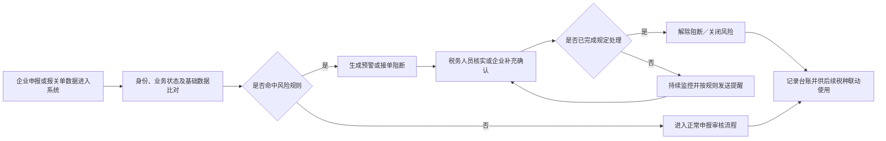

# 出口企业税收监管业务需求说明书

## 文档信息

| 项目 | 内容 |
| --- | --- |
| 文档名称 | 出口企业税收监管业务需求说明书 |
| 文件名称 | `cc.md` |
| 文档版本 | V1.0 |
| 文档状态 | 待评审 |
| 编制日期 | 2026-06-30 |
| 需求来源 | 《关于加强对出口企业税收监管的设想》（《加强对出口企业税收监管-需求分析.md》） |
| 适用系统 | 浙江省出口退税便捷办理系统及其相关协同平台 |

## 修订记录

| 版本 | 日期 | 修订内容 | 状态 |
| --- | --- | --- | --- |
| V1.0 | 2026-06-30 | 根据原始业务设想及其中“【开发需求】”“【说明】”内容，形成首版业务需求说明书 | 待评审 |

## 1. 引言

### 1.1 编制目的

本文档用于明确出口企业税收监管项目的建设目标、业务范围、业务规则、功能要求、数据与接口要求、权限要求及验收标准，作为需求评审、系统设计、开发、测试、上线和业务验收的共同依据。

### 1.2 项目背景

为落实《财政部 税务总局关于出口业务增值税和消费税政策的公告》（财政部 税务总局公告 2026 年第 11 号）等政策要求，适应出口退税申报期限调整后的管理形势，需要依托浙江省出口退税便捷办理系统，进一步强化出口企业日常审核、长期未申报业务监控、风险预警、消息提醒及跨部门协同管理。

项目拟形成“企业申报—系统比对—接单拦截—风险提示—税种联动”的闭环监管机制，实现对退税、免税、征税业务以及已备案、未备案出口企业的全口径覆盖，在保障退税准确规范的同时，防范多退税、少缴税、漏申报和骗取退税等风险。

### 1.3 编制原则

1. 以原始业务设想中标注的“【开发需求】”为系统建设边界。
2. 原稿明确“无需系统开发支持”的事项作为配套业务管理要求列示，不纳入本期开发范围。
3. 原稿未明确的阈值、期限、口径及技术指标统一标记为“待确认”，不得直接作为生产参数。
4. 优先复用现有系统、数据和接口能力，在现有长期未申报监控及审核助手接单预警能力上增量建设。

### 1.4 术语和缩略语

| 术语 | 说明 |
| --- | --- |
| 已备案企业 | 已办理出口退（免）税备案的企业 |
| 未备案企业 | 尚未办理出口退（免）税备案但已发生出口业务的企业 |
| 退税业务 | 符合出口退（免）税政策并申报办理退税或免抵退税的业务 |
| 免税业务 | 法定免税或不适用退（免）税政策、按免税处理的出口业务 |
| 征税业务 | 按规定应视同内销等方式申报缴税的出口业务 |
| 长期未申报业务 | 超过业务规则规定期限仍未完成退税、免税或征税申报处理的出口业务；具体期限口径待确认 |
| 关联号换汇成本 | 人民币出口成本与美元出口收入的比值，即“人民币出口成本 ÷ 美元出口收入” |
| 征纳互动平台 | 用于向纳税人发送短信、电子税务局消息等信息的协同平台 |
| 易税云平台 | 企业进行报关单状态确认并提交税务审核的平台 |
| 接单 | 税务端接收企业出口退税申报业务的处理环节 |

## 2. 建设目标

1. 建立出口商品代码、视同自产业务和异常换汇成本三类事中预警能力。
2. 将长期未申报监控由可退税业务扩展至免税业务，并与接单阻断、状态确认和解除阻断形成闭环。
3. 建立待申报退税业务与进项发票的关联检查能力。
4. 对接征纳互动平台，实现多渠道、批量、模板化消息推送及全流程台账追溯。
5. 建立临期业务、未申报退税占比异常和年度未申报业务三类提醒机制。
6. 建立未备案出口企业名册，为税源管理部门提供持续、准确的监管数据。
7. 通过参数化、权限化和可追溯设计，提高风险规则的适应性与监管过程的规范性。

## 3. 建设范围

### 3.1 本期系统建设范围

| 需求编号 | 需求模块 | 需求名称 | 建设类型 |
| --- | --- | --- | --- |
| FR-01 | 预警服务 | 11 位出口商品代码退税率异常预警 | 新增 |
| FR-02 | 预警服务 | 生产企业视同自产出口货物审核预警 | 新增 |
| FR-03 | 预警服务 | 关联号换汇成本异常监控预警 | 新增 |
| FR-04 | 长期未申报业务 | 长期未申报监控口径扩展至免税业务 | 优化 |
| FR-05 | 长期未申报业务 | 外贸企业待申报退税业务进项发票检查 | 新增 |
| FR-06 | 消息推送服务 | 征纳互动平台接口及通用消息推送能力 | 新增 |
| FR-07 | 消息推送服务 | 消息提醒推送台账 | 新增 |
| FR-08 | 消息推送服务 | 三类出口业务提醒任务 | 新增 |
| FR-09 | 未备案企业监管 | 未备案出口企业名册管理 | 新增 |

### 3.2 现有能力复用范围

1. 复用现有审核助手接单环节对可退税报关单长期未申报的预警监控能力。
2. 复用现有出口退（免）税备案、申报、审核及企业身份数据。
3. 复用易税云平台的报关单状态确认及税务审核流程。
4. 在条件具备时复用征纳互动平台、短信和电子税务局消息渠道。
5. 复用现行商品代码及退税率、增值税发票、海关报关单等基础数据。

### 3.3 本期不纳入系统开发的事项

下列事项应通过制度、流程、岗位职责或人工管理落实，本期不新增系统功能：

1. 日常退税审核中的疑点规范处理、进项发票逐票人工核对和单证备案常态化检查。
2. 年度专项核查中的计税依据及退税率适用、收汇情况、报关单与财务账一致性、生产经营能力与出口规模匹配度四项人工核查。
3. 进出口管理、税源管理、纳税服务、征管及其他税费种业务部门之间的工作传递和职责协同。
4. 组织领导、绩效通报、制度建设、线下培训辅导及出口发票日常检查。
5. 原稿未明确要求开发的外部部门数据共享平台建设。

> 注：FR-05“待申报退税业务进项发票检查”虽在年度专项核查章节中提出，但原稿明确其为新增开发需求，因此纳入本期范围。

## 4. 业务参与方与职责

| 参与方 | 主要职责 | 系统权限概述 |
| --- | --- | --- |
| 出口企业 | 办理备案及退税、免税、征税申报；确认报关单状态；录入待申报退税业务对应进项发票号码；接收提醒 | 企业自身数据录入、查询和消息接收 |
| 退税审核岗／接单人员 | 处理预警、核实疑点、执行接单管理、开展临期业务点对点提醒 | 风险明细查询、审核处理、接单及结果查看 |
| 进出口税收管理部门 | 维护风险规则、筛查和传递数据、开展督导 | 全辖数据查询、规则配置、任务及统计查看 |
| 税源管理部门 | 管理未备案企业，督促备案和申报，核实传递任务 | 管辖范围名册、明细查询及处理 |
| 纳税服务部门 | 配合消息渠道和集中提醒工作 | 消息任务及发送结果查询 |
| 征管部门 | 归集并比对出口与多税种申报数据 | 经授权的数据查询及任务查看 |
| 其他税费种业务部门 | 接收问题数据，开展对应税费种管理 | 经授权的任务及明细查询 |
| 系统管理员 | 用户、角色、参数、模板和基础配置管理 | 系统管理权限 |

## 5. 总体业务流程

未备案企业监管流程如下：

## 6. 详细功能需求

### 6.1 FR-01：11 位出口商品代码退税率异常预警

#### 6.1.1 业务目标

对企业使用 11 位商品代码申报出口退（免）税的业务进行退税率异常检查，防范外贸企业将低退税率商品按高退税率申报造成多退税，以及生产企业将高退税率商品按低退税率申报造成少计免抵额、少缴附加税。

#### 6.1.2 适用对象及规则

| 企业类型 | 风险方向 | 触发条件 | 风险提示 |
| --- | --- | --- | --- |
| 外贸企业 | 退税率就高申报 | 11 位商品代码申报退税率高于该商品按规则应适用的退税率，且退免税额达到配置阈值 | 外贸企业 11 位商品代码退税率就高申报，请加强审核。业务类型{业务类型}，报关单号{报关单号}，商品代码{商品代码}，退税率{退税率}，退免税额{退免税额}。 |
| 生产企业 | 退税率就低申报 | 11 位商品代码申报退税率低于该商品按规则应适用的退税率，且退免税额达到配置阈值 | 生产企业 11 位商品代码退税率就低申报，请加强审核。业务类型{业务类型}，视同自产货物出口额{出口额}，退免税额{退免税额}。 |

#### 6.1.3 功能要求

1. 系统应在退税申报审核阶段自动识别企业类型及 11 位商品代码。
2. 系统应依据有效商品代码及退税率基础数据执行高报、低报比对。
3. 系统应支持按企业类型分别配置退免税额阈值，阈值启用时间和修改记录应可追溯。
4. 命中规则后，系统应在审核界面展示预警提示及对应业务明细。
5. 预警明细至少应包含企业信息、业务类型、报关单号、商品代码、申报退税率、比对退税率、出口额、退免税额及命中时间；不适用于某类企业的字段可为空。
6. 审核人员应可查看预警所依据的商品代码及退税率数据。

#### 6.1.4 待确认事项

1. 11 位商品代码“应适用退税率”的权威数据源及高、低退税率识别规则。
2. 外贸企业和生产企业的退免税额阈值及阈值比较方式。
3. 生产企业提示中是否需要增加报关单号、商品代码、申报退税率等定位字段。

### 6.2 FR-02：生产企业视同自产出口货物审核预警

#### 6.2.1 业务目标

对生产企业申报视同自产货物退税的业务按业务类型进行预警，提示审核人员重点核实业务是否符合视同自产退税条件。

#### 6.2.2 功能要求

1. 适用对象为申报视同自产货物退税业务的生产企业。
2. 系统应识别视同自产业务类型，并按业务类型执行预警规则。
3. 当业务退免税额达到配置阈值时，系统应生成审核预警。
4. 预警提示为：“生产企业申报退税业务类型{业务类型}，视同自产货物出口额{出口额}，退免税额{退免税额}，请加强审核。”
5. 系统应支持配置退免税额阈值，并保留参数变更记录。
6. 审核人员应可从预警下钻查看企业、申报批次及相关出口业务明细。

#### 6.2.3 待确认事项

1. 纳入预警的视同自产业务类型范围。
2. 各业务类型是否共用同一阈值，以及具体阈值。
3. 预警是否仅提示，还是需要审核人员录入处理意见后方可继续办理。

### 6.3 FR-03：关联号换汇成本异常监控预警

#### 6.3.1 业务目标

在外贸企业申报环节按关联号监控换汇成本，及时识别出口额误录、高报进价或低报出口价格等异常风险。

#### 6.3.2 业务规则

1. 适用对象为外贸企业。
2. 计算粒度为申报业务关联号。
3. 换汇成本计算公式：`换汇成本 = 人民币出口成本 ÷ 美元出口收入`。
4. 换汇成本高于上限或低于下限，且退免税额达到配置阈值时，生成预警。
5. 原稿建议在金税三期系统 5～8 的参考范围基础上，将本预警上下限初步设置为 3～10；该数值仅为建议值，须经业务评审确认后配置。

#### 6.3.3 功能要求

1. 系统应按关联号归集人民币出口成本和美元出口收入并自动计算换汇成本。
2. 系统应支持配置换汇成本上限、下限及退免税额阈值。
3. 超过上限时提示：“外贸企业关联号{关联号}的换汇成本{换汇成本}，超过预警上限{上限}。”
4. 低于下限时提示：“外贸企业关联号{关联号}的换汇成本{换汇成本}，低于预警下限{下限}。”
5. 预警明细应展示计算所用人民币出口成本、美元出口收入、换汇成本、上下限、退免税额及关联业务明细。
6. 参数调整只影响参数生效时间后的规则计算，历史预警应保留生成时的参数快照。

#### 6.3.4 待确认事项

1. 人民币出口成本和美元出口收入的具体取数口径、汇率口径及小数精度。
2. 多币种、收入为零、数据缺失和冲减业务的处理规则。
3. 正式启用的上下限及退免税额阈值。

### 6.4 FR-04：长期未申报监控口径扩展至免税业务

#### 6.4.1 业务目标

在现有可退税报关单长期未申报监控基础上，将已备案企业的免税业务纳入监控，形成退税、免税、征税全口径的临期提醒、超期阻断和处理闭环。

#### 6.4.2 监控范围

1. 现有可退税但长期未申报的出口业务。
2. 出口退（免）税备案企业的法定免税业务。
3. 不适用退（免）税政策的免税业务。
4. 原业务流程要求纳入的未申报征税业务；其识别口径及数据源待确认。

#### 6.4.3 功能要求

1. 系统应优化长期未申报业务抽数口径，新增已备案企业免税业务数据源。
2. 对可退税业务继续沿用现有长期未申报监控规则。
3. 对免税业务，应从企业完成业务状态确认后开始计算申报期限，并在规定期限内监控其是否完成免税申报。
4. 原稿提出“确认后近期内（例如两个征期内）申报”，系统应将征期数量设计为可配置参数；正式期限待业务确认。
5. 企业存在超期未处理出口业务时，系统应在出口退税接单环节自动阻断，并提示：“存在超期未处理出口业务，暂不予接单。”
6. 系统应展示导致阻断的业务类型、报关单号、出口日期、确认日期、应处理期限、当前状态及超期时长。
7. 企业通过易税云平台完成报关单状态确认并经税务审核通过后，符合解除条件的业务应自动解除阻断。
8. 系统应记录阻断时间、阻断原因、关联明细、企业处理情况、审核结果、解除时间及解除方式。
9. 系统应支持按企业、业务类型、申报状态、是否超期、所属机关等条件查询和导出长期未申报明细。

#### 6.4.4 状态流转

`待识别 → 待企业确认 → 待申报退税／免税／征税 → 临期 → 超期阻断 → 待税务审核 → 已处理／解除阻断`

状态的进入条件、允许回退节点及异常修正流程须在详细设计阶段与业务部门确认。

#### 6.4.5 待确认事项

1. “长期未申报”和“超期”的起算日期、截止日期及节假日处理规则。
2. 免税业务应在确认后几个征期内完成申报。
3. 未申报征税业务的数据来源、识别规则和解除阻断条件。
4. 存量免税业务是否追溯纳入，以及追溯起始时间。
5. 同一企业多笔超期业务全部处理后解除，还是允许部分业务例外解除。

### 6.5 FR-05：外贸企业待申报退税业务进项发票检查

#### 6.5.1 业务目标

对企业确认为“待申报退税”的出口业务检查是否存在状态正常的对应进项发票，为长期未申报业务核实和后续监管提供依据。

#### 6.5.2 功能要求

1. 适用对象原则上为外贸企业，最终企业范围以业务评审结论为准。
2. 企业端在选择“待申报退税”状态时，应支持录入对应进项发票号码。
3. 系统应对发票号码进行格式和必填校验，并支持一笔出口业务关联一张或多张发票；具体对应关系待确认。
4. 税务端应自动校验发票是否存在、发票状态是否正常。
5. 校验结果至少包括“校验通过、发票不存在、发票状态异常、未录入发票、校验失败”。
6. 税务人员应可查询“已确认为待申报退税但未录入进项发票”的出口业务明细。
7. 查询条件至少包括企业税号、企业名称、报关单号、确认日期、所属期、发票校验结果和主管税务机关。
8. 查询结果应支持导出，并可下钻查看报关单、状态确认及发票校验信息。
9. 系统应记录企业录入、修改发票号码以及机器校验的时间和结果。

#### 6.5.3 待确认事项

1. 是否仅适用于外贸企业，以及生产企业外购视同自产等业务是否纳入。
2. 发票号码字段格式、允许关联的发票种类及一对多关系。
3. “状态正常”的业务判定标准和发票数据接口。
4. 发票校验不通过时是仅提示，还是限制状态确认或后续申报。

### 6.6 FR-06：征纳互动平台接口及通用消息推送能力

#### 6.6.1 业务目标

对接征纳互动平台，形成面向出口企业的短信、电子税务局消息及批量提醒能力，为各类临期和风险提醒提供统一服务。

#### 6.6.2 功能要求

1. 系统应对接征纳互动平台接口，并支持短信和电子税务局消息两类渠道。
2. 系统应支持单户推送和批量推送。
3. 系统应支持按业务场景配置消息模板、模板变量、适用渠道、启停状态和生效时间。
4. 推送任务应校验企业身份、接收渠道和必填模板变量。
5. 系统应接收并保存平台返回的发送结果，至少区分成功和失败。
6. 对同一企业、同一业务、同一提醒批次应具备防止重复提交的控制机制；重复判断口径待确认。
7. 批量任务应能统计任务总数、成功数、失败数和处理状态。
8. 发送失败原因应可查询，以便业务人员后续处理。
9. 消息正文及附件不得向企业展示其他纳税人的信息。

#### 6.6.3 待确认事项

1. 征纳互动平台接口规范、认证方式、调用限额和结果回执机制。
2. 短信及电子税务局消息的可用接收信息来源。
3. 失败重试次数、重试间隔及人工补发流程。
4. 消息正文长度、附件类型、大小及数量限制。

### 6.7 FR-07：消息提醒推送台账

#### 6.7.1 业务目标

记录所有出口企业提醒任务及发送结果，满足业务查询、下钻、导出和责任追溯需要。

#### 6.7.2 台账字段

| 字段分类 | 字段 |
| --- | --- |
| 企业信息 | 企业税号、企业名称、主管税务机关 |
| 任务信息 | 任务编号、提醒场景、关联业务类型、任务批次、创建时间 |
| 推送信息 | 推送时间、推送内容、消息模板、推送渠道、接收目标脱敏信息 |
| 明细信息 | 关联业务明细数量、附件信息、业务明细关联标识 |
| 结果信息 | 发送状态、平台返回时间、失败原因、重试／补发情况 |
| 操作信息 | 发起方式（自动／人工）、发起人员、最后更新时间 |

#### 6.7.3 功能要求

1. 每次发送请求均应生成台账记录；发送成功和失败的记录均须保留。
2. 系统应支持按企业、时间、提醒场景、业务类型、渠道、状态、主管税务机关等条件组合查询。
3. 系统应支持按查询结果导出，导出范围受数据权限控制。
4. 用户应可下钻查看每笔提醒关联的出口业务明细。
5. 台账应展示消息发送状态及失败原因。
6. 对包含附件的消息，应支持查看附件名称、生成时间、明细数量和发送结果。
7. 台账记录应只允许经授权的更正操作，不允许普通用户物理删除。

### 6.8 FR-08：出口业务提醒任务

FR-08 依托 FR-06 通用推送能力和 FR-07 消息台账，建设以下三类业务提醒。

#### 6.8.1 FR-08-01：即将超期业务提醒

1. 适用对象为存在尚未处理、距超期不足 6 个月出口业务的企业。
2. 对距超期不足 6 个月的业务，系统应通过征纳互动平台推送未申报报关单明细及处理提醒。
3. 对距超期不足 3 个月的业务，系统应标识为高紧迫等级，供接单人员开展点对点提示，明确即将面临的接单阻断和视同内销征税等后果。
4. 提醒记录应自动进入消息推送台账，并关联具体出口业务明细。
5. 系统应定期重新识别临期业务；执行频率、同一业务重复提醒周期和停止条件待确认。
6. 已完成申报处理或经审核无需处理的业务，不应继续进入后续提醒批次。

#### 6.8.2 FR-08-02：未申报退税占比异常提醒

1. 适用对象仅为生产企业。
2. 系统应按月统计企业近三年的未申报退税报关单占比。
3. 计算公式：`未申报退税报关单条数 ÷ 总出口报关单条数 × 100%`。
4. 当企业总报关单份数达到最小统计门槛，且企业占比高于本地市平均值时，生成提醒任务。
5. 占比上限比较规则和报关单最小份数阈值应支持配置。
6. 系统应通过征纳互动平台向命中规则的企业推送消息。
7. 推送提示为：“该企业近三年未申报退税占比为{企业占比}%，高于本地市平均值{本地市平均值}%。请尽快办理退税申报。未申报明细详见附件。”
8. 消息附件应包含最多前 100 笔未申报出口明细；排序规则待确认。
9. 对占比持续偏高且无明显合理原因的企业，系统应支持查询连续命中情况，供业务部门纳入风险核查计划。

#### 6.8.3 FR-08-03：年度未申报业务集中提醒

1. 适用对象为生产企业和外贸企业。
2. 系统应在每年 3 月、4 月征期前，分别对上一年度出口但尚未申报退税、免税或征税的业务生成提醒任务。
3. 提醒渠道包括征纳互动平台短信和电子税务局消息。
4. 提醒内容应明确超期后果并提供办理指引。
5. 消息附件应包含最多前 100 笔未申报业务明细；超过 100 笔时，应在正文中提示实际总笔数及附件仅展示前 100 笔。
6. 已完成处理的业务不得进入后续年度提醒批次。
7. 每年具体执行日期应支持配置，并与当年征期安排匹配。

#### 6.8.4 提醒任务公共要求

1. 每个任务应保存统计时点、规则参数和数据快照，保证结果可追溯。
2. 任务生成后、实际发送前应再次校验业务状态，防止向已处理企业发送过期提醒。
3. 自动任务应支持授权人员暂停、恢复和查看执行结果。
4. 附件至少应包含报关单号、出口日期、业务类型、当前状态、应处理期限等必要字段，最终字段由业务部门确认。
5. 企业消息不得直接暴露仅供税务内部使用的风险等级或内部处置意见。

#### 6.8.5 待确认事项

1. 临期提醒的运行频率、重复提醒规则及点对点提醒是否需要记录处理结果。
2. “近三年”采用滚动 36 个月还是三个完整自然年度。
3. 本地市平均值的企业范围、加权方式、计算周期和数据时点。
4. 未申报报关单和总出口报关单的去重、作废、撤销及冲减口径。
5. 附件前 100 笔的排序规则、格式和下载有效期。
6. 3 月、4 月提醒的具体日期、两次提醒对象是否完全相同及重复提示策略。
7. 各场景正式消息文案和办理指引内容。

### 6.9 FR-09：未备案出口企业名册管理

#### 6.9.1 业务目标

依托海关未清分报关单数据，定期筛查已发生出口业务但未办理出口退（免）税备案的企业，形成动态名册，为税源管理部门督促备案、开具出口发票及完成退税、免税、征税申报提供数据支撑。

#### 6.9.2 数据采集及更新

1. 系统应从海关未清分报关单数据中识别出口企业。
2. 系统应关联出口退（免）税备案数据，筛选当前未备案企业。
3. 名册原则上每周更新一次；具体执行日和数据时点支持配置。
4. 企业完成备案后，系统应更新“转备案时间”，并将其转入已备案企业管理流程。
5. 系统应保留企业进入名册、信息更新和转出名册的历史记录。

#### 6.9.3 名册字段

| 序号 | 字段 | 说明 |
| --- | --- | --- |
| 1 | 企业税号 | 企业唯一身份标识 |
| 2 | 企业名称 | 企业登记名称 |
| 3 | 税务状态 | 正常、非正常等；具体枚举取自税务登记数据 |
| 4 | 首次出口时间 | 原稿表述为“首次出口时间（首次进入未申报时间）”，最终定义待确认 |
| 5 | 累计美元出口额 | 统计范围及折算口径待确认 |
| 6 | 转备案时间 | 企业完成出口退（免）税备案的时间；未备案时为空 |
| 7 | 企业类型 | 企业分类口径待确认 |
| 8 | 管辖税务机关 | 对应主管税务机关 |
| 9 | 名册状态 | 待核实、辅导中、已备案、按免税处理、按征税处理、已销号等；枚举待确认 |
| 10 | 数据更新时间 | 本条名册最近更新时间 |

#### 6.9.4 功能要求

1. 名册应支持按企业税号、企业名称、税务状态、企业类型、管辖税务机关、首次出口时间、名册状态等条件查询和筛选。
2. 名册应支持按权限导出。
3. 用户点击企业后，应可下钻查看该企业报关单明细。
4. 报关单明细至少应展示报关单号、出口日期、商品信息、出口金额、币种及当前处理状态；最终字段待确认。
5. 系统应按管辖税务机关向税源管理部门分配查询或处理权限。
6. 对已备案企业，系统应显示转备案时间并停止将其作为“当前未备案”对象；历史信息仍可查询。
7. 名册应支持记录业务处理状态和销号结果，以支撑“筛查—督促—补报／备案—销号”的闭环管理；具体录入字段待确认。

#### 6.9.5 待确认事项

1. 海关“未清分报关单”的数据接口、更新频率和可用字段。
2. 未备案企业的准确识别规则及跨区域经营企业的管辖归属。
3. 首次出口时间、累计美元出口额和企业类型的统计口径。
4. 税源管理部门是否需要在系统中录入辅导、申报和销号处理结果。
5. 历史名册、报关单及处理记录的保存期限。

## 7. 公共业务规则

| 规则编号 | 规则内容 |
| --- | --- |
| BR-01 | 风险判断应使用业务发生时或规则规定时点有效的商品代码、退税率、备案状态和参数。 |
| BR-02 | 所有可配置参数应包含参数名称、适用对象、参数值、生效时间、失效时间、启停状态、修改人和修改时间。 |
| BR-03 | 同一业务可命中多个风险规则，各风险记录应分别生成并关联同一业务主键。 |
| BR-04 | 企业完成申报、审核或状态确认后，应在下一次规则运行或实时校验时更新业务状态。 |
| BR-05 | 接单阻断必须有明确业务依据和关联明细，解除阻断必须记录条件及操作轨迹。 |
| BR-06 | 统计结果和消息任务应保存生成时的数据时点及参数快照，后续参数调整不得篡改历史结果。 |
| BR-07 | 查询、导出和消息附件中的数据范围必须同时受机构权限和角色权限控制。 |
| BR-08 | 企业税号、联系方式、发票信息等敏感数据在非必要界面和日志中应脱敏展示。 |
| BR-09 | 作废、撤销、重复和已冲减的报关单不得重复计入统计；具体处理口径待业务确认。 |
| BR-10 | 金额、比例、换汇成本等数值的精度、舍入方式及单位应在全系统保持一致，具体标准待确认。 |

## 8. 数据与接口需求

### 8.1 数据来源

| 数据／接口 | 主要用途 | 数据方向 | 建设说明 |
| --- | --- | --- | --- |
| 出口退（免）税备案数据 | 识别已备案、未备案企业及备案时间 | 输入 | 复用现有数据 |
| 出口退税申报及审核数据 | 识别企业类型、业务类型、退免税额及申报状态 | 输入 | 复用现有数据 |
| 海关报关单／未清分报关单 | 未申报业务监控、临期提醒、未备案企业筛查 | 输入 | 需确认接口及更新频率 |
| 商品代码及退税率数据 | 11 位商品代码退税率异常比对 | 输入 | 需确认权威来源和版本机制 |
| 增值税进项发票数据 | 待申报退税业务发票存在性及状态校验 | 输入 | 需确认接口 |
| 企业税务登记及主管机关数据 | 企业状态、企业类型、机构权限 | 输入 | 复用现有数据 |
| 易税云平台 | 报关单状态确认、审核结果及解除阻断 | 双向／输入 | 在现有流程上扩展 |
| 征纳互动平台 | 短信、电子税务局消息发送及结果回执 | 双向 | 新增或扩展接口 |
| 征期日历 | 临期计算、年度任务执行 | 输入 | 数据来源待确认 |

### 8.2 接口公共要求

1. 接口应具备身份认证、访问授权、传输加密和调用日志。
2. 接口请求应包含可追踪的唯一标识，便于问题定位及重复调用控制。
3. 系统应记录接口调用时间、请求结果、返回状态和异常原因；日志中的敏感内容应脱敏。
4. 外部接口暂时不可用时，不得丢失已生成的业务任务；补偿和重试机制按最终接口能力设计。
5. 批量数据交换应提供总数、成功数、失败数及失败明细校验机制。
6. 数据更新频率、延迟容忍度、对账机制和异常补数流程由接口双方在详细设计阶段确认。

## 9. 权限与审计要求

1. 系统应采用基于角色和管辖机构的数据权限控制。
2. 企业只能查询、录入和接收本企业相关信息。
3. 税源管理部门原则上只能访问本部门管辖企业；跨机构查询须单独授权。
4. 风险参数、消息模板、任务暂停和人工补发应设置专门权限。
5. 数据导出权限应与页面查询权限分离管理，导出文件应记录操作人、时间、条件及数据量。
6. 参数变更、状态调整、人工解除阻断、消息补发、名册销号等关键操作应记录审计日志。
7. 审计日志应包含操作人、操作时间、操作对象、操作前后内容、操作结果及来源地址等信息。
8. 审计日志和业务台账保存期限按照税务系统数据管理制度执行，具体年限待确认。

## 10. 非功能需求

### 10.1 性能与容量

1. 预警计算、月度统计、年度集中提醒和每周名册刷新应采用可监控的任务机制，避免影响日常申报接单。
2. 批量推送应支持分批处理，并能够查看任务进度。
3. 常用查询、单户下钻、批量统计的响应时间及最大数据量指标在掌握生产数据规模后确定。

### 10.2 可用性与异常处理

1. 自动任务执行失败时应产生系统告警，并支持授权人员查看失败环节和重新执行。
2. 外部数据缺失或接口异常时，应明确展示“数据待更新”或“校验失败”，不得误判为业务正常。
3. 接单阻断、解除阻断及消息发送等关键操作应保证事务一致性，避免状态与台账不一致。

### 10.3 安全与保密

1. 系统应遵循现行税务信息系统网络安全、数据安全和个人信息保护要求。
2. 敏感数据应按最小必要原则采集、展示、导出和传输。
3. 导出文件和消息附件应具备访问控制，具体水印、加密及有效期要求待确认。

### 10.4 可配置与可维护

1. 金额阈值、换汇成本上下限、申报期限、任务执行时间、消息模板及提醒渠道应支持配置。
2. 参数配置应具备格式、范围及上下限关系校验。
3. 规则和参数启停不得删除历史业务记录。
4. 任务、接口和规则运行情况应具备统一监控及日志检索能力。

## 11. 配套业务管理要求（非开发事项）

### 11.1 日常退税审核

1. 对系统提示疑点逐项核实；能够排除的注明理由，无法排除的开展约谈、函调或实地核查并留存记录。
2. 逐票核对增值税专用发票或海关缴款书金额、税率、税额与申报明细的一致性。
3. 对生产企业视同自产业务审核资格及佐证材料，必要时实地核查。
4. 对换汇成本异常业务逐笔核实。
5. 每月抽查企业单证备案情况，检查购销合同、运输单据、报关单据的留存及业务真实性。

### 11.2 年度专项核查

每年 5 月起，对上一年度出口业务开展专项核查，重点包括：

1. 计税依据和退税率适用是否正确。
2. 是否按期收汇或已办理不能收汇手续，长期挂账或大额应收款是否异常。
3. 报关单商品名称、数量、金额与财务账、成本、出入库及主营业务收入是否一致。
4. 生产能力、经营规模、供应链情况与出口规模是否匹配。

### 11.3 未备案企业线下管理

1. 进出口管理部门原则上每周筛查未备案企业并将名册传递至税源管理部门。
2. 对有退税需求的企业，督促办理备案并辅导退税申报。
3. 对适用免税或征税政策的业务，督促企业及时申报并逐笔销号。
4. 辅导企业按规定开具出口发票，备案完成后转入已备案企业常态化管理。

### 11.4 部门协同

1. 进出口管理部门每月月初 5 个工作日内提取超期未处理业务，形成《未处理征免税出口业务传递单》并推送税源管理部门。
2. 税源管理部门逐户核对、督促申报并反馈处理结果。
3. 进出口管理部门每月月初 3 个工作日内归集相关出口数据，形成《出口业务信息传递单》并推送征管部门。
4. 征管部门比对出口额与增值税、企业所得税、印花税等申报数据，将问题数据清分至相应业务条线。
5. 各部门应明确联系人、处理时限、传递表单、反馈方式和争议处理机制。

### 11.5 组织与制度保障

1. 将未申报出口业务管理纳入日常考核，明确责任部门和责任人。
2. 完善海关、外汇等数据共享和质量管理机制。
3. 建立未申报出口业务常态化管理制度。
4. 将未申报业务清理率、阻断执行情况和风险提醒完成率纳入绩效管理并定期通报。
5. 通过线上培训和线下辅导规范出口发票开具，并加强日常检查。

## 12. 验收要求

### 12.1 功能验收场景

| 验收编号 | 对应需求 | 验收场景 | 预期结果 |
| --- | --- | --- | --- |
| AC-01 | FR-01 | 外贸企业以高于应适用值的 11 位商品代码退税率申报，且金额达到阈值 | 系统生成就高申报预警，文案和明细准确；未达到阈值时按配置不预警 |
| AC-02 | FR-01 | 生产企业以低于应适用值的 11 位商品代码退税率申报，且金额达到阈值 | 系统生成就低申报预警并可下钻查看业务 |
| AC-03 | FR-02 | 生产企业申报视同自产业务且金额达到阈值 | 系统按业务类型生成审核预警，出口额及退免税额正确 |
| AC-04 | FR-03 | 外贸企业关联号换汇成本分别高于上限、低于下限和处于区间内 | 前两种分别生成对应预警，区间内不预警，计算过程可核对 |
| AC-05 | FR-04 | 已备案企业存在超过配置期限仍未申报的免税业务 | 系统将业务纳入长期未申报明细并在接单时阻断，提示及关联明细准确 |
| AC-06 | FR-04 | 企业完成状态确认且税务审核通过，所有阻断业务满足解除条件 | 系统解除阻断并完整记录处理轨迹 |
| AC-07 | FR-05 | 企业录入存在且状态正常／不存在／状态异常的进项发票 | 系统返回相应校验结果，并可查询待申报退税但无发票的业务 |
| AC-08 | FR-06 | 分别发送短信、电子税务局消息及批量任务 | 平台可正常受理，系统保存成功或失败结果，批量统计准确 |
| AC-09 | FR-07 | 按企业、时间、渠道和状态查询台账并下钻、导出 | 查询和导出结果与权限一致，关联明细准确 |
| AC-10 | FR-08-01 | 业务分别进入不足 6 个月和不足 3 个月临期区间 | 系统生成对应提醒，后者标记为高紧迫等级；已处理业务不再提醒 |
| AC-11 | FR-08-02 | 生产企业报关单数达到门槛且近三年占比高于本地市平均值 | 系统按月生成消息，比例准确，附件不超过 100 笔且与企业一致 |
| AC-12 | FR-08-03 | 3 月、4 月征期前存在上年度未申报退税、免税或征税业务 | 系统按配置生成集中提醒，文案、渠道及附件准确 |
| AC-13 | FR-09 | 海关数据出现未备案企业，随后该企业完成备案 | 名册按周期新增企业并可下钻；备案后更新转备案时间且保留历史 |
| AC-14 | 公共要求 | 修改阈值后执行新任务，并查看修改前历史任务 | 新任务使用新参数，历史任务仍展示原参数快照和原结果 |
| AC-15 | 权限要求 | 不同主管机关用户查询、导出名册及风险明细 | 用户只能访问授权范围，越权访问被拒绝并记录日志 |

### 12.2 验收通过条件

1. 所有已确认的功能需求均已实现，关键及高优先级测试用例全部通过。
2. 预警、统计、阻断、解除、推送及名册数据与业务抽样人工计算结果一致。
3. 消息内容、附件和接收企业一一对应，不发生跨企业数据泄露。
4. 权限、审计、异常处理及参数生效机制通过专项测试。
5. 接口联调、批量任务、生产规模性能和安全测试达到评审确定的指标。
6. 本文档“待确认事项”已形成评审结论，并同步到需求基线、规则配置或详细设计文档。

## 13. 待评审确认清单

| 编号 | 确认事项 | 影响范围 | 建议责任方 |
| --- | --- | --- | --- |
| C-01 | 11 位商品代码应适用退税率的数据源、匹配及高低判断规则 | FR-01 | 进出口管理部门 |
| C-02 | 各类预警的退免税额阈值 | FR-01～FR-03 | 进出口管理部门 |
| C-03 | 换汇成本取数、汇率、精度及正式上下限 | FR-03 | 进出口管理部门、数据部门 |
| C-04 | 退税、免税、征税业务的临期、超期起算及解除规则 | FR-04、FR-08 | 进出口管理部门 |
| C-05 | 免税业务在状态确认后应于几个征期内完成申报 | FR-04 | 进出口管理部门 |
| C-06 | 待申报退税业务适用企业、发票类型、关联关系及拦截方式 | FR-05 | 进出口管理部门、发票管理部门 |
| C-07 | 征纳互动平台接口、渠道限制、失败重试和附件限制 | FR-06～FR-08 | 纳税服务部门、平台建设方 |
| C-08 | 三类提醒的执行频率、去重规则、文案、附件字段和排序 | FR-08 | 进出口管理部门、纳税服务部门 |
| C-09 | 近三年、本地市平均值及报关单统计口径 | FR-08-02 | 进出口管理部门、数据部门 |
| C-10 | 未备案名册识别、字段定义、处理状态和销号流程 | FR-09 | 进出口管理部门、税源管理部门 |
| C-11 | 各类数据接口更新频率、数据时点、对账和补数机制 | 全部 | 数据部门、接口提供方 |
| C-12 | 性能容量、日志及业务数据保存期限 | 非功能需求 | 技术部门、业务部门 |

## 14. 需求追踪矩阵

| 原始需求内容 | 处理结论 | 本文对应章节 |
| --- | --- | --- |
| 出口商品编码核对 | 需要开发 | FR-01 |
| 视同自产审核预警 | 需要开发 | FR-02 |
| 换汇成本监控 | 需要开发 | FR-03 |
| 长期未申报增加免税业务 | 需要开发 | FR-04 |
| 待申报退税业务进项发票检查 | 需要开发 | FR-05 |
| 征纳互动平台及消息推送 | 需要开发 | FR-06 |
| 消息推送台账 | 需要开发 | FR-07 |
| 即将超期、占比异常、年度未申报提醒 | 需要开发 | FR-08 |
| 未备案出口企业名册 | 需要开发 | FR-09 |
| 疑点处理、逐票核对、单证检查 | 无需开发，纳入业务管理 | 11.1 |
| 年度四项专项核查 | 无需开发，纳入业务管理 | 11.2 |
| 部门协同及税种联动 | 暂无需开发，纳入业务管理 | 11.4 |
| 组织、数据、制度、考核及发票管理保障 | 无需开发，纳入保障要求 | 11.5 |

---

> 本文档为需求评审稿。所有标记为“待确认”的内容，应在开发排期和需求基线冻结前由相关业务、数据、接口及技术责任方共同确认。
