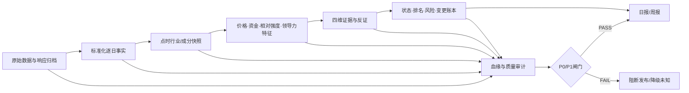

# 行业板块报告修复需求

> 文档版本：V1.1
>
> 编制日期：2026-09-02（Asia/Shanghai）
>
> 适用对象：《A股板块潜力与龙头图形股研究报告》的日报、周报、历史回填和相关派生数据
>
> 输入依据：[资金轮动自查](资金轮动自查.md)、[其他维度自查](其他维度自查.md)、2026-09-02 每日收盘数据下载任务发布物专项核查
>
> 当前决策：**资金维度、龙头日变更频道及每日行业事实采集完整性属于 P0 阻断项；四维确认及其派生结果须在修复后统一重算**

## 一、文档目的

本文档不再重复讨论“异常是否存在”，而是将两份自查结论转换为可开发、可测试、可发布和可签收的统一修复需求。

修复后的系统必须达到以下结果：

1. 报告中的每个数值都能定位到原始数据、标准化记录、公式版本和生成代码。
2. 所有 N 日窗口都由同一逐日事实序列计算，不再将无业务日期的供应商周期快照当作已验证累计值。
3. 价格、资金、相对强度、领导力四维的口径、窗口、分母、阈值和缺失处理可独立复算。
4. 数据未知、部分覆盖和数据无效与信号 `FAIL` 严格分开，不得填零或沿用前值。
5. 日报、周报、状态迁移、龙头变更和风险频道都由可对账的快照/事件账本生成。
6. `publish_status=PASS` 代表数据时点、算术、窗口、血缘、对账和渲染全部通过，不再只代表 HTML 可渲染。

## 二、问题基线与修复边界

### 2.1 已确认问题

| 编号 | 维度/环节 | 已确认问题 | 当前处置 |
|---|---|---|---|
| B-01 | 资金 | 2026-08-26 与 08-27 的 90行业×4窗口净额 360/360 完全一致 | P0，资金字段降为无效/待重算 |
| B-02 | 资金 | 08-31的5日值与08-27的3日值、09-01的5日值与08-28的3日值均在90/90行业精确复制 | P0，阻断旧周期快照口径 |
| B-03 | 资金 | 缺少供应商业务日期、逐日分解、原始响应和窗口可复算证据 | P0，重建逐日事实表与证据归档 |
| B-04 | 领导力 | 领导力分位只在当日部分行业集合中计算，分母 31→28→32，跨日不可直接比较 | P1，改为固定宇宙或显式标记覆盖子集 |
| B-05 | 领导力 | 08-31、09-01的 `daily_leader_changes` 分别少 24、30 个应有事件 | P0，暂停龙头日变更频道 |
| B-06 | 覆盖 | 09-01有58/90行业领导力未知；有5个行业 `coverage=COMPLETE` 但扩散度仍为 `UNKNOWN` | P1，拆分领导力和扩散度覆盖状态 |
| B-07 | 价格 | 价格截面分位通过与 `price_setup=A/B/C/D` 是两套规则，却共用“价格确认”表述 | P1，拆分绝对趋势与截面强弱 |
| B-08 | 相对强度 | 基准、5D/20D权重和原始超额收益未披露；与价格分量相关系数约0.89至0.93 | P1/P2，补齐公式并验证增量信息 |
| B-09 | 发布审计 | 已知时点、窗口和事件账本异常未阻断，仍发布 `PASS` | P0，扩展为业务数据发布闸门 |
| B-10 | 历史回填 | 多份历史报告在截止日后数日生成，发布物没有输入最大交易日证据 | P1，强制点时快照与防穿越校验 |
| B-11 | 每日采集 | 当前发布物只能证明报告含90个行业的派生结果，不能证明收盘任务已采集并持久化90个行业的当日逐日事实 | P0，补齐行业宇宙、逐日事实、运行清单和报告前置闸门 |

### 2.2 每日收盘数据下载任务专项核查

本次核查范围是当前仓库完整 Git 历史及 `A股板块潜力与龙头图形股研究报告_20260901.html` 的内嵌发布载荷，不包含仓库外未提供的调度平台、数据库实例或对象存储。结论为：**`NOT_VERIFIABLE`（无法证明已采集并保存）**，因此必须按缺口纳入调整，不能把“报告展示了90行”当作“每日事实已落库”的替代证据。

| 核查项 | 可见证据 | 判断 |
|---|---|---|
| 行业范围 | 报告 `payload_counts.current_states=90`，且有90个唯一 `industry_code` | 只能证明报告结果层覆盖90个行业 |
| 个股数据仓 | 报告元数据声明 `store_generation_id`、`source=tencent+sina`、`universe_count=5560`、`missing_count=0` | 能证明报告引用了一个个股数据仓声明，不能证明该仓另有90行业逐日事实 |
| 当日逐日事实 | 90条 `current_states` 主要包含分位、3/5/10/20日供应商净额和状态；未包含行业 `open/high/low/close/volume/amount` | 不能从发布物复算行业当日价格事实 |
| 采集血缘 | 发布载荷没有 `source_business_date`、`fetched_at`、`raw_evidence_id`、原始响应地址和解析器版本 | 不能确认数据实际采集日、保存位置及解析版本 |
| 任务实现与运行证据 | 当前仓库及其 Git 历史未发现下载脚本、调度配置、表结构迁移或逐日运行清单 | 不能确认任务是否包含行业数据分支及其成功条件 |
| 可访问任务配置 | 当前工作区没有可编辑的 Workspace Agent；按“股市数据”“收盘”“A股”检索也无匹配项 | 当前上下文无法取得任务指令、日程和运行记录；不能据此断言任务不存在，但仍无法验收 |
| 现有发布审计 | 09-01报告的 `publish_status=PASS`，但其审计字段未覆盖行业逐日事实落库完整性 | 现有 `PASS` 不能作为每日采集成功证明 |

如生产环境实际已保存这些数据，仍须以数据库查询结果、任务运行清单、原始证据哈希和报告读取血缘关闭本问题；口头说明、任务日志中的“请求成功”或报告中的90条派生结果均不构成验收证据。

### 2.3 未发现但仍需补证的项目

- 价格和相对强度未发现资金那种全90行业整列冻结或跨窗口复制。
- 价格、相对强度和领导力最终 `current_value/threshold/difference/state` 共 810 个检查格内部一致。
- 领导力未采集的58个行业已正确传播为 `UNKNOWN`，应保留这项失败关闭行为。

上述“未发现同型异常”不代表免于修复。价格、相对强度和领导力仍缺少可执行公式、原始特征和点时数据证据。

### 2.4 修复范围

本次修复包括：

- 价格、资金、相对强度、领导力四维的数据与规则。
- 扩散度、龙头 L1/L2/L3、资金阶段、价资关系和反证。
- 四维确认、生命周期、雷达、市场闸门、风险、状态迁移和日/周变化账本。
- 板块总分/排名、未来30日条件统计、前瞻队列及图形候选闸门的依赖复核。
- 每日收盘数据下载任务、90行业宇宙快照、行业逐日事实持久化及完成性监控。
- 日报、周报、历史回填、原始证据归档和发布审计。

## 三、优先级与上线策略

| 优先级 | 定义 | 本次范围 | 上线要求 |
|---|---|---|---|
| P0 | 已造成错误数值、错误变更或虚假 `PASS` | 每日行业事实完整性、资金窗口、受污染派生字段、龙头变更账本、数据发布闸门 | 未完成不得恢复确定数值/变更频道 |
| P1 | 口径、血缘、覆盖或点时性不可验收 | 逐日事实表、四维公式、覆盖模型、回填、报告披露 | 与 P0 一同作为正式恢复发布的必要条件 |
| P2 | 模型方法和运行质量改进 | 价格/相对强度去重、样本外检验、监控趋势 | 不得影响 P0/P1 数据正确性；按方法负责人签字排期 |

### 3.1 P0 立即止损

在正式修复完成前：

1. 将 2026-08-26 至 2026-09-01 的资金频道标记为 `DATA_QUALITY_FAIL`。
2. `vendor_net_*`、`vendor_net_share_*`、`flow_component_percentile`、`flow_regime_state`、`price_flow_relation`、`flow_contradiction` 全部降为待重算/未知。
3. 暂停“今日龙头新增、退出、晋级、降级”频道。
4. 四维确认不得输出完整通过；受影响市场闸门输出 `UNKNOWN`。
5. 不得通过删除异常历史、补零或用其他供应商金额无痕替换方式消除问题。
6. 报告顶部增加勘误提示，明确原值不可继续引用为已验证窗口值。
7. 在每日行业事实的生产运行清单和持久化回读证据补齐前，不得仅因报告含90条行业结果就将采集审计标记为 `PASS`。

## 四、总体数据与计算架构

### 4.1 统一处理链路



### 4.2 统一主键与版本键

所有事实、特征、维度和报告表必须使用或可追溯到以下关键字段：

```text
trade_date
report_cutoff
industry_code
industry_name
classification_version
constituent_snapshot_id
industry_universe_id
source_id
source_metric_version
formula_version
adjustment_version
raw_evidence_id
generated_at
generator_git_commit
quality_status
```

要求：

- `trade_date` 是业务交易日，`generated_at` 是生成时间，两者不得混用。
- 同一报告的四维必须声明各自数据截止日；任一核心维度截止日不一致时不得伪装为同一快照。
- 任一数据源、公式、行业分类或复权规则变更，必须产生新版本，禁止无痕混用。

### 4.3 原始证据归档

每次采集必须保存：

```text
request_url_or_dataset_id
request_parameters
response_headers_or_dataset_version
provider_business_date
fetched_at
raw_content_sha256
raw_content_storage_uri
parser_version
parse_status
```

任一参与正式报告的输入都必须有不可变原始证据。如数据源授权不允许保存全量响应，至少保存可重建的标准化记录、数据集版本、业务日期和哈希，并在数据合同中明确可审计性。

### 4.4 质量状态与信号状态分离

#### 数据质量状态

```text
VALID       数据完整并通过全部校验
PARTIAL     已知部分缺失，不满足完整证据要求
UNKNOWN     未采集、无前序快照或无法判定
INVALID     已采集但时点、窗口、算术或对账失败
```

#### 信号状态

```text
PASS        数据必须先为 VALID，且满足信号阈值和反证规则
FAIL        数据必须先为 VALID，但未满足信号规则
UNKNOWN     数据为 PARTIAL、UNKNOWN 或 INVALID
```

`INVALID` 不得转换为信号 `FAIL`。`FAIL` 表示已知数据下的研究结论，`INVALID` 表示数据不能支持结论。

### 4.5 每日收盘后数据下载任务调整需求

#### REQ-INGEST-01：行业数据必须成为每日任务的正式数据集

交易日收盘且上游数据源确认当日数据就绪后，每日下载任务必须按以下顺序执行：

```text
确认交易日和源业务日
→ 固化当日行业宇宙快照
→ 归档原始响应
→ 写入行业逐日价格/资金事实
→ 校验预期集合与实际集合
→ 提交运行清单
→ 置为 READY_FOR_REPORT
```

要求：

- 预期行业集合来自带版本的 `industry_universe_snapshot`；当前为90个行业，但不得在代码中永久硬编码为90。
- 至少采集并保存行业代码、名称、行业分类版本、源指数代码、源业务日、OHLCV、成交额及逐日资金字段；无正式资金逐日源时，资金数据必须明确为 `UNKNOWN`，不得用供应商 N 日快照冒充。
- 行业行情若由成分股合成，必须保存当日点时成分快照、合成公式版本和输入股票事实版本；若直接使用供应商行业指数，必须保存指数代码和指数版本。
- 个股行情下载成功不能替代行业事实完成；两者必须使用不同的数据集状态和完成计数。
- 每日任务不得以“HTTP 200”“解析出若干行”或“报告可生成”作为行业采集成功条件，必须以持久化后的集合、字段和业务日校验结果为准。

#### REQ-INGEST-02：运行清单和状态机

每次执行必须生成不可变 `daily_ingest_manifest`：

```text
job_run_id
trade_date
trading_calendar_version
industry_universe_id
classification_version
expected_industry_count
expected_industry_codes_hash
raw_industry_count
persisted_price_count
persisted_flow_count
valid_price_count
valid_flow_count
price_dataset_status
flow_dataset_status
missing_price_industry_codes
missing_flow_industry_codes
extra_industry_codes
duplicate_industry_codes
max_source_business_date
raw_evidence_count
raw_evidence_hash
parser_version
started_at
finished_at
job_status
failure_codes
```

任务状态只允许按以下方向迁移：

```text
STARTED → RAW_SAVED → FACTS_SAVED → RECONCILED → READY_FOR_REPORT
任一未通过阶段 → FAILED
```

- `READY_FOR_REPORT` 必须在事务提交后由回读校验产生，不得在写库前提前设置。
- 价格、资金可以有独立子状态；任何报告使用的维度未达到 `VALID` 时，该维度必须为 `UNKNOWN`，完整四维报告不得发布为 `PASS`。
- 对每个启用且参与正式报告的数据集，必须分别执行 `expected_industry_codes == persisted_valid_industry_codes` 的集合相等校验；仅比较数量不合格。

#### REQ-INGEST-03：幂等、重试和禁止陈旧回退

- 同一 `trade_date + industry_code + classification_version + source_id` 重跑必须幂等，不得新增重复有效行。
- 原始响应追加保存且不可覆盖；标准化事实如因供应商修订发生变化，必须生成修订版本并保留前值、原因和两版哈希。
- 缺失行业可按配置退避重试；重试耗尽后任务状态为 `FAILED` 或 `PARTIAL`，不得把前一交易日数据、缓存数据或空值填充为当日成功数据。
- 源业务日不等于目标交易日时立即触发 `SOURCE_BUSINESS_DATE_MISMATCH`；即使90行齐全也不得进入 `READY_FOR_REPORT`。
- 非交易日不得生成伪交易日事实；补采和历史回填必须走带显式截止日的隔离作业。

#### REQ-INGEST-04：报告只读已验收事实

- 行业报告必须依赖指定 `job_run_id` 的已提交事实，不得在生成过程中临时访问实时网页并绕过每日任务。
- 断开外部网络后，给定运行清单、原始证据或标准化事实、代码和配置，必须能复算同一报告载荷。
- 报告读取的行业代码集合、业务日和分类版本必须与 `daily_ingest_manifest` 完全一致。
- 调度依赖必须表现为“数据任务成功后触发报告”，不得只依赖固定钟点；报告抢跑时应等待或失败，而不是读取最近一次成功快照。

#### REQ-INGEST-05：监控、告警和补采

至少监控：任务延迟、源业务日、预期/实际行业集合差、持久化计数、重复主键、空值率、跨日异常复制、原始证据数和报告消费的 `job_run_id`。P0告警必须包含交易日、缺失/重复代码、失败阶段、重试次数和原始证据位置。

补采完成后必须重新执行从逐日事实到全部派生状态的影响链；不得只补表而沿用补采前的分位、排名或报告。

## 五、数据事实表需求

### 5.1 行业逐日价格事实

表：`industry_daily_price_fact`

```text
trade_date
industry_code
classification_version
industry_universe_id
source_index_code
pre_close
open
high
low
close
volume
amount
adjustment
source_id
source_business_date
raw_evidence_id
job_run_id
quality_status
```

要求：

- 一个 `industry_code + trade_date + classification_version + source_id` 只有一条有效记录。
- 计算任一窗口时保存实际交易日列表，不只保存“20D”字样。
- 行业价格如由成分股合成，必须保存点时成分快照和合成公式版本。
- 行业价格如直接来自供应商行业指数，必须保存指数版本和业务日期。
- 每条事实必须记录 `job_run_id`；源返回前收盘价时同时保存 `pre_close`，用于单日收益和跨日连续性校验。

### 5.2 行业逐日资金事实

表：`industry_daily_flow_fact`

```text
trade_date
industry_code
industry_name
classification_version
industry_universe_id
constituent_snapshot_id
provider
provider_metric_version
inflow_cny
outflow_cny
net_cny
source_business_date
fetched_at
raw_evidence_id
job_run_id
quality_status
```

强制公式：

```text
net_cny = inflow_cny - outflow_cny
```

修复后的3/5/10/20日值必须由该逐日表聚合。供应商 N 日排行快照只能作为交叉核对数据，不得作为唯一事实源。

每条事实必须与同一交易日的行业宇宙、原始证据和价格事实对账。

### 5.3 基准逐日价格事实

表：`benchmark_daily_price_fact`

```text
trade_date
benchmark_code
benchmark_name
open
high
low
close
adjustment
source_id
source_business_date
raw_evidence_id
quality_status
```

相对强度的行业价格与基准价格必须覆盖同一交易日集合。

### 5.4 成分股点时快照

表：`industry_constituent_snapshot`

```text
snapshot_id
as_of_date
industry_code
stock_code
stock_name
membership_state
classification_version
source_id
raw_evidence_id
```

要求：

- 历史回填只能使用 `as_of_date <= report_cutoff` 的成分快照。
- 禁止用当前成分表回填历史后不标注版本。
- 领导力、扩散度和龙头选择必须引用同一份成分快照，或明确记录不同快照及原因。

### 5.5 个股逐日价格事实

表：`stock_daily_price_fact`

至少保存个股 OHLCV、成交额、复权规则、行情日、原始证据和质量状态，供领导力、扩散度、龙头和图形研究共用。

### 5.6 行业宇宙点时快照

表：`industry_universe_snapshot`

```text
trade_date
industry_universe_id
classification_version
industry_code
industry_name
source_index_code
membership_state
source_id
source_business_date
raw_evidence_id
job_run_id
quality_status
```

要求：

- 一个 `industry_universe_id` 必须对应唯一的有序代码集合和集合哈希。
- 当前分类版本的正常预期为90个行业；分类增加、删除、改名或换码时必须生成新版本和变更账本。
- 每日报告必须引用当日宇宙快照，不得用当前90行业列表无版本地解释历史报告。
- 宇宙快照中的代码集合是每日采集完整性、截面分位分母和报告覆盖率的共同基准。

## 六、四维指标修复需求

### 6.1 价格维度

#### REQ-PRICE-01：拆分绝对价格状态与截面排名

必须分开发布：

```text
price_absolute_state            绝对趋势/形态是否成立
price_component_raw_score       价格组合原始分
price_component_percentile      固定行业宇宙截面分位
price_evidence_state            四维中的最终价格证据
```

`price_setup=A/B/C/D` 不得与“截面前20%”共用一个未加限定的“价格通过”文案。

#### REQ-PRICE-02：明文公式与原始特征

公式配置必须至少声明：

```text
feature_name
window_sessions
transform
weight
missing_policy
outlier_policy
formula_version
```

报告或审计附件必须提供 `return_5/10/20`、均线距离/斜率、阻力距离、量比等实际入模特征。未使用的特征不应为了“看起来完整”而虚假列入。

#### REQ-PRICE-03：最终价格证据规则

默认建议规则为：

```text
price_evidence_state = PASS
WHEN data_quality = VALID
 AND price_component_percentile >= configured_threshold
 AND price_absolute_state = PASS
```

如业务决策仍要求仅使用截面分位，必须将字段改名为 `price_cross_section_evidence_state`，且不得将其表述为绝对趋势确认。

### 6.2 资金维度

#### REQ-FLOW-01：以逐日事实为唯一计算源

对截止日 `t` 和最近 N 个交易日：

```text
inflow_N(t)  = Σ daily_inflow(d)
outflow_N(t) = Σ daily_outflow(d)
net_N(t)     = Σ daily_net(d)
             = inflow_N(t) - outflow_N(t)

net_share_N(t)
= net_N(t) / (inflow_N(t) + outflow_N(t))
```

分母是供应商口径的“流入+流出”，不是行业总成交额或市值。分母为零时输出 `UNKNOWN_ZERO_DENOMINATOR`。

#### REQ-FLOW-02：窗口日期强制披露

每个 3/5/10/20 日值必须同时输出：

```text
window_start_date
window_end_date
covered_session_count
covered_sessions
source_metric_version
quality_status
```

`window_end_date` 必须等于 `report_cutoff`，`covered_session_count` 必须等于 N，否则该窗口为 `UNKNOWN_INCOMPLETE_WINDOW`。

#### REQ-FLOW-03：资金语义披露

报告必须声明该指标是供应商资金流向代理，不是北向资金、融资融券、ETF申赎、真实会计现金流或机构真实净买入。跨供应商不得无版本平移或拼接金额。

#### REQ-FLOW-04：派生标签重算

以下字段必须在逐日窗口修复后重算：

```text
flow_component_raw_score
flow_component_percentile
flow_regime_state
price_flow_relation
flow_contradiction
daily_flow_leaderboards
weekly_flow_review
```

`price_flow_relation` 必须改名或明确展示为“5日价格-3/5日资金关系”，不得让 `daily` 被理解为当日价格与当日资金。

`money_pressure_30` 必须继续标记为独立量价代理，不得与供应商净额混同或用于证明供应商窗口正确。

### 6.3 相对强度维度

#### REQ-RS-01：基准和公式必须显式化

配置必须声明：

```text
benchmark_code
benchmark_source
return_definition
window_5_sessions
window_20_sessions
window_weights
standardization_method
percentile_universe_id
tie_method
formula_version
```

每个行业必须保存并可发布审计：

```text
industry_return_5
benchmark_return_5
industry_excess_return_5
industry_return_20
benchmark_return_20
industry_excess_return_20
relative_component_raw_score
relative_component_percentile
```

#### REQ-RS-02：行业和基准时点必须一致

任一窗口中行业与基准的交易日列表必须一致。存在日期差集时该行业的相对强度为 `UNKNOWN_WINDOW_MISMATCH`，不得使用最近值对齐。

#### REQ-RS-03：验证对价格维度的增量信息

每份日报保存价格与相对强度的截面相关系数和 PASS 集合交集率；滚动方法审计至少保存：

```text
cross_section_correlation
pass_set_jaccard
incremental_explanatory_test
ablation_test_result
```

默认监控线：

- 当日截面相关系数 `>= 0.90`：输出 `HIGH_DIMENSION_CORRELATION` 警告。
- 连续20个交易日的中位相关系数 `>= 0.90`：触发方法复核，在复核签字前不得声称两维是独立证据。
- 是否合并两维确认票数，由方法负责人基于样本外结果签字，不由报告展示层自行决定。

### 6.4 领导力维度

#### REQ-LEAD-01：固定分位宇宙

优先要求为当日 `industry_universe_id` 中的全部行业计算领导力原始分和分位。当前宇宙为90行业；如行业分类改版，使用新宇宙版本而不是假定永远为90。

如计算成本或数据覆盖不允许全宇宙计算，必须：

```text
leadership_component_percentile = null
leadership_covered_subset_percentile = 子集分位
leadership_evidence_state = UNKNOWN
```

子集分位不得直接进入全市场四维确认。

#### REQ-LEAD-02：披露原始分数与分母

至少保存：

```text
raw_leadership_score
leadership_formula_version
percentile_universe_id
percentile_member_count
percentile_members_sha256
tie_method
coverage_state
```

跨日比较时，如 `percentile_universe_id` 不同，页面必须显示 `NOT_COMPARABLE_UNIVERSE_CHANGED`，不得将分位变化写成领导力改善/恶化。

#### REQ-LEAD-03：拆分覆盖状态

用下列独立字段替代语义过宽的单一 `coverage_state`：

```text
leadership_coverage_state
diffusion_coverage_state
leader_candidate_coverage_state
pattern_coverage_state
```

每个覆盖状态同时输出 `expected_count`、`effective_count`、`missing_count` 和缺失原因。

#### REQ-LEAD-04：龙头快照和事件账本对账

表：`industry_leader_snapshot`

```text
trade_date
industry_code
stock_code
leader_tier
leader_score
candidate_universe_id
formula_version
quality_status
```

表：`industry_leader_event_ledger`

```text
event_date
industry_code
stock_code
prior_tier
current_tier
event_type
prior_snapshot_id
current_snapshot_id
reconciliation_status
```

强制对账公式：

```text
added   = current_keys - prior_keys
removed = prior_keys - current_keys
tier_changed
        = intersection(current_keys, prior_keys)
          WHERE current_tier != prior_tier

expected_event_count
= count(added) + count(removed) + count(tier_changed)

actual_event_count == expected_event_count
```

前一交易日快照不可用时，输出 `UNKNOWN_NO_PRIOR_LEADER_SNAPSHOT`，不得输出空列表表示无变化。

## 七、四维证据与派生状态需求

### 7.1 统一维度输出合同

每个维度统一输出：

```text
dimension_name
raw_component_value
component_percentile
threshold
difference
data_quality_state
evidence_state
contradiction_state
window_sessions
window_start_date
window_end_date
universe_id
formula_version
source_evidence_ids
unknown_reasons
earliest_review
```

### 7.2 未知和无效传播

默认依赖链路：

```text
raw input PARTIAL / UNKNOWN / INVALID
  -> raw_component_value = null
  -> component_percentile = null
  -> evidence_state = UNKNOWN
  -> contradiction_state = UNKNOWN（如反证也依赖该输入）
  -> confirmation_known_count 不计入该维度
  -> state_confidence = PARTIAL_EVIDENCE
  -> market_gate_state = UNKNOWN
```

禁止行为：

- 将未知填为0。
- 将数据无效转换为信号 `FAIL`。
- 沿用上一交易日值且不标记。
- 在少一维时对剩余维度无痕重新加权。

### 7.3 组合分和排名

如任一组合分必需输入为 `UNKNOWN/INVALID`，默认：

```text
score_total = null
rank = null
score_quality_state = INCOMPLETE_EVIDENCE
```

如业务必须保留部分证据排序，必须使用独立字段 `partial_research_score/partial_research_rank`，声明参与维度和公式版本，且不得与完整四维排名纵向混比。

### 7.4 生命周期、闸门和风险

- S3/S4 等要求四维确认的状态，在任一维 `UNKNOWN` 时不得进入。
- 四维未知时市场闸门必须为 `UNKNOWN`，不是 `FAIL` 或 `PASS`。
- 受资金、领导力反证影响的 S5/S6、风险和迁移必须在修复后从起始快照重放，不得仅修改当日展示值。
- 前瞻30日条件统计、校准队列和样本状态如使用了受污染状态，必须重建样本或明确版本断点。

### 7.5 日报与周报一致性

- 周报必须由本周已验证日快照和日事件账本聚合，不得另外读取当前供应商快照回写周初值。
- 周初/周末比较的两份快照必须有确定 `snapshot_id`。
- 日账本与周账本的事件并集必须对账，周报不得遗漏或虚构日变化。

## 八、历史回填与防穿越需求

### REQ-PIT-01：输入最大业务日校验

报告发布前必须验证：

```text
max(industry_price.trade_date)       == report_cutoff
max(flow.trade_date)                 == report_cutoff
max(benchmark.trade_date)            == report_cutoff
max(stock_price.trade_date)          == report_cutoff
constituent_snapshot.as_of_date      <= report_cutoff
window_end_date                      == report_cutoff
```

任一必需输入大于 `report_cutoff`，立即触发 `FUTURE_DATA_LEAKAGE` 并阻断发布。

### REQ-PIT-02：回填作业隔离

历史回填作业必须显式传入：

```text
as_of_cutoff
allowed_input_snapshot_ids
classification_version
formula_version
backfill_job_id
```

回填运行时的“今天”不得参与业务窗口选择。

### REQ-PIT-03：不可恢复数据的处理

如无法取得历史当日原始数据：

- 输出 `UNKNOWN_HISTORICAL_EVIDENCE_UNAVAILABLE`。
- 保留原错误版本和勘误记录。
- 不得用当前快照、相邻日值、插值或其他供应商金额伪造“已修正历史值”。

## 九、发布审计与阻断规则

### 9.1 发布审计维度

`release_audit` 必须包含：

```text
structural_audit_status
ingest_audit_status
persistence_audit_status
semantic_audit_status
temporal_audit_status
arithmetic_audit_status
window_audit_status
coverage_audit_status
reconciliation_audit_status
lineage_audit_status
independence_audit_status
render_audit_status
publish_status
blocking_errors
warnings
```

`publish_status=PASS` 的条件：所有 P0/P1 审计维度均为 `PASS`，`blocking_errors=[]`。P2 警告可不阻断，但必须展示、分配责任人并设置处理期限。

### 9.2 P0/P1 阻断码

| 阻断码 | 触发条件 |
|---|---|
| `INDUSTRY_UNIVERSE_SNAPSHOT_MISSING` | 报告交易日没有带版本且可哈希校验的行业宇宙快照 |
| `INDUSTRY_DAILY_COVERAGE_INCOMPLETE` | 预期行业代码集合与持久化后有效代码集合不相等 |
| `INDUSTRY_DAILY_DUPLICATE` | 同一行业逐日事实业务键存在多条有效记录 |
| `INDUSTRY_DAILY_PERSISTENCE_UNVERIFIED` | 任务只证明请求/解析成功，未完成持久化回读和清单对账 |
| `DAILY_INGEST_NOT_READY` | 报告引用的每日任务未达到 `READY_FOR_REPORT` |
| `SOURCE_BUSINESS_DATE_MISMATCH` | 供应商业务日不等于应有窗口日 |
| `FUTURE_DATA_LEAKAGE` | 任一必需输入日期大于报告截止日 |
| `RAW_EVIDENCE_MISSING` | 正式数值无原始证据或可重建数据集版本 |
| `FLOW_NET_ARITHMETIC_FAIL` | `net != inflow - outflow` 超出精度容差 |
| `FLOW_SHARE_ARITHMETIC_FAIL` | 净额占比不可按声明分母复算 |
| `FLOW_WINDOW_INCOMPLETE` | N日窗口未覆盖N个交易日或末日不等于截止日 |
| `FLOW_ROLLING_IDENTITY_FAIL` | 相邻日滚动恒等式不成立 |
| `FLOW_NESTED_WINDOW_FAIL` | 同截止日累计流入/流出不满足长窗口不小于短窗口 |
| `ABNORMAL_VECTOR_DUPLICATION` | 不同日期/窗口的连续数值整列异常精确复制 |
| `PRICE_RECOMPUTE_FAIL` | 价格原始分、分位或状态不可复算 |
| `RELATIVE_RECOMPUTE_FAIL` | 相对强度超额收益、原始分、分位或状态不可复算 |
| `BENCHMARK_WINDOW_MISMATCH` | 行业与基准交易日集不一致 |
| `LEADERSHIP_UNIVERSE_UNDECLARED` | 领导力分位无分母集合版本/哈希 |
| `LEADERSHIP_SUBSET_USED_AS_FULL` | 子集分位被用作全行业领导力确认 |
| `COVERAGE_SEMANTIC_MISMATCH` | 覆盖状态与 expected/effective/missing 或下游扩散状态冲突 |
| `LEADER_EVENT_RECONCILIATION_FAIL` | 龙头快照集合差与事件账本不一致 |
| `UNKNOWN_PROPAGATION_FAIL` | 未知/无效被转为数值、PASS或FAIL |
| `DERIVED_STATE_NOT_RECOMPUTED` | 上游版本变更但派生状态仍沿用旧版 |
| `MANIFEST_HASH_MISMATCH` | 报告引用的数据/代码哈希与发布清单不一致 |

### 9.3 异常复制默认阈值

对金额、占比、原始分等连续数值，忽略明确的休市日和重跑同一快照场景：

- 整列哈希完全相同：直接阻断。
- 相邻交易日同一字段精确相同比例 `>=95%`：默认阻断。
- 精确相同比例 `>=80% and <95%`：默认警告并要求人工签字。
- 不同窗口与历史其他窗口出现 `>=95%` 逐行精确复制：直接阻断。

阈值必须配置化并有变更记录；降低门槛可以，提高门槛必须有数据质量负责人批准。

## 十、发布物与报告展示需求

### 10.1 发布清单

每份正式报告与以下文件形成一个不可分割的 release：

```text
report.html
report_payload.json
release_manifest.json
release_audit.json
daily_ingest_manifest.json
industry_daily_reconciliation.json
formula_registry.json
dimension_reconciliation.json
flow_window_reconciliation.json
leader_event_reconciliation.json
coverage_summary.json
input_lineage.json
correction_notice.md                 # 仅修正版需要
```

`release_manifest.json` 至少包含所有文件哈希、输入哈希、代码提交号、公式版本、行业分类版本和生成时间。

### 10.2 报告顶部数据状态

顶部必须显示：

```text
report_cutoff
daily_ingest_job_run_id
daily_ingest_status
price_data_cutoff
flow_data_cutoff
benchmark_data_cutoff
constituent_snapshot_as_of
industry_universe_count
industry_price_valid_count
industry_flow_valid_count
industry_price_missing_codes
industry_flow_missing_codes
leadership_complete_count
leadership_partial_count
leadership_not_collected_count
diffusion_complete_count
diffusion_unknown_count
publish_status
blocking_error_count
warning_count
```

不得只显示“不完整行业1个”而不显示57个未采集和63个扩散未知。

### 10.3 四维展示

每个维度同时显示：

- 原始分或可复算原始值。
- 分位及分母数量。
- 阈值、差值、反证和最终状态。
- 窗口起止日和交易日数。
- 数据质量状态、未知原因和公式版本。

报告默认中文文案必须能区分：

```text
数据无效
数据未知
数据部分覆盖
已知数据但信号未通过
已知数据且信号通过
```

### 10.4 修正版报告

已发布报告修正时：

- 保留原版，顶部标记已被哪个修正版取代。
- 新版使用新 `release_id`、新公式/数据版本和勘误说明。
- 列出字段级变更、受影响行业数和派生状态变化。
- 不得删除旧版来隐藏历史问题。

## 十一、历史修复和重算要求

### 11.1 必修历史范围

最低要求重算：

- 2026-08-26 至 2026-09-01 的全部资金逐日事实和 3/5/10/20 日窗口。
- 2026-08-28 → 08-31、08-31 → 09-01 的龙头变更账本。
- 上述日期受影响的四维分位、确认、生命周期、雷达、市场闸门、风险、状态迁移和日/周榜单。
- 任何使用了受污染状态的前瞻样本、校准统计和图形/个股研究闸门。

在正式开发时，应自动向前扩展影响分析，直到找到第一个已通过全部新校验的起始快照；不得仅因为自查示例从8月26日开始就假定更早日期无影响。

### 11.2 重算顺序

```text
1. 原始证据和点时快照
2. 逐日事实
3. 窗口与原始特征
4. 四维原始分与分位
5. 证据、反证和覆盖状态
6. 总分/排名和生命周期
7. 市场闸门、风险和状态迁移
8. 龙头/图形研究闸门和事件账本
9. 日报与周报
10. 前瞻样本与校准统计
```

下游结果不得在上游新版本未完成时抢先发布。

## 十二、测试要求

### 12.1 单元测试

必须覆盖：

- 行业宇宙快照、预期/实际代码集合差和集合哈希。
- 每日任务状态机、持久化回读、幂等重跑和源业务日校验。
- 资金净额与占比算术。
- N日窗口交易日选择。
- 滚动恒等式和嵌套窗口。
- 价格、相对强度和领导力原始分、分位、并列排名和阈值。
- `VALID/PARTIAL/UNKNOWN/INVALID` 向 `PASS/FAIL/UNKNOWN` 的传播。
- 龙头 added/removed/tier_changed 集合差。
- 时点截止和未来数据拦截。

### 12.2 属性/不变式测试

使用随机生成且可复现的逐日序列验证：

```text
net == inflow - outflow
net_N == sum(daily_net over declared sessions)
inflow_20 >= inflow_10 >= inflow_5 >= inflow_3 >= 0
outflow_20 >= outflow_10 >= outflow_5 >= outflow_3 >= 0
percentile in (0, 1]
evidence PASS or FAIL implies data_quality VALID
actual_leader_events == snapshot_set_difference
no_input_date > report_cutoff
expected_industry_codes == persisted_valid_industry_codes
job_status == READY_FOR_REPORT implies persistence_reconciliation == PASS
report_job_run_id == daily_ingest_manifest.job_run_id
```

### 12.3 集成测试

从原始证据开始完整生成一份报告，验证：

- 模拟缺行、重复行、陈旧源业务日和事务提交失败时，每日任务不能进入 `READY_FOR_REPORT`，报告任务不能启动。
- 禁用外部网络后，报告仍能只依赖指定 `job_run_id` 的已验收事实完成复算。
- 数据血缘能从 HTML 反向定位到原始证据和代码版本。
- 审计失败能真正阻止 release，不是只在 JSON 中记录错误后继续发布。
- 日报、周报和事件账本使用同一快照链。
- 同输入、同代码、同配置多次运行生成的载荷哈希一致（排除声明的生成时间字段）。

### 12.4 渲染和语义测试

- `UNKNOWN`、`INVALID`、`PARTIAL` 和 `FAIL` 中文展示不得相同。
- 价格绝对状态与截面分位分开。
- 资金窗口显示实际日期。
- 领导力显示分母和覆盖状态。
- 无前日快照显示不可比，不显示“无变化”。
- 勘误版和原版的替代关系可见。

## 十三、统一验收用例

### 13.1 每日采集与持久化

| 用例编号 | 验收场景 | 预期结果 |
|---|---|---|
| AC-INGEST-01 | 当前分类版本预期90行业，数据源当日齐全 | 原始证据、宇宙快照、价格事实及启用的资金事实均覆盖同一90代码集合，源业务日等于交易日，任务为 `READY_FOR_REPORT` |
| AC-INGEST-02 | 90行业中缺少任意1个 | 输出缺失代码，触发 `INDUSTRY_DAILY_COVERAGE_INCOMPLETE`，不得生成完整四维正式报告 |
| AC-INGEST-03 | 返回90行但含1个重复代码和1个缺失代码 | 集合校验和唯一键校验同时失败，不得因总行数为90而通过 |
| AC-INGEST-04 | 返回90行业但源业务日为前一交易日 | 触发 `SOURCE_BUSINESS_DATE_MISMATCH`，禁止用陈旧快照回退 |
| AC-INGEST-05 | 数据已解析但写库事务失败或回读数量不符 | 触发 `INDUSTRY_DAILY_PERSISTENCE_UNVERIFIED`，任务不得标成功 |
| AC-INGEST-06 | 同一交易日同一输入重跑两次 | 无重复有效事实，标准化结果哈希一致，运行清单分别可追溯 |
| AC-INGEST-07 | 行业分类改版后宇宙变为非90 | 预期集合随新版本变化并生成变更账本，不因硬编码90误报成功或失败 |
| AC-INGEST-08 | 禁用外部网络并指定已验收 `job_run_id` 生成报告 | 能复算同一载荷；若指定任务未就绪则明确失败，不读取最近成功日 |
| AC-INGEST-09 | 非交易日触发普通每日任务 | 不生成伪交易日事实；任务记录为按日历跳过，报告不新增交易日 |

### 13.2 资金维度

| 用例编号 | 验收场景 | 预期结果 |
|---|---|---|
| AC-FLOW-01 | 给定同口径逐日流入/流出 | 每日及3/5/10/20日 `net=inflow-outflow` 全部通过 |
| AC-FLOW-02 | 相邻交易日滚动 N 日窗口 | `net_N(t)-net_N(t-1)=daily_net(t)-daily_net(t-N)` 通过 |
| AC-FLOW-03 | 同截止日嵌套窗口 | 流入和流出的长窗口累计不小于短窗口 |
| AC-FLOW-04 | 缺少窗口内任一交易日 | 输出 `UNKNOWN_INCOMPLETE_WINDOW`，阻止派生资金标签 |
| AC-FLOW-05 | 重放08-26与08-27旧报告的360/360相同数据 | 触发 `ABNORMAL_VECTOR_DUPLICATION`，不得发布 |
| AC-FLOW-06 | 重放08-31的5D=08-27的3D、09-01的5D=08-28的3D全90行业复制 | 两组均必须被阻断 |
| AC-FLOW-07 | 半导体08-31和09-01的原三日值 | 不得作为已验证值；只能由逐日事实重算或标未知 |
| AC-FLOW-08 | 上游资金无效 | 资金分位、阶段、价资关系、反证全部为 `UNKNOWN` |

### 13.3 价格与相对强度

| 用例编号 | 验收场景 | 预期结果 |
|---|---|---|
| AC-PRICE-01 | 使用已归档价格事实重算 | 原始特征、原始分、分位、阈值和状态在容差内一致 |
| AC-PRICE-02 | `price_setup=D` 但截面分位前20% | 绝对状态与截面强弱分开展示，不得共用模糊“价格通过” |
| AC-PRICE-03 | 价格输入最大日大于截止日 | 触发 `FUTURE_DATA_LEAKAGE` |
| AC-RS-01 | 使用声明基准重算5D/20D相对强度 | 行业收益、基准收益、超额收益、原始分和分位一致 |
| AC-RS-02 | 行业和基准窗口少一个交易日 | 输出 `UNKNOWN_WINDOW_MISMATCH` |
| AC-RS-03 | 价格/相对强度截面相关系数>=0.90 | 输出方法警告，不得声称是独立证据 |
| AC-CROSS-01 | 同一交易日同一代码重跑 | 除允许变动字段外，载荷哈希完全一致 |

### 13.4 领导力与覆盖

| 用例编号 | 验收场景 | 预期结果 |
|---|---|---|
| AC-LEAD-01 | 全行业宇宙有完整原始分 | 领导力分位分母等于当日行业宇宙数，分母哈希可验证 |
| AC-LEAD-02 | 只有覆盖子集 | 只输出子集分位，全行业领导力证据为 `UNKNOWN` |
| AC-LEAD-03 | 两日分位宇宙不同 | 输出 `NOT_COMPARABLE_UNIVERSE_CHANGED` |
| AC-LEAD-04 | `leadership_coverage=COMPLETE` 但领导力 effective count 不闭合 | 触发 `COVERAGE_SEMANTIC_MISMATCH` |
| AC-LEAD-05 | 领导力完整但扩散度未知 | 两个覆盖状态分开展示，扩散依然为 `UNKNOWN` |
| AC-LEAD-06 | 重放08-27→08-28龙头快照 | 应有27个事件，实际账本必须为27 |
| AC-LEAD-07 | 重放08-28→08-31龙头快照 | 应有24个事件，原空账本必须被测试拦截 |
| AC-LEAD-08 | 重放08-31→09-01龙头快照 | 应有30个事件，原空账本必须被测试拦截 |
| AC-LEAD-09 | 无前一交易日龙头快照 | 输出 `UNKNOWN_NO_PRIOR_LEADER_SNAPSHOT`，不输出“0个变化” |
| AC-LEAD-10 | 半导体领导力未采集 | 保持分位null、evidence UNKNOWN、confidence PARTIAL、market gate UNKNOWN |

### 13.5 发布、回填与派生状态

| 用例编号 | 验收场景 | 预期结果 |
|---|---|---|
| AC-STATE-01 | 四维任一维 INVALID/UNKNOWN | 四维完整确认不成立，market gate UNKNOWN |
| AC-STATE-02 | 上游公式版本变更 | 所有依赖字段和快照生成新版本，不沿用旧派生值 |
| AC-STATE-03 | 部分证据排名 | 使用独立 `partial_research_rank`，不与完整排名混比 |
| AC-PIT-01 | 历史回填输入中混入未来数据 | 作业失败且不生成正式 release |
| AC-PIT-02 | 历史原始数据不可得 | 标记历史证据不可得，不伪造修正值 |
| AC-REL-01 | 任一 P0/P1 审计失败 | `publish_status=FAIL`，HTML/报告不进入正式发布目录 |
| AC-REL-02 | 全部 P0/P1 审计通过 | 发布清单完整，哈希、代码和输入可追溯 |
| AC-REL-03 | 修正已发布报告 | 原版保留、新版有新 release_id，双向链接和勘误清单完整 |

## 十四、上线验收门槛

正式恢复四维报告前，必须同时满足：

- [ ] 本文档所有 P0/P1 需求完成，且无未关闭的 P0/P1 缺陷。
- [ ] 统一验收用例全部自动化并通过。
- [ ] 每日任务按当日版本化行业宇宙完成集合级对账，当前分类版本正常交易日达到90/90，且价格/资金子状态分别可见。
- [ ] 每份报告引用唯一且已达到 `READY_FOR_REPORT` 的 `job_run_id`，不存在临时联网取数或最近成功日回退。
- [ ] 08-26→09-01 资金已用同口径逐日事实重算，或对不可恢复日期明确标记未知。
- [ ] 08-28→08-31、08-31→09-01 龙头变更分别重建出24和30个事件。
- [ ] 价格、相对强度、领导力全部可从发布输入重算到最终分位/状态。
- [ ] 四维缺失和无效传播测试通过，没有填零、前值填充或无痕重加权。
- [ ] 历史回填通过防穿越测试。
- [ ] 每份报告的原始证据、中间表、公式、代码、审计和 HTML 哈希闭环。
- [ ] 完成至少 10 个连续交易日的新旧链路双跑，新链路 P0/P1 阻断为0，所有警告有书面解释。
- [ ] 完成一次人工抽查：至少5个行业（含半导体），逐维从原始证据复算至报告页面。
- [ ] 数据负责人、规则/方法负责人、测试负责人和发布负责人完成签字。

### 14.1 No-Go 条件

任一下列情况存在时不得恢复正式发布：

- 每日任务没有行业宇宙快照、持久化回读结果或不可变运行清单。
- 预期行业代码集合与价格/资金有效事实集合不一致，当前分类版本未达到90/90且未按未知阻断。
- 报告可以在 `daily_ingest_status != READY_FOR_REPORT` 时启动，或可回退读取前一交易日/最近成功快照。
- 资金 N 日值仍直接来自无业务日期的供应商周期快照。
- 任一核心维度不可从已归档输入复算。
- 历史回填可以读到报告截止日之后的数据。
- 子集分位仍伪装成全行业分位。
- 龙头事件账本与前后快照不一致。
- 未知/无效仍可被转为 `PASS/FAIL` 或数值0。
- 数据审计失败时仍能将 `publish_status` 标为 `PASS`。
- 修正版无法定位原版、输入版本或生成代码。

## 十五、交付物

### 15.1 数据与代码

- [ ] 每日收盘下载任务的行业数据分支、调度依赖、数据库变更脚本和部署配置。
- [ ] 行业宇宙点时快照、`daily_ingest_manifest`、持久化回读对账和幂等/修订机制。
- [ ] 原始证据归档模块。
- [ ] 价格、资金、基准、成分和个股逐日事实表。
- [ ] 点时快照与历史回填隔离器。
- [ ] 四维公式注册表与可复算实现。
- [ ] 状态、反证、覆盖和缺失传播实现。
- [ ] 龙头快照和事件账本生成器。
- [ ] 日报/周报统一快照生成器。
- [ ] 发布闸门和 release manifest 生成器。

### 15.2 测试与审计

- [ ] 每日采集正常、缺行、重复、陈旧数据、事务失败、重跑和分类改版测试集。
- [ ] 连续交易日行业采集完整率、准时率、补采和报告消费运行号对账报告。
- [ ] 单元、属性、集成、回归和渲染测试集。
- [ ] 本次已知异常固化数据集。
- [ ] 四维复算对账报告。
- [ ] 历史回填防穿越报告。
- [ ] 新旧链路10交易日双跑报告。
- [ ] 警告处理和签字记录。

### 15.3 报告与勘误

- [ ] 新版日报/周报模板。
- [ ] 数据状态和口径披露面板。
- [ ] 2026-08-26 至 09-01 影响分析清单。
- [ ] 可恢复日期的修正版报告。
- [ ] 不可恢复日期的“历史证据不可得”声明。
- [ ] 原版与修正版双向索引。

## 十六、角色与签字责任

| 角色 | 必须签字的内容 |
|---|---|
| 数据负责人 | 数据源口径、业务日、逐日事实、成分快照、原始证据和修正范围 |
| 规则/方法负责人 | 四维公式、阈值、基准、权重、反证、证据独立性和版本变更 |
| 开发负责人 | 数据链路、确定性、血缘、回填隔离、账本对账和发布闸门实现 |
| 测试负责人 | 自动化验收用例、已知异常回归、防穿越和发布失败演练 |
| 报告/产品负责人 | 中文语义、窗口/覆盖披露、UNKNOWN与FAIL区分、勘误展示 |
| 发布负责人 | 所有P0/P1闸门通过、release文件齐全、签字齐全与可回滚性 |

## 十七、待业务/方法确认的决策项

以下决策须在编码前由负责人书面确认，不得由开发根据当前输出反推：

| 决策编号 | 决策内容 | 本文档默认建议 |
|---|---|---|
| D-01 | 资金逐日事实的正式数据源及历史修订规则 | 同一供应商、同一指标版本；变更数据源必须断开版本 |
| D-02 | 价格维度是绝对趋势确认，还是截面相对强弱 | 拆分两个字段；四维的价格票同时要求绝对闸门和截面阈值 |
| D-03 | 相对强度基准和5D/20D权重 | 选择代表全A市场的固定基准，在公式注册表中版本化 |
| D-04 | 价格与相对强度是否各计1票 | 完成样本外增量测试后决定；测试前不宣称独立 |
| D-05 | 领导力是全行业计算还是只有研究子集 | 全行业计算；子集只作研究展示，不进四维确认 |
| D-06 | 核心维度缺失时是否保留部分排名 | 完整排名置空；如确需保留，用独立的部分研究排名 |
| D-07 | 历史不可恢复日期的对外处理 | 保留原版，发布证据不可得勘误，不伪造修正值 |
| D-08 | 行业逐日价格采用供应商行业指数还是成分股点时合成 | 优先选择可获得历史业务日和原始证据的稳定行业指数；若合成，必须版本化成分、权重和公式 |

## 十八、需求追溯矩阵

| 自查结论 | 对应主要需求 | 对应验收用例 |
|---|---|---|
| 每日任务是否保存90行业当日事实不可验证 | REQ-INGEST-01至05、5.6、9.1/9.2 | AC-INGEST-01至09 |
| 资金整列冻结/跨窗口复制 | REQ-FLOW-01/02、9.2、9.3 | AC-FLOW-01至06 |
| 资金无逐日分解和业务日 | 4.3、5.2、8.1 | AC-FLOW-01至04、AC-PIT-01 |
| 资金派生标签受污染 | REQ-FLOW-04、7.2至7.4 | AC-FLOW-08、AC-STATE-01/02 |
| 价格分位与绝对形态语义混淆 | REQ-PRICE-01/03、10.3 | AC-PRICE-02 |
| 价格公式不可复算 | REQ-PRICE-02、9.2 | AC-PRICE-01 |
| 相对强度基准/权重未披露 | REQ-RS-01/02 | AC-RS-01/02 |
| 价格与相对强度证据重叠 | REQ-RS-03 | AC-RS-03 |
| 领导力分母日间变化 | REQ-LEAD-01/02 | AC-LEAD-01至03 |
| 领导力/扩散度覆盖语义冲突 | REQ-LEAD-03 | AC-LEAD-04/05 |
| 龙头变更账本遗漏 | REQ-LEAD-04、9.2 | AC-LEAD-06至09 |
| 未知传播 | 4.4、7.2至7.4 | AC-LEAD-10、AC-STATE-01/03 |
| 历史回填时点不可证 | 8.1至8.3 | AC-PIT-01/02 |
| 异常未阻断仍发布PASS | 9.1至9.3 | AC-REL-01/02 |

## 十九、完成定义（Definition of Done）

本次修复只有在以下条件全部满足后才能宣布完成：

1. 每个交易日都有可审计的行业宇宙快照、行业逐日事实和运行清单；当前分类版本能证明90/90代码集合已持久化并通过回读校验。
2. 报告只消费状态为 `READY_FOR_REPORT` 的明确 `job_run_id`，任务缺失、不完整、陈旧或写入失败时能够失败关闭。
3. 不再使用无日期的供应商周期快照作为资金 N 日值的唯一事实源。
4. 四维原始值、分位、状态和反证都可从归档输入复算。
5. 数据日、窗口日、行业宇宙、成分快照、公式和代码全部版本化。
6. 未知、部分和无效已与已知 `FAIL` 完全分离，并通过自动化传播测试。
7. 龙头变更、日迁移和周汇总可由前后快照完整对账。
8. 已知的资金和领导力异常已成为永久回归用例。
9. 数据质量失败能真正阻止正式发布。
10. 受影响历史已按可恢复/不可恢复分类完成重算或勘误。
11. 完成10交易日双跑、人工抽查、角色签字和正式上线演练。
12. 修复后的每份 release 能回答：“这个数从哪来、是哪些交易日、怎么算、用了哪个行业集合、哪个任务运行号、哪个代码版本、通过了哪些审计”。

---

本文档为行业板块研究报告的数据、规则、发布和验收需求，不构成投资建议。
